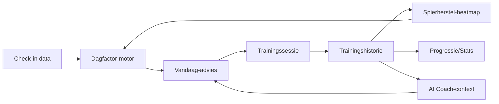
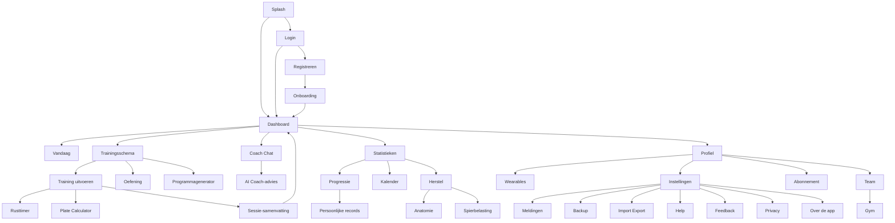

# TrainingKompas Premium Development Handbook

## Hoofdstuk 10 — Navigation Architecture, Information Architecture & User Flow Blueprint

**Status:** bindend document. Vanaf dit hoofdstuk wordt geen enkel nieuw scherm, workflow of navigatiepad toegevoegd zonder hieraan te voldoen.
**Voortbouwend op:** Hoofdstuk 1-9. In het bijzonder Hoofdstuk 6 (de 37 schermen die hier tot één samenhangende navigatiestructuur worden verbonden), Hoofdstuk 7 (Deel 4, Navigation-componenten) en Hoofdstuk 4 (Deel 2, de 18 basisflows).
**Karakter:** productspecificatie — geen code, geen implementatie, geen React. Dit hoofdstuk verbindt wat eerdere hoofdstukken als losse schermen en componenten specificeerden tot één navigeerbaar geheel.

---

### Leeswijzer

Dit hoofdstuk herhaalt geen enkele schermspecificatie (Hoofdstuk 6), componentspecificatie (Hoofdstuk 7) of flowdetail (Hoofdstuk 4, Deel 2) die al vastligt — het verbindt ze. Waar Hoofdstuk 4 al een flow volledig beschreef (bijvoorbeeld "Rusttimer" of "Wearable koppelen"), verwijst dit hoofdstuk daarnaar en voegt uitsluitend de navigatie-specifieke laag toe die Hoofdstuk 4 bewust niet behandelde: ouder/kind-relaties tussen schermen, exit-routes, back-stack-gedrag, deep links.

**Statusaanduiding:** 🟢 bestaand · 🟡 gedeeltelijk bestaand · 🔴 nieuw/toekomstig — zelfde conventie als Hoofdstuk 6-9.

---

## Deel 1 — Information Architecture

### 1.1 Domeinen

TrainingKompas' 37 schermen (Hoofdstuk 6) groeperen zich in zes domeinen — geen technische indeling, maar een indeling naar *gebruikersintentie*:

| Domein | Doel voor de gebruiker | Schermen (Hoofdstuk 6-nummering) |
|---|---|---|
| **Toegang** | De app in en uit komen | 1.1-1.4 (Splash, Onboarding, Login, Registreren) |
| **Vandaag & Trainen** | De kernactiviteit: weten wat te doen, en het doen | 2.1-2.2 (Dashboard, Vandaag), 3.1-3.6 (Trainingsschema t/m Plate Calculator) |
| **Coaching & Intelligentie** | Begrijpen waarom, en verder plannen | 4.1-4.3 (Programmagenerator, AI Coach, Coach Chat) |
| **Lichaam & Inzicht** | Weten hoe het lichaam ervoor staat, over tijd | 5.1-5.3 (Herstel, Anatomie, Spierbelasting), 6.1-6.4 (Progressie t/m Kalender) |
| **Motivatie & Gemeenschap** | Doelen, prestaties, en anderen | 7.1-7.4 (Doelen, Challenges, Team, Gym) |
| **Beheer & Systeem** | Alles rondom het gebruik zelf | 8.1-8.4 (Wearables t/m Profiel), 9.1-9.7 (Abonnement t/m Over de app) |

### 1.2 Modules binnen domeinen

Sommige domeinen bevatten een technisch/functioneel te onderscheiden module die zich anders gedraagt dan de rest van het domein:

| Module | Domein | Bijzonderheid |
|---|---|---|
| **Actieve trainingssessie** | Vandaag & Trainen | Enige module met een eigen navigatiemodus (bottom-navigatie ondergeschikt, Hoofdstuk 6 Scherm 3.2) |
| **Rolgebonden beheer** | Motivatie & Gemeenschap (Team/Gym) | Enige module die potentieel Drawer-navigatie gebruikt op tablet/desktop (Hoofdstuk 7, 4.7) |
| **AI-conversatie** | Coaching & Intelligentie | Enige module met een doorlopend, persistent gespreksgeheugen (Hoofdstuk 9, Deel 2) |

### 1.3 Schermgroepen, relaties en prioriteiten

| Schermgroep | Toegankelijk via | Prioriteit (Hoofdstuk 2, Deel 6-matrix) |
|---|---|---|
| Bottom-navigatie-hoofdschermen (Dashboard, Trainingsschema, Coach Chat, Profiel, Statistieken) | Permanent, één tik | P0 |
| Directe sub-schermen (Vandaag, Herstel, Rusttimer, Plate Calculator) | Één tik vanaf een hoofdscherm | P0-P1 |
| Tweede-niveau-schermen (Anatomie, Spierbelasting, Kalender, PR-tijdlijn) | Twee tikken, via een hoofd- of subscherm | P1-P2 |
| Beheerschermen (Team, Gym, Wearables, Instellingen) | Via Profiel | P1-P2 |
| Systeemschermen (Privacy, Over de app, Help, Feedback) | Via Instellingen | P3 |

### 1.4 Datastromen op hoog niveau

Deze cyclus — check-in voedt advies, training voedt geschiedenis, geschiedenis voedt zowel herstel als toekomstig advies — is de datamotor achter vrijwel elke navigatiebeslissing in dit hoofdstuk: de meeste primaire navigatiepaden volgen deze cyclus letterlijk (Dashboard → Vandaag → Training → Sessie-samenvatting → terug naar Dashboard).

### 1.5 Informatiehiërarchie en navigatiehiërarchie

Twee afzonderlijke hiërarchieën die vaak verward worden — dit hoofdstuk maakt het onderscheid expliciet:

- **Informatiehiërarchie** (Hoofdstuk 3, UX-regels): wat is het belangrijkst *op* een scherm. Al volledig vastgelegd per scherm in Hoofdstuk 6.
- **Navigatiehiërarchie** (dit hoofdstuk): hoe diep moet een gebruiker *reizen* om ergens te komen. Drie niveaus, bindend systeembreed (herbevestiging van Golden Rule UX4, Hoofdstuk 3): hoofdschermen (niveau 0, bottom-navigatie) → directe subschermen (niveau 1) → detailschermen (niveau 2). Nooit dieper dan niveau 2 zonder expliciete herziening van dit hoofdstuk.

### 1.6 Information Architecture Matrix

| Domein | Hoofdschermen (niveau 0) | Subschermen (niveau 1) | Detailschermen (niveau 2) |
|---|---|---|---|
| Toegang | — (vóór-login, geen bottom-nav) | Login, Registreren | — |
| Vandaag & Trainen | Dashboard, Trainingsschema | Vandaag, Training uitvoeren, Rusttimer, Plate Calculator | Oefening-detail |
| Coaching & Intelligentie | Coach Chat | AI Coach-advies, Programmagenerator | Programmablok-detail |
| Lichaam & Inzicht | Statistieken | Progressie, Herstel, Kalender | Anatomie, Spierbelasting, Persoonlijke records |
| Motivatie & Gemeenschap | — (via Profiel) | Doelen, Team, Gym | Challenges, Challenge-detail |
| Beheer & Systeem | Profiel | Instellingen, Wearables, Abonnement | Meldingen, Backup, Import/Export, Help, Feedback, Privacy, Over de app |

---

## Deel 2 — Navigation Principles

Veertien navigatiepatronen. Waar een patroon al volledig als component is gespecificeerd (Hoofdstuk 7, Deel 4: Bottom Navigation, Top App Bar, Back Button, Bottom Sheet), wordt hier uitsluitend de *navigatie*-laag toegevoegd — niet de visuele/interactie-specificatie herhaald.

### 2.1 Bottom Navigation 🟢
Component-specificatie: Hoofdstuk 7, 4.1. **Navigatieregel:** de vijf hoofdschermen zijn de enige plekken waarvandaan een gebruiker "helemaal opnieuw" kan beginnen — elke bottom-navigatie-tik reset de sub-navigatie-stack van dat domein naar zijn startpunt (tik nogmaals op een reeds actieve tab: scrollt terug naar boven, bestaand patroon uit vergelijkbare apps, hier bevestigd als bindend).
**Wanneer gebruiken:** voor elk van de vijf permanente hoofddomeinen. **Wanneer NIET gebruiken:** nooit voor een zesde functie (Screen Design Laws, Hoofdstuk 6, wet 6).
**UX-regels:** Hoofdstuk 3, UX1. **Golden Rules:** Product Constitution — navigatievoorspelbaarheid.
**Acceptatiecriteria:** vanaf elk scherm in de app is een hoofddomein bereikbaar binnen één tik.

### 2.2 Top App Bar 🟢
Component-specificatie: Hoofdstuk 7, 4.2. **Navigatieregel:** toont altijd de titel van het huidige niveau (Deel 1.5) — nooit de titel van het bovenliggende niveau, ook niet tijdens een schermovergang-animatie.
**Wanneer gebruiken:** elk scherm behalve Splash en de actieve trainingsflow. **Wanneer NIET gebruiken:** als primaire actielocatie (Hoofdstuk 7, 4.2).
**UX-regels/Golden Rules:** Product Principle P7. **Acceptatiecriteria:** titel komt exact overeen met de positie in de Navigation Tree (Deel 3).

### 2.3 Back Behaviour (software) 🟢
Component-specificatie: Hoofdstuk 7, 4.3. **Navigatieregel:** software-back (Top App Bar-chevron) navigeert altijd exact één niveau omhoog in de hiërarchie uit Deel 1.5 — nooit meerdere niveaus tegelijk, ook niet als "snelkoppeling".
**Wanneer gebruiken:** elk subscherm/detailscherm. **Wanneer NIET gebruiken:** hoofdschermen (niveau 0) tonen geen back-knop.
**UX-regels:** Hoofdstuk 3, UX3. **Golden Rules:** navigatievoorspelbaarheid.
**Acceptatiecriteria:** software-back en hardware-back (2.4) leiden altijd naar exact hetzelfde scherm vanuit dezelfde positie.

### 2.4 Hardware Back Button (Android) 🟢
**Navigatieregel:** gedraagt zich altijd identiek aan de software-Back Button (2.3) — geen enkel scherm implementeert eigen, afwijkend hardware-back-gedrag. Uitzondering: tijdens een actieve trainingssessie toont hardware-back een Confirmation Dialog (Hoofdstuk 7, 11.5) vóór het de sessie zou verlaten (voorkomt onbedoeld dataverlies-risico, consistent met Hoofdstuk 3 Deel 9 Error Recovery-uitgangspunt).
**Wanneer gebruiken:** systeembreed, Android. **Wanneer NIET gebruiken:** n.v.t. — dit is platformverplicht gedrag.
**Acceptatiecriteria:** nul schermen met afwijkend hardware-back-gedrag buiten de expliciete trainingssessie-uitzondering.

### 2.5 Deep Links 🔴
**Doel:** een gebruiker vanuit een externe context (notificatie, PWA-shortcut, gedeelde link) direct op de relevante plek in de app brengen, zonder eerst door de volledige hiërarchie te hoeven navigeren.
**Wanneer gebruiken:** PWA-manifest-shortcuts (bestaand: `?start=A`, `?start=B`, `?checkin=1`), notificatie-doorklikken (Hoofdstuk 8, Deel 12), gedeelde content (bijv. een geëxporteerde PR-afbeelding met terug-link).
**Wanneer NIET gebruiken:** nooit naar een scherm dat zonder voorafgaande context onbegrijpelijk zou zijn (bijv. rechtstreeks naar een Set Block zonder de omvattende sessie te tonen).
**UX-regels:** een deep link opent altijd met de volledige Top App Bar/context van het doelscherm zichtbaar — nooit een "kaal" scherm zonder oriëntatie.
**Golden Rules:** Screen Design Laws (Hoofdstuk 6) wet 15 (kwetsbaarste gebruiker: een deep link vanuit bijv. een notificatie mag nooit verwarrend aanvoelen voor een minder ervaren gebruiker).
**Acceptatiecriteria:** elke deep link laadt het doelscherm mét een correcte back-stack (Deel 3) naar het meest logische bovenliggende scherm, niet naar een lege/ontbrekende geschiedenis.

### 2.6 Context Navigation 🟢
**Doel:** navigatie die verschijnt/verdwijnt afhankelijk van de staat van de gebruiker (bijv. "Volgende training: Training A"-snelkoppeling op het Dashboard).
**Wanneer gebruiken:** wanneer de meest waarschijnlijke vervolgactie voorspelbaar is uit de huidige context (Hoofdstuk 4, Deel 1: voorspelbaarheid).
**Wanneer NIET gebruiken:** nooit als vervanging van de standaardnavigatie — context-navigatie is altijd een versnelling, nooit de enige route.
**UX-regels:** Golden Rule UX14 (Hoofdstuk 3). **Acceptatiecriteria:** elke contextuele snelkoppeling heeft ook een volledig uitgeschreven, niet-contextuele route naar hetzelfde doel.

### 2.7 AI Navigation 🟡
**Doel:** de AI-coach kan een route *suggereren* (bijv. "bekijk je spierherstel" als link binnen een AI-bericht) maar navigeert nooit zelfstandig.
**Wanneer gebruiken:** wanneer een AI-antwoord verwijst naar data die elders in de app visueel beter tot zijn recht komt (bijv. een verwijzing naar de spierherstel-heatmap vanuit een Coach Chat-antwoord).
**Wanneer NIET gebruiken:** nooit als automatische, ongevraagde omleiding.
**UX-regels:** Hoofdstuk 8, Product Constitution I/II (AI beslist nooit). **Golden Rules:** zie Deel 8 van dit hoofdstuk voor de volledige uitwerking.
**Acceptatiecriteria:** elke AI-gesuggereerde link vereist een expliciete tik van de gebruiker — nooit een automatische redirect.

### 2.8 Workout Navigation 🟢
**Doel:** navigatie binnen de actieve trainingssessie, de meest afwijkende navigatiemodus in de hele app (Hoofdstuk 6, Scherm 3.2).
**Wanneer gebruiken:** uitsluitend tijdens een actieve sessie. **Wanneer NIET gebruiken:** n.v.t. — automatisch geactiveerd bij sessiestart, gedeactiveerd bij afronden.
**UX-regels:** Hoofdstuk 4, Deel 4 (Workout Experience Principles): bottom-navigatie ondergeschikt, geen ongevraagde navigatie weg van de sessie (Golden Rule UX18).
**Golden Rules:** Product Constitution XIX. **Acceptatiecriteria:** de enige uitgangen uit deze modus zijn: sessie afronden, sessie pauzeren + expliciete navigatie elders (met terugkeeroptie), of hardware-back met bevestiging (2.4).

### 2.9 Search Navigation 🟢
Component-specificatie: Hoofdstuk 7, 2.1 (Search), 2.4 (Autocomplete). **Navigatieregel:** zoeken is altijd *binnen* de huidige context (bijv. binnen de oefeningbibliotheek), nooit een universele, app-brede zoekfunctie op dit moment (zie Deel 10 voor de toekomstvisie op een wereldwijde zoekfunctie).
**Acceptatiecriteria:** een zoekresultaat opent altijd binnen dezelfde navigatiehiërarchie als waar de zoekopdracht gestart is.

### 2.10 Instellingen-navigatie 🟢
Schermspecificatie: Hoofdstuk 6, Scherm 8.3. **Navigatieregel:** Instellingen is een niveau-1-verzamelscherm bereikbaar vanuit Profiel én vanuit de Dashboard-header (twee ingangen naar exact dezelfde plek — bewust, geen duplicatie van content, enkel van toegang).
**Acceptatiecriteria:** ongeacht via welke ingang, Instellingen toont identieke content en back-navigatie leidt terug naar de ingang van vertrek.

### 2.11 Profiel-navigatie 🟢
Schermspecificatie: Hoofdstuk 6, Scherm 8.4. **Navigatieregel:** Profiel is het enige hoofdscherm dat tegelijk toegang geeft tot vier verschillende subdomeinen (Wearables, Team/Gym, Abonnement, Instellingen) — dit is een bewuste uitzondering op de "één primair doel per scherm"-regel (Product Principle P7) omdat Profiel zelf per definitie een verzamelpunt is, geen actiescherm.
**Acceptatiecriteria:** elk subdomein vanuit Profiel is bereikbaar binnen één tik.

### 2.12 Modal Navigation 🟢
Component-specificatie: Hoofdstuk 7, Deel 11 (Dialogs, Confirmation/Permission/Error Dialog). **Navigatieregel:** een modal (Dialog) onderbreekt nooit de onderliggende navigatiestack — na sluiten keert de gebruiker exact terug naar het scherm en de scrollpositie van vóór het openen.
**Acceptatiecriteria:** geen enkele modal-actie verandert de back-stack (Deel 3) van het onderliggende scherm.

### 2.13 Bottom Sheets 🟢
Component-specificatie: Hoofdstuk 7, 4.8. **Navigatieregel:** zelfde principe als Modal Navigation (2.12) — een Bottom Sheet is nooit een "verborgen scherm" met eigen navigatiegeschiedenis, uitsluitend een tijdelijke, contextuele uitbreiding van het onderliggende scherm.
**Acceptatiecriteria:** sluiten van een Bottom Sheet vereist nooit meer dan één actie (tik buiten, swipe-down, of expliciete knop).

### 2.14 Wizards (meerstaps-flows) 🟡
**Doel:** een lineaire, stap-voor-stap-flow voor complexe, eenmalige taken (Onboarding, Programmagenerator).
**Wanneer gebruiken:** wanneer een taak natuurlijke, sequentiële stappen heeft die niet los van elkaar zinvol zijn.
**Wanneer NIET gebruiken:** nooit voor taken die net zo goed op één scherm zouden passen (voorkomt kunstmatige stap-opdeling die enkel de indruk van grondigheid wekt, Product Principle P6).
**UX-regels:** Golden Rule UX9 (max. vijf stappen, Hoofdstuk 3); elke wizard toont een voortgangsindicator (Deel 1.5-conform: de gebruiker weet altijd waar hij zich bevindt).
**Golden Rules:** Product Constitution IX. **Acceptatiecriteria:** elke wizard-stap is terug te navigeren zonder ingevoerde data op eerdere stappen te verliezen (Golden Rule UX8).

---

## Deel 3 — Complete Navigation Map

### 3.1 Navigation Tree (top-niveau)

### 3.2 Volledige Navigation Map-tabel

Alle 37 schermen (Hoofdstuk 6-nummering), elk met ouder, kind(eren), routes, back-stack, AI-routes en offline-status. "Route via bottom-nav" betekent: direct bereikbaar zonder tussenliggend scherm.

| # | Scherm | Parent | Child(ren) | Alternatieve route | Exit route | Deep link | AI-route | Offline |
|---|---|---|---|---|---|---|---|---|
| 1.1 | Splash | — | Login, Dashboard | — | Automatisch | — | — | Ja (shell gecached) |
| 1.2 | Onboarding | Registreren | Dashboard | — | Overslaan → Dashboard | — | Eindigt in AI-advies | Nee (vereist AI-verbinding voor eindadvies) |
| 1.3 | Login | Splash | Dashboard, Registreren | — | — | — | — | Nee |
| 1.4 | Registreren | Login | Onboarding | — | — | — | — | Nee |
| 2.1 | Dashboard | — (hoofdscherm) | Vandaag, Trainingsschema, Coach Chat, Statistieken, Profiel | Bottom-nav | — | `?start=A/B`, `?checkin=1` | Toont dagfactor-advies | Ja (laatst bekende data) |
| 2.2 | Vandaag | Dashboard | — | Via Vandaag-kaart-tik | Terug naar Dashboard | — | Volledige AI-toelichting | Ja (laatst berekend) |
| 3.1 | Trainingsschema | Dashboard (bottom-nav) | Training uitvoeren, Oefening, Programmagenerator | — | — | `?start=A/B` | — | Ja |
| 3.2 | Training uitvoeren | Trainingsschema | Rusttimer, Plate Calculator, Sessie-samenvatting | Dashboard-snelkoppeling | Sessie afronden → Samenvatting | `?start=A/B` | "Vraag de coach"-knop | Ja (volledig) |
| 3.3 | Oefening | Trainingsschema | (zelfde als 3.2) | Via "+ Oefening" binnen 3.2 | Zelfde als 3.2 | — | Zelfde als 3.2 | Ja |
| 3.4 | Set logging | (component binnen 3.2/3.3) | — | — | — | — | — | Ja |
| 3.5 | Rusttimer | Training uitvoeren | — | — | Automatisch/overslaan | — | RPE-gebaseerde suggestie | Ja |
| 3.6 | Plate Calculator | Training uitvoeren | — | — | Sluiten | — | — | Ja |
| 4.1 | Programmagenerator | Trainingsschema | Programmablok-detail | Profiel (indien later toegevoegd) | Opslaan/Annuleren → Trainingsschema | — | Volledige generatie | Nee (generatie vereist verbinding) |
| 4.2 | AI Coach-advies | Dashboard (na check-in) | Training uitvoeren | — | Keuze → Training uitvoeren | — | Is zelf AI-content | Nee (nieuw advies vereist verbinding) |
| 4.3 | Coach Chat | Dashboard (bottom-nav) | AI Coach-advies (uitgelicht) | — | — | — | Is zelf AI-content | Ja (geschiedenis leesbaar) |
| 5.1 | Herstel | Statistieken | Anatomie, Spierbelasting | Dashboard-mini-kaart | — | — | AI-suggestie bij lage groep | Ja |
| 5.2 | Anatomie | Herstel | — | Oefeningdetail ("welke spieren?") | Terug naar Herstel | — | — | Ja |
| 5.3 | Spierbelasting | Herstel/Statistieken | — | — | — | — | Duiding bij afwijking | Ja (laatst berekend) |
| 6.1 | Progressie | Statistieken (bottom-nav) | — | — | — | — | Optionele AI-duiding | Ja |
| 6.2 | Statistieken | — (hoofdscherm) | Progressie, Herstel, Kalender, Persoonlijke records | Bottom-nav | — | — | — | Ja |
| 6.3 | Persoonlijke records | Statistieken/Profiel | — | — | — | — | — | Ja |
| 6.4 | Kalender | Programmagenerator/Profiel | — | — | — | — | — | Ja (laatst gesynchroniseerd) |
| 7.1 | Doelen | Profiel/Dashboard | — | — | — | — | Optionele AI-suggestie | Nee (suggestie), Ja (handmatig) |
| 7.2 | Challenges | Doelen/Gym | — | — | — | — | — | Nee (deelname vereist verbinding) |
| 7.3 | Team | Profiel | Gym | — | — | — | — | Ja (laatst gesynchroniseerd) |
| 7.4 | Gym | Team | — | — | — | — | — | Ja |
| 8.1 | Wearables | Profiel | — | — | — | — | — | Ja (statuscache) |
| 8.2 | Meldingen | Instellingen | — | — | — | — | — | Ja |
| 8.3 | Instellingen | Profiel/Dashboard-header | Meldingen, Backup, Import/Export, Help, Feedback, Privacy, Over de app | — | — | — | — | Ja |
| 8.4 | Profiel | — (hoofdscherm) | Instellingen, Wearables, Team, Abonnement | Bottom-nav | — | — | — | Ja (basisgegevens) |
| 9.1 | Abonnement | Profiel | — | — | — | — | — | Ja (statuscache) |
| 9.2 | Backup | Instellingen/Profiel | — | — | — | — | — | Ja |
| 9.3 | Import/Export | Profiel | — | — | — | — | — | Deels (export lokale data) |
| 9.4 | Help | Instellingen | Feedback | — | — | — | — | Ja |
| 9.5 | Feedback | Instellingen/Help | — | — | — | — | — | Nee (verzenden vereist verbinding, invoer lokaal bewaard) |
| 9.6 | Privacy | Registreren/Instellingen/Profiel | — | — | — | — | — | Ja |
| 9.7 | Over de app | Instellingen | Privacy, Help | — | — | — | — | Ja |

**Leesregel back-stack:** voor elk scherm geldt, tenzij anders vermeld, dat de back-stack exact de "Parent"-kolom volgt — er bestaat geen scherm met een afwijkende, "verrassende" terugnavigatie t.o.v. zijn ouderrelatie in deze tabel (Golden Rule UX3, Hoofdstuk 3).

---

## Deel 4 — User Flow Library

Tweeëntwintig flows. Waar een flow al volledig is uitgewerkt in Hoofdstuk 4 (Deel 2, achttien flows met doel/stappen/emoties/risico's/frictiepunten/verbeteringen/acceptatiecriteria), wordt dat expliciet vermeld en beperkt dit hoofdstuk zich tot de navigatie-specifieke aanvulling (Trigger, Beslismomenten, Alternatieve/Exit-routes) — geen inhoudelijke herhaling.

| # | Flow | Referentie Hoofdstuk 4 | Trigger | Begin | Einde | Beslismoment(en) | Mogelijke fouten | Alternatieve route | Acceptatiecriteria (navigatie) |
|---|---|---|---|---|---|---|---|---|---|
| 4.1 | Eerste installatie | Flow 1 (volledig) | App-store/link | Splash | Onboarding-start | Account aanmaken vs. inloggen | Trage/mislukte eerste load | — | <90 sec tot eerste gepersonaliseerde content |
| 4.2 | Onboarding | Flow 2 (volledig) | Na registratie | Stap 1 | Eerste AI-advies zichtbaar | Overslaan op elk moment | Onvoldoende data voor advies | Deel 2.4 Hoofdstuk 8 fallback | Max. 5 stappen, altijd voltooibaar |
| 4.3 | **Account aanmaken** 🟢 | Nieuw t.o.v. Hoofdstuk 4 | Tik "Account aanmaken" op Login | Registreren (Hoofdstuk 6, Scherm 1.4) | Onboarding-start | E-mail/wachtwoord vs. toekomstig OAuth | E-mail al in gebruik, zwak wachtwoord | Terug naar Login | Succesvolle registratie leidt direct door naar Onboarding, geen tussenscherm |
| 4.4 | **Inloggen** 🟢 | Nieuw t.o.v. Hoofdstuk 4 | Tik "Inloggen" op Splash/na uitloggen | Login (Hoofdstuk 6, Scherm 1.3) | Dashboard | Wachtwoord vergeten? | Onjuiste inloggegevens | "Wachtwoord vergeten"-link | Succesvolle login → direct Dashboard, geen tussenscherm |
| 4.5 | Dashboard (gebruiken) | Flow 11 (volledig) | App geopend, ingelogd | Dashboard | Doorklik naar detail of training starten | Welke kaart eerst | Mislukte data-fetch per kaart | Skeleton/losstaande foutstaat per kaart | Max. 5 kaarten boven de vouw |
| 4.6 | Eerste training | Flow 3 (volledig) | Eerste keer "Training starten" | Trainingsschema/Dashboard | Sessie-samenvatting | — | Onduidelijke eerste setinvoer | — | Eerste set gelogd binnen 2 min na start |
| 4.7 | Workout starten | Flow 4 (volledig) | Tik op Training A/B of shortcut | Trainingsschema/Dashboard | Training uitvoeren (actief) | Welke training vandaag | — | `?start=A/B`-deep link | Één tik vanaf Dashboard |
| 4.8 | Set loggen | Flow 5 (volledig) | Tijdens actieve sessie | Set Block | Bevestigde opslag | Superset toevoegen? | Dubbele tik, sync-fout | Offline-wachtrij | Max. 2 tikken, bevestiging <2 sec |
| 4.9 | **Workout afronden** 🟡 | Uitbreiding op Flow 5 | Tik "Sessie afronden" (groen vinkje) | Training uitvoeren | Sessie-samenvatting → Dashboard | Onvolledig gelogde sets? (waarschuwing, geen blokkade) | Onvolledige synchronisatie op moment van afronden | Samenvatting toont "wordt nog bijgewerkt"-indicator | Samenvatting verschijnt direct; PR's zonder scroll zichtbaar (Hoofdstuk 6, Scherm 3.9-equivalent) |
| 4.10 | AI Coach gebruiken | Flow 8 (volledig) | Check-in voltooid of vraag in Coach Chat | AI Coach-advies / Coach Chat | Keuze gemaakt / antwoord ontvangen | Advies opvolgen vs. negeren | AI niet bereikbaar | Trainen zonder advies | Beide keuzeopties gelijkwaardig bereikbaar |
| 4.11 | Programma volgen | Flow 9 (volledig) | Lopend programma aanwezig | Programma-overzicht | Training gestart vanuit programmablok | Welke week is "nu" | Leeg blok (contentcheck-fout) | — | Huidige week altijd zonder scroll zichtbaar |
| 4.12 | Programma wijzigen | Flow 10 (volledig) | Tik "Wijzigen" binnen Programma | Programma-parameters | Bevestigde, opnieuw gegenereerde weken | Welke weken worden geraakt | Mislukte herregeneratie van één week | Alleen die week opnieuw proberen | Expliciete bevestiging welke weken wijzigen vóór definitief |
| 4.13 | **PR behalen** 🟢 | Uitbreiding op Flow 14 (Hoofdstuk 4 behandelde "PR bekijken", dit is het moment van behalen zelf) | Automatische detectie tijdens het opslaan van een set | Set Block | PR-badge zichtbaar + optioneel PR-tijdlijn | — | Twijfelachtige data (Hoofdstuk 8, Deel 5.3) | Lagere-confidence-badge | PR zichtbaar op het moment zelf, niet pas in de samenvatting |
| 4.14 | Herstel bekijken | Flow 13 (volledig) | Tik op Herstel-kaart/tab | Herstel-scherm | Detail per spiergroep bekeken | Voor-/achteraanzicht wisselen | Laadfout SVG | Tekstuele fallback-lijst | Zonder scroll zichtbaar |
| 4.15 | Analytics bekijken | Flow 12 (Statistieken, volledig) | Tik op Statistieken-tab | Statistieken-overzicht | Detailgrafiek bekeken | Welke filter | Onvoldoende data | Golden Rule UX30-uitleg | Standaardweergave zonder filter al zinvol |
| 4.16 | **Doelen instellen** 🔴 | Nieuw, Hoofdstuk 6 Scherm 7.1 | Tik "+ Nieuw doel" | Doelen-scherm | Bevestigd doel zichtbaar met voortgangsbalk | Handmatig vs. AI-suggestie (Hoofdstuk 8, Deel 6.1) | Te ambitieuze AI-suggestie | Handmatige aanpassing vóór bevestigen | Doel aanpasbaar vóór bevestiging, max. 3 stappen |
| 4.17 | **Gym gebruiken** 🟡 | Nieuw, Hoofdstuk 6 Scherm 7.3-7.4 | Tik Team/Gym vanuit Profiel | Team-scherm | Ledenlijst/rolwijziging voltooid | Welke rol toewijzen | Mislukte rolwijziging | — | Elke rolwijziging vereist bevestiging + verschijnt in audit-log |
| 4.18 | Wearable koppelen | Flow 16 (volledig) | Tik "Koppelen" in Wearables | Wearables-scherm | Bevestigde koppeling | — | OAuth mislukt, token verloopt later | Doorverwijzing naar herautorisatie | Max. 3 stappen |
| 4.19 | Offline werken | Flow 17 (volledig) | Verbinding verbroken tijdens gebruik | Elk scherm | Verbinding hersteld | — | Data die alleen online beschikbaar is (Deel 6) | Offline-vervangende content waar mogelijk | Trainingslogging 100% functioneel offline |
| 4.20 | Synchroniseren | Flow 18 (volledig) | Verbinding hersteld na offline-periode | Achtergrondproces | Bevestigde synchronisatie of conflictresolutie | Conflict tussen apparaten? | Gedeeltelijk mislukte sync | Item blijft in wachtrij, handmatig retry | Gebruiker kan altijd sync-status zien |
| 4.21 | **Premium abonnement** 🔴 | Nieuw, Hoofdstuk 6 Scherm 9.1 | Tik "Upgrade" of quota-limiet bereikt | Abonnement-scherm | Bevestigde upgrade | Welke tier | Mislukte betaling | Bestaande tier blijft actief tot expliciete degradatie | Upgrade in max. 3 stappen, geen gedwongen upsell-onderbreking (zie Deel 7) |
| 4.22 | Instellingen wijzigen | Flow 15 (volledig) | Tik Instellingen | Instellingen-scherm | Bevestigde wijziging | Welke sectie | — | — | Elke instelling bereikbaar binnen 2 tikken |
| — | **Account verwijderen** 🟢 | Nieuw, Hoofdstuk 6 Scherm 8.4 | Tik "Account verwijderen" in Profiel | Confirmation Dialog (dubbele bevestiging) | Account + alle data verwijderd (Hoofdstuk 9, Deel 2.5-2.6) | — | Mislukte verwijdering (technische fout) | Duidelijke foutmelding, geen gedeeltelijke verwijdering | Expliciete, niet-dubbelzinnige bevestiging vereist (Golden Rule UX32) |

**Gedeelde emotionele/frictiepunt-referentie:** voor elke flow hierboven met een Hoofdstuk 4-referentie zijn Emoties en Frictiepunten al volledig beschreven daar — dit hoofdstuk voegt uitsluitend de tabelkolommen toe die Hoofdstuk 4 niet expliciet had (Trigger, Beslismomenten, Exit/Alternatieve routes) om dubbele beschrijving van dezelfde emotie te vermijden.

---

## Deel 5 — Permission Flows

Component-basis: Hoofdstuk 7, 11.6 (Permission Dialog). Zeven permissietypen, elk met wanneer wel/niet vragen, uitleg, weigering en herstelroute.

| Permissie | Wanneer vragen | Wanneer NIET vragen | Uitleg (Permission Dialog-inhoud) | Bij weigering | Herstelroute |
|---|---|---|---|---|---|
| **Camera** | Bij eerste poging tot profielfoto-upload (Hoofdstuk 7, 12.4) | Nooit bij app-start (geen voorbarige permissie-aanvraag) | "Nodig om een profielfoto te maken — je kunt ook een bestaande foto kiezen" | Terugval op bestandskiezer (geen camera nodig) | Systeeminstellingen-link vanuit Instellingen indien later alsnog gewenst |
| **Microfoon** | Alleen bij activering van een toekomstige spraakinvoer-functie (Hoofdstuk 7, 2.7 Stepper-uitbreiding) | Nooit vooraf, nooit voor een functie die niet direct gebruikt wordt | "Nodig om gewicht/reps via spraak in te voeren tijdens training" | Terugval op standaard stepper-invoer | Systeeminstellingen-link |
| **Locatie** | N.v.t. — TrainingKompas heeft momenteel geen locatiegebonden functionaliteit | Altijd (tenzij een toekomstige gym-locatiezoekfunctie dit rechtvaardigt — dan eerst een aparte Decision Log-vermelding) | — | — | — |
| **Bluetooth** | Bij een toekomstige directe wearable-koppeling die Bluetooth vereist (los van de huidige OAuth-gebaseerde Fitbit-koppeling) | Nooit vooraf | "Nodig om rechtstreeks met je hartslagmeter te verbinden" | Terugval op de bestaande OAuth-koppelmethode (Hoofdstuk 6, Scherm 8.1) | Systeeminstellingen-link |
| **Meldingen** | Bij de eerste keer dat een functionele melding relevant zou zijn (bijv. eerste wearable-koppeling, niet bij eerste app-open) | Nooit direct bij onboarding-start (te vroeg, geen context) | "We melden je alleen functionele zaken — nooit om je terug te laten komen" (directe toepassing van Product Constitution XX) | App blijft volledig functioneel, notificatie-afhankelijke functies (Hoofdstuk 8, Deel 12) vallen terug op in-app-badges (Hoofdstuk 5, `ni-dot`) | Instellingen → Meldingen (Hoofdstuk 6, Scherm 8.2) |
| **Gezondheidsdata** (HealthKit/Health Connect, toekomstig) | Bij expliciete wearable-koppelpoging (Hoofdstuk 6, Scherm 8.1) | Nooit vooraf | "Nodig om je HRV en hartslag automatisch te synchroniseren — je kunt dit ook handmatig invullen" | Terugval op handmatige invoer (Hoofdstuk 8, Deel 10.1: volwaardig alternatief) | Wearables-scherm |
| **Bestandsopslag** | Bij Export (Hoofdstuk 6, Scherm 9.3) of import van een logboek | Nooit vooraf | "Nodig om je exportbestand op te slaan" | Export mislukt met duidelijke melding | Systeeminstellingen-link |

**Gedeelde regel (alle zeven):** elke permissie wordt gevraagd op het moment van functionele noodzaak, nooit vooraf verzameld "voor het geval dat" — directe toepassing van Hoofdstuk 1, sectie 1.10 (datafilosofie) en Hoofdstuk 7, 11.6 (Permission Dialog legt context uit vóór het systeemvenster).

---

## Deel 6 — Offline Navigation

### 6.1 Welke schermen offline bruikbaar zijn

Zie de "Offline"-kolom in de Navigation Map (Deel 3.2) voor het volledige overzicht per scherm. Samengevat: **volledig offline bruikbaar** zijn alle schermen binnen "Vandaag & Trainen" (behalve het genereren van een nieuw AI-advies) en "Lichaam & Inzicht" (op basis van laatst gesynchroniseerde data); **vereisen een verbinding** zijn elke actie die nieuwe AI-content genereert (Programmagenerator, nieuw Coach-advies), Toegang-schermen (Login/Registreren), en elke betalings-/rolwijzigingsactie (Abonnement, Team-rolwijziging).

### 6.2 Welke AI-functies beperkt zijn offline

Volledig gespecificeerd in Hoofdstuk 8 (elk Deel vermeldt "Offline gedrag") en Hoofdstuk 9, Deel 3.6 (Contextverlies). Samengevat: **geen enkele nieuwe AI-output** wordt offline gegenereerd; **alle eerder ontvangen AI-content** (Coach Chat-geschiedenis, laatst berekende dagfactor/herstelscore) blijft volledig leesbaar offline.

### 6.3 Synchronisatiegedrag

Volledig gespecificeerd in Hoofdstuk 4, Flow 17-18 en Hoofdstuk 6, Scherm 9.2 (Backup). Navigatie-specifieke aanvulling: een offline gelogde actie (bijv. een set) wijzigt de navigatiestructuur niet — de gebruiker navigeert door de app alsof online, met een consistente, subtiele offline-indicator (Hoofdstuk 4, Deel 6 Micro-interactie #43) op elk relevant scherm.

### 6.4 Conflictbehandeling

Volledig gespecificeerd in Hoofdstuk 4, Deel 9 (Error Recovery — conflict tussen apparaten). Navigatie-specifieke aanvulling: een conflict onderbreekt nooit de reguliere navigatie — de conflictresolutie-dialoog (Hoofdstuk 7, 11.1) verschijnt als modal (Deel 2.12), de onderliggende navigatiestack blijft ongewijzigd na afhandeling.

### 6.5 Herstel na verbinding

| Moment | Navigatiegedrag |
|---|---|
| Verbinding hersteld tijdens een actief scherm | Geen automatische navigatie-wijziging; het scherm ververst zijn data op de achtergrond (skeleton alleen indien de content nog niet eerder geladen was) |
| Verbinding hersteld terwijl de app op de achtergrond stond | Bij terugkeer naar de voorgrond: Dashboard (of het laatst actieve scherm, platformafhankelijk gedrag) toont bijgewerkte data, geen geforceerde navigatie naar een "sync voltooid"-scherm |
| Een AI-advies dat offline niet gegenereerd kon worden | Wordt automatisch (niet met een aparte navigatie-actie) alsnog aangeboden zodra de verbinding en de relevante context (bijv. een nog actuele check-in) dat toelaten |

---

## Deel 7 — Premium vs Free

Gegrond in het bestaande, nog niet gehandhaafde entitlement-schema (`plan_features`, `credit_packs`, Blueprint.md) en Hoofdstuk 6, Scherm 9.1 (Abonnement).

### 7.1 Gratis routes (basis, altijd volledig toegankelijk)

Volledige trainingslogging (Deel 3, alle schermen in "Vandaag & Trainen"), spierherstel-heatmap, basis-statistieken, handmatige programma-invoer, Team/Gym-lidmaatschap. **Bindende regel:** de kernervaring — trainen, loggen, herstel zien — wordt nooit achter een betaalmuur geplaatst (Hoofdstuk 1, sectie 1.16: "een businessmodel is een middel om deze visie vol te houden, nooit een reden om ervan af te wijken").

### 7.2 Premium routes (metered/uitgebreide functies)

| Functie | Gratis | Premium (Atleet-tier) |
|---|---|---|
| AI-coach-adviezen | Beperkt maandelijks quotum | Ruimer/onbeperkt quotum |
| Programmagenerator | Beperkt aantal generaties/maand | Onbeperkt |
| Geavanceerde analytics (ACWR, plateau-detectie, Hoofdstuk 8 Deel 5) | Basisweergave | Volledige diepgang |
| Gym-brede functies (Sportschool-tier) | N.v.t. voor individuen | Eigenaar-specifiek: branding, ledenbeheer op schaal |

### 7.3 Upsell-momenten

| Moment | Vorm | Verboden vorm |
|---|---|---|
| Quota bereikt (80%-waarschuwing, bestaand ontworpen mechanisme) | Neutrale, informatieve melding binnen de bestaande interactie, met een niet-opdringerige link naar Abonnement | Een blokkerende dialoog die de lopende actie (bijv. het loggen van een set) onderbreekt |
| Expliciete tik op "Abonnement" vanuit Profiel | Volledige, feitelijke tier-vergelijking (Hoofdstuk 6, Scherm 9.1) | Kunstmatige schaarste-taal ("nog maar 2 uur korting!") |
| Een premium-only functie aangeraakt (bijv. geavanceerde analytics bij een gratis account) | Duidelijke, feitelijke uitleg wat de upgrade toevoegt, ter plekke | Het bestaan van de functie verbergen in plaats van uit te leggen waarom deze niet beschikbaar is |

### 7.4 Beperkingen (hoe ze worden getoond)

Een gratis-tier-limiet wordt nooit gepresenteerd als een gebroken/foutieve functie — altijd als een duidelijk gecommuniceerde grens met een feitelijke upgrade-optie ernaast, consistent met Golden Rule UX36 (elke "beperking"-melding legt uit wat er aan de hand is én wat de gebruiker kan doen).

### 7.5 Upgrade-flow

Zie Deel 4.21 (Premium abonnement-flow). **Bindende regel, expliciet vastgelegd zoals gevraagd:** upsells zijn nooit storend (nooit een blokkerende interruptie van een lopende taak) of manipulatief (nooit kunstmatige schaarste, nooit verborgen kosten, nooit een moeilijk vindbare annuleeroptie — directe toepassing van Hoofdstuk 4, Deel 1, verboden UX-patronen, en Product Constitution XX).

---

## Deel 8 — AI Navigation

Volledig gegrond in Hoofdstuk 8 (AI Behaviour Library) en Hoofdstuk 9 (AI Governance) — dit Deel voegt uitsluitend de navigatie-specifieke laag toe.

| AI-navigatievorm | Beschrijving | Voorbeeld | Grens |
|---|---|---|---|
| **AI-suggesties** | Een AI-bericht bevat een klikbare verwijzing naar een relevant scherm | "Bekijk je spierherstel" binnen een Coach Chat-antwoord | Nooit automatisch geopend — altijd een expliciete tik vereist |
| **Snelkoppelingen** | Context-gedreven snelkoppelingen op het Dashboard (Deel 2.6), soms AI-geïnformeerd (bijv. de suggestie welke training vandaag) | "Volgende training: Training A" | Altijd ook via de standaardnavigatie bereikbaar, nooit de enige route |
| **Contextuele acties** | Een AI Card (Hoofdstuk 7, 10.3) met een directe actieknop | "Pas aan en start" binnen het Dagadvies (Hoofdstuk 8, Deel 2.1) | Altijd naast een gelijkwaardig alternatief (Product Constitution I) |
| **Slimme aanbevelingen** | Alternatieve oefeningen (Hoofdstuk 8, Deel 7.1) als navigeerbare opties binnen hetzelfde scherm | Drie alternatieve-oefening-kaarten | Nooit een automatische vervanging zonder gebruikersactie |
| **Coach-doorgangen** | Een verwijzing vanuit de Coach Chat naar een ander AI-gedreven scherm (bijv. van een vraag over herstel naar het volledige Herstel-scherm) | — | Blijft binnen de reguliere Navigation Map (Deel 3) — geen verborgen, AI-only navigatiepaden |

**Bindende samenvatting (letterlijk zoals gevraagd):** AI ondersteunt de gebruiker in navigatie, maar neemt deze nooit over. Elke AI-gesuggereerde route is een verkorting van een reeds bestaand, ook zonder AI bereikbaar pad — nooit een exclusieve, enkel-via-AI-toegankelijke bestemming. Dit is de navigatie-vertaling van Product Constitution I en wordt hier als bindende regel voor deze hele architectuur bevestigd.

---

## Deel 9 — Error & Recovery Flows

Basis: Hoofdstuk 4, Deel 9 (volledig gespecificeerd: melding/uitleg/herstelactie/fallback/logging per situatie). Dit Deel voegt de navigatie-specifieke laag toe: *waar* landt de gebruiker na elke foutsituatie.

| Situatie | Referentie Hoofdstuk 4 | Gebruikersmelding | Herstelactie | Alternatieve route (navigatie) | Logging | Acceptatiecriteria |
|---|---|---|---|---|---|---|
| Netwerkproblemen | Deel 9 (volledig) | "Geen verbinding — wijzigingen lokaal bewaard" | Automatisch bij herstel | Gebruiker blijft op het huidige scherm, geen geforceerde navigatie | Hoofdstuk 9, Deel 6.2 | Geen enkele navigatie-actie wordt geblokkeerd door een netwerkfout |
| Synchronisatiefouten | Deel 9 (volledig) | "X item(s) niet gesynchroniseerd" | Retry per item/bulk | Backup-scherm (Hoofdstuk 6, Scherm 9.2) toont details | Hoofdstuk 9, Deel 6.2 | Toegang tot Backup-scherm vanuit elke foutmelding binnen één tik |
| Wearable niet gevonden | Deel 9 (volledig, "Wearable-fout") | Onderscheid tijdelijk/verlopen | Directe link naar Wearables-scherm | Handmatige invoer blijft overal beschikbaar | Hoofdstuk 9, Deel 6.2 | Foutmelding bevat een directe navigatielink naar herstel |
| AI niet beschikbaar | Deel 9 (volledig) | "Coach niet bereikbaar" | Retry-knop | Training start ook zonder AI-advies (Deel 4.10) | Hoofdstuk 9, Deel 6.2 | Geen enkele kernflow wordt geblokkeerd door AI-onbeschikbaarheid |
| Verlopen sessie | Nieuw t.o.v. Hoofdstuk 4 | "Je sessie is verlopen" | Doorverwijzing naar Login | Onopgeslagen lokale wijzigingen blijven bewaard tot na herinloggen | Server-side | Terugkeer na herinloggen brengt de gebruiker naar het scherm van vóór het verlopen, niet terug naar Dashboard als default |
| Verwijderde data | Nieuw t.o.v. Hoofdstuk 4 | "Deze [oefening/sessie] bestaat niet meer" | Terugkeer naar het bovenliggende scherm (Navigation Map, Deel 3) | Alternatieve/vergelijkbare content waar zinvol (bijv. Hoofdstuk 8, Deel 7.1) | Client + server | Nooit een "dode" verwijzing zonder navigatie-uitweg |
| Conflicten (apparaten) | Deel 9 (volledig) | Duidelijke keuzedialoog | Gebruiker kiest expliciet | Modal (Deel 2.12), onderliggende navigatie ongewijzigd | Hoofdstuk 9, Deel 6.2 | Nooit automatisch overschreven zonder bevestiging |

---

## Deel 10 — Search & Discovery

### 10.1 Huidige staat: contextueel zoeken 🟢
Zie Deel 2.9 en Hoofdstuk 7, 2.1/2.4 (Search/Autocomplete). Zoeken is vandaag beperkt tot de context waarin het gestart wordt (oefeningbibliotheek, ledenlijst).

### 10.2 Wereldwijde zoekfunctie 🔴
**Doel:** één zoekingang die dwars door alle domeinen (Deel 1.1) content kan vinden — oefeningen, PR's, programma's, instellingen, help-artikelen.
**Wanneer bouwen:** zodra het aantal schermen/functies (nu 37) een punt bereikt waarop contextueel zoeken alleen onvoldoende is — een concrete drempel hiervoor is nog niet vastgesteld en vereist een aparte productbeslissing (Decision Log) vóór bouw, consistent met Hoofdstuk 2, Deel 8 (onbevestigde aannames blijven aannames).
**Navigatieregel (indien gebouwd):** een wereldwijd zoekresultaat opent altijd het doelscherm met volledige context (Deel 2.5, Deep Links-regel), nooit een geïsoleerde weergave.

### 10.3 Slim zoeken (AI-ondersteund) 🔴
Zoekresultaten die niet enkel op letterlijke tekstmatch werken maar op betekenis (bijv. "been-oefeningen zonder gewichten" vindt calisthenics-beenoefeningen). Directe toepassing van Exercise Intelligence (Hoofdstuk 8, Deel 7). Blijft, net als alle AI-navigatie (Deel 8), een suggestie — nooit de enige zoekmethode.

### 10.4 Filters 🟢
Zie Hoofdstuk 7, 3.3 (Filter Chips) — reeds volledig gespecificeerd, systeembreed hergebruikt binnen elke zoek-/lijstcontext (Statistieken-filters, oefeningbibliotheek).

### 10.5 Recente zoekopdrachten 🔴
**Doel:** herhaald zoekgedrag versnellen. **Wanneer gebruiken:** bij elk Autocomplete-veld (Hoofdstuk 7, 2.4) met voldoende herhaald gebruik. **Navigatieregel:** getoond als eerste suggesties bij een leeg zoekveld (Hoofdstuk 7, 2.4: "toont bij lege invoer recent gebruikte items").

### 10.6 Favorieten 🔴
**Doel:** snelle toegang tot veelgebruikte oefeningen/programma's zonder te zoeken. **Navigatieregel:** favorieten verschijnen als eigen, herkenbare sectie bovenaan een Grouped List (Hoofdstuk 7, 6.2) — nooit vermengd zonder onderscheid met de reguliere lijst.

### 10.7 Snelle acties 🟡
Zie Deel 2.6 (Context Navigation) — dit ís in essentie de "snelle acties"-vorm van discovery: contextueel voorspelde vervolgstappen (Training starten, Vraag de coach) direct vanaf het Dashboard, zonder zoeken.

---

## Deel 11 — Accessibility Navigation

Basis: Hoofdstuk 3 (Deel 7), Hoofdstuk 4 (Deel 10), Hoofdstuk 5 (Deel 16) — dit Deel voegt de navigatie-specifieke laag toe voor elk van de zeven gevraagde gebieden.

| Gebied | Status | Navigatie-specifieke regel |
|---|---|---|
| **Eenhandig gebruik** | 🟡 (Hoofdstuk 4, Deel 10: nieuw vastgesteld principe) | De bottom-navigatie en primaire acties tijdens training blijven binnen het onderste twee derde van het scherm bereikbaar (Hoofdstuk 4, Deel 10); dit geldt ook voor de Top App Bar-back-navigatie, die daarom altijd een alternatieve, onderin bereikbare route heeft (hardware-back of een dichterbij geplaatste actie) waar mogelijk |
| **Grote lettertypes** | 🟢 | Navigatielabels (Bottom Navigation, Tabs) schalen mee met systeeminstellingen zonder afgekapt te worden (Hoofdstuk 5, Deel 16) — bij extreme schaling vouwt een label samen tot enkel het icoon met `aria-label`, nooit onleesbare afgekapte tekst |
| **Screen readers** | 🟢 | Elke navigatieovergang wordt aangekondigd (nieuwe schermtitel als hoofding); de Navigation Map (Deel 3) is de bindende bron voor de correcte "vorige scherm"-aankondiging bij back-navigatie |
| **Keyboard Navigation** | 🟡 | Tab-volgorde volgt de visuele/informatiehiërarchie (Hoofdstuk 3) op elk scherm; bottom-navigatie en primaire content zijn beide bereikbaar via Tab, in die volgorde; Escape sluit altijd het meest recent geopende modal/sheet (Deel 2.12-2.13) |
| **Voice Access** (systeemniveau spraakbediening, niet de eigen spraakinvoer uit Deel 5) | 🔴 | Elk interactief navigatie-element heeft een uniek, uitspreekbaar toegankelijk label (geen twee knoppen met identiek label "meer" op hetzelfde scherm) — een systeemvereiste die bij elke nieuwe schermtoevoeging expliciet gecontroleerd wordt |
| **Switch Access** (schakelaar-gestuurde navigatie voor motorische beperkingen) | 🔴 | Navigatievolgorde bij scanning-gebaseerde bediening volgt dezelfde Tab-volgorde als Keyboard Navigation — geen aparte, afwijkende volgorde nodig |
| **Reduce Motion** | 🟢 | Schermovergangen (Deel 2.2-2.3) gebruiken bij `prefers-reduced-motion` het `motion-reduced`-token (Hoofdstuk 5, Deel 14) — navigatie blijft functioneel identiek, uitsluitend de overgangsanimatie vereenvoudigt |

**Bindende regel (Deel 11, samenvattend):** geen enkele navigatiefunctie is exclusief bereikbaar via één enkele interactiemethode (uitsluitend tik, uitsluitend swipe, uitsluitend spraak) — elke navigatieroute heeft minimaal twee onafhankelijke manieren om bereikt te worden (herhaling van het ontdekbaarheidsprincipe, Hoofdstuk 4 Deel 1).

---

## Deel 12 — Navigation Analytics

Welke UX-metrics worden gemeten om deze architectuur doorlopend te toetsen aan de acceptatiecriteria uit Deel 4 en de Golden Rules uit Hoofdstuk 3/4.

| Metric | Wat het meet | Norm (afgeleid van eerdere hoofdstukken) |
|---|---|---|
| **Gemiddeld aantal tikken** (kernacties) | Set loggen, training starten | ≤2 tikken (Product Constitution XIX) |
| **Tijd tot workout** | Vanaf app-open tot eerste gelogde set | Zo kort mogelijk; geen harde norm, wel trendmatig gevolgd |
| **Tijd tot AI-advies** | Vanaf check-in-voltooiing tot zichtbaar advies | <3 seconden (Hoofdstuk 8, Deel 2.1, acceptatiecriterium) |
| **Drop-off per flow** | Waar gebruikers een flow (Deel 4) verlaten zonder te voltooien | Vergeleken tegen de Customer Journey-verwachtingen (Hoofdstuk 2, Deel 3) |
| **Onboarding completion** | Percentage dat de volledige onboarding (Deel 4.2) doorloopt versus overslaat | Gevolgd als kernindicator van de eerste-indruk-kwaliteit (Hoofdstuk 2, Fase 1-2) |
| **Zoekgebruik** | Frequentie en succes van zoekopdrachten (Deel 10) | Hoog percentage "resultaat gevonden en geopend" versus "geen resultaat" |
| **Foutpercentages** | Frequentie van elke Error-situatie (Deel 9) per scherm | Dalende trend na elke release; een stijgende trend triggert een Hoofdstuk 9-achtige incident-achtige review (niet een AI-incident, maar wel eenzelfde onderzoeksdiscipline) |
| **Back-navigatie-frequentie per scherm** | Hoe vaak een gebruiker direct terugkeert zonder de verwachte vervolgactie te nemen | Een hoog percentage op een specifiek scherm signaleert een mogelijke informatiehiërarchie-fout (Hoofdstuk 3) op dat scherm, te herzien |
| **Diepte-bereik** (hoeveel gebruikers niveau 2 bereiken, Deel 1.5) | Gebruik van detailschermen (Anatomie, Spierbelasting, PR-tijdlijn) | Laag gebruik is niet per definitie een probleem (sommige detailschermen zijn bewust voor een subset gebruikers, Hoofdstuk 2 Persona's), wel gevolgd om te onderscheiden van "onvindbaar" |

**Gebruiksregel:** deze metrics zijn een diagnostisch instrument, geen doel op zich — een verbetering in een metric die tegelijk een Golden Rule (Hoofdstuk 3/4) zou schenden, wordt nooit doorgevoerd (bijv. het kunstmatig verlagen van "tijd tot workout" door de check-in over te slaan zou de uitlegbaarheids-principes ondermijnen).

---

## Deel 13 — Navigation Quality Assurance

Drie checklists, doorlopend genummerd, elk met JA/NEE-toetsbare punten. Verplicht bij elke sprint die navigatie, schermen of flows raakt.

### Navigation Review Checklist (1-120)

**Information Architecture (1-15)**
1. Is elk nieuw scherm toegewezen aan één van de zes domeinen (Deel 1.1)?
2. Is de navigatiehiërarchie-diepte van elk nieuw scherm ≤2 niveaus vanaf een hoofdscherm?
3. Is de Information Architecture Matrix (Deel 1.6) bijgewerkt bij elke schermtoevoeging?
4. Is het domein van een nieuw scherm consistent met zijn primaire gebruikersintentie (Deel 1.1)?
5. Bevat geen enkel domein meer dan één hoofdscherm zonder expliciete rechtvaardiging?
6. Is de datastroom-cyclus (Deel 1.4) niet doorbroken door een nieuwe schermtoevoeging?
7. Volgt elk nieuw scherm het onderscheid tussen informatiehiërarchie en navigatiehiërarchie (Deel 1.5)?
8. Is de module-indeling (Deel 1.2) nog actueel na de wijziging?
9. Zijn schermgroep-prioriteiten (Deel 1.3) correct toegewezen aan nieuwe schermen?
10. Is er geen ongeautoriseerde toevoeging van een zevende domein zonder Handbook-herziening?
11. Is de Information Architecture Matrix intern consistent met de Navigation Map (Deel 3)?
12. Is elk scherm terug te herleiden tot een concrete persona-behoefte (Hoofdstuk 2)?
13. Overlapt geen enkel nieuw scherm functioneel met een bestaand scherm zonder expliciete architecturale rechtvaardiging?
14. Is de zes-domeinenindeling (Deel 1.1) getoetst bij elke grote productuitbreiding (nieuwe Fase)?
15. Is er een duidelijk onderscheid tussen niveau-0/1/2-schermen voor elk nieuw scherm?

**Navigation Principles (16-45)**
16. Blijft de bottom-navigatie beperkt tot vijf items?
17. Reset een bottom-navigatie-tik de sub-stack van dat domein naar zijn startpunt?
18. Toont de Top App Bar altijd de titel van het huidige, niet het bovenliggende niveau?
19. Is de Top App Bar afwezig op Splash en tijdens de actieve trainingsflow?
20. Navigeert software-back altijd exact één niveau omhoog?
21. Tonen hoofdschermen (niveau 0) nooit een back-knop?
22. Gedraagt hardware-back zich overal identiek aan software-back, behalve de trainingssessie-uitzondering?
23. Toont hardware-back tijdens een actieve sessie een Confirmation Dialog?
24. Opent elke deep link met volledige context zichtbaar (nooit een "kaal" scherm)?
25. Heeft elke deep link een correcte back-stack naar een logisch bovenliggend scherm?
26. Is context-navigatie altijd een versnelling, nooit de enige route naar een bestemming?
27. Heeft elke contextuele snelkoppeling een volledig uitgeschreven alternatieve route?
28. Navigeert de AI-coach nooit zelfstandig zonder gebruikersactie?
29. Vereist elke AI-gesuggereerde link een expliciete tik?
30. Is bottom-navigatie ondergeschikt tijdens een actieve trainingssessie?
31. Zijn de enige uitgangen uit de trainingsflow: afronden, pauzeren+navigeren, of hardware-back-met-bevestiging?
32. Is zoeken altijd beperkt tot de startcontext (tenzij wereldwijd zoeken, Deel 10.2, actief is)?
33. Opent een zoekresultaat binnen dezelfde navigatiehiërarchie als de zoekopdracht?
34. Zijn Instellingen vanuit twee ingangen bereikbaar met identieke content?
35. Leidt back-navigatie vanuit Instellingen terug naar de daadwerkelijke ingang van vertrek?
36. Geeft Profiel toegang tot alle vier subdomeinen binnen één tik?
37. Onderbreekt een modal nooit de onderliggende navigatiestack?
38. Keert de gebruiker na het sluiten van een modal terug naar exact dezelfde scrollpositie?
39. Verandert geen enkele modal-actie de back-stack van het onderliggende scherm?
40. Is een Bottom Sheet sluitbaar in maximaal één actie?
41. Bevat elke wizard een voortgangsindicator?
42. Is elke wizard-stap terug te navigeren zonder dataverlies?
43. Bestaat er geen wizard langer dan vijf stappen zonder Handbook-herziening?
44. Is elk navigatiepatroon herleidbaar tot een van de veertien in Deel 2?
45. Is er geen nieuw, veertiende navigatiepatroon geïntroduceerd zonder toetsing aan Product Principle P9?

**Navigation Map (46-70)**
46. Is elk scherm opgenomen in de Navigation Map-tabel (Deel 3.2)?
47. Is de Parent-relatie van elk scherm eenduidig en correct?
48. Zijn alle Child-relaties wederzijds consistent (als A een child van B is, is B de parent van A)?
49. Is elke Exit-route expliciet gedocumenteerd?
50. Zijn alle Deep Links gedocumenteerd en getest?
51. Is de back-stack van elk scherm getest tegen de "Parent"-kolom?
52. Zijn AI-routes per scherm correct gemarkeerd?
53. Is de Offline-status van elk scherm correct en actueel?
54. Is de Navigation Tree (Mermaid-diagram, Deel 3.1) bijgewerkt bij elke structurele wijziging?
55. Bevat de Navigation Tree geen enkele weeskaart (scherm zonder ouder)?
56. Bevat de Navigation Tree geen enkele doodlopende tak zonder exit-route?
57. Is elke alternatieve route in de Navigation Map daadwerkelijk functioneel getest?
58. Leidt elke Exit-route daadwerkelijk naar het gedocumenteerde doel?
59. Is er geen inconsistentie tussen de Navigation Map en de Information Architecture Matrix (Deel 1.6)?
60. Zijn nieuwe schermen toegevoegd aan de Navigation Map vóór release, niet erna?
61. Is elke sectie in de Navigation Map (Toegang t/m Beheer & Systeem) intern consistent?
62. Is het onderscheid tussen "Alternatieve route" en "Deep Link" in elke rij correct toegepast?
63. Bevat geen enkel scherm meer dan de gedocumenteerde child-schermen (ongeautoriseerde uitbreiding)?
64. Is elk scherm met AI-route ook getoetst aan Hoofdstuk 8/9?
65. Klopt de offline-status van elk scherm met de daadwerkelijke technische implementatie?
66. Is elke rij in de Navigation Map-tabel actueel na de laatste release?
67. Zijn er geen twee schermen met identieke Parent/Child-structuur die eigenlijk gedupliceerde functionaliteit zijn?
68. Is voor elk 🔴-scherm in de Navigation Map een Roadmap-/Decision Log-verwijzing aanwezig?
69. Is voor elk 🟡-scherm gedocumenteerd wat er verandert t.o.v. de huidige implementatie?
70. Is de Navigation Map als geheel doorlopen door minimaal één andere persoon vóór een grote structurele wijziging?

**Deep Links, Permissions, Offline (71-95)**
71. Werken alle bestaande PWA-shortcuts (`?start=A/B`, `?checkin=1`) nog correct na elke release?
72. Is elke nieuwe permissie-aanvraag getoetst aan Deel 5 (wanneer wel/niet vragen)?
73. Wordt elke permissie pas gevraagd op het moment van functionele noodzaak?
74. Bevat elke Permission Dialog een duidelijke uitleg vóór het systeemvenster?
75. Heeft elke permissieweigering een functionele herstelroute (geen doodlopend pad)?
76. Blijft trainingslogging 100% functioneel offline?
77. Blijft de spierherstel-heatmap zichtbaar (laatst berekend) offline?
78. Genereert geen enkele AI-functie nieuwe output zonder verbinding?
79. Blijft alle eerder ontvangen AI-content leesbaar offline?
80. Wijzigt een offline actie nooit de navigatiestructuur?
81. Is de offline-indicator consistent zichtbaar op elk relevant scherm?
82. Onderbreekt conflictresolutie nooit de reguliere navigatie buiten de modal zelf?
83. Wordt bij verbindingsherstel geen ongevraagde navigatie naar een ander scherm geforceerd?
84. Verschijnt een offline niet-gegenereerd AI-advies automatisch zodra mogelijk, zonder aparte navigatie-actie?
85. Is voor elk scherm in de Navigation Map de offline-status expliciet getest (niet aangenomen)?
86. Werkt Export (Hoofdstuk 6, Scherm 9.3) op lokaal gecachede data ook offline?
87. Is de Backup-scherm-status (Hoofdstuk 6, Scherm 9.2) altijd actueel, ook na een offline-periode?
88. Wordt een gebruiker nooit naar een leeg/foutief scherm geleid door een mislukte offline-naar-online-overgang?
89. Is elke permissie-gerelateerde foutmelding voorzien van een concrete herstelactie?
90. Is Bluetooth-permissie correct NIET gevraagd zolang er geen Bluetooth-vereisende functie actief is?
91. Is Locatie-permissie correct NOOIT gevraagd bij de huidige featureset?
92. Is Meldingen-permissie pas gevraagd bij een concreet eerste functioneel moment, niet bij onboarding-start?
93. Valt Gezondheidsdata-weigering correct terug op handmatige invoer zonder functieverlies?
94. Is Bestandsopslag-permissie correct gekoppeld aan het daadwerkelijke Export/Import-moment?
95. Is elke permissie-flow getest met zowel "toestaan" als "weigeren" als uitkomst?

**AI Navigation & Premium/Free (96-110)**
96. Neemt de AI-coach in geen enkel scenario zelfstandig de navigatie over?
97. Heeft elke AI-suggestie een niet-AI-alternatieve route naar hetzelfde doel?
98. Zijn AI-snelkoppelingen op het Dashboard nooit de enige toegangsweg tot een functie?
99. Blijft de kernervaring (trainen, loggen, herstel) volledig gratis toegankelijk?
100. Is elke premium-beperking feitelijk en niet-alarmerend gecommuniceerd?
101. Onderbreekt geen enkel upsell-moment een lopende kernactie?
102. Ontbreekt elke vorm van kunstmatige schaarste-taal in upsell-communicatie?
103. Is de annuleeroptie voor een abonnement even makkelijk vindbaar als de upgrade-optie?
104. Blijft een bestaande tier actief tot expliciete degradatie bij een betaalfout?
105. Is de 80%-quotawaarschuwing niet-blokkerend geïmplementeerd?
106. Is de volledige tier-vergelijking (Hoofdstuk 6, Scherm 9.1) feitelijk en zonder overdrijving?
107. Kost een upgrade maximaal drie stappen?
108. Is er geen verborgen kostenpost in de upgrade-flow?
109. Is elke AI-doorgang (Deel 8) getoetst aan de AI Governance Constitution (Hoofdstuk 9)?
110. Is er geen AI-navigatiepad dat data van een andere gebruiker zou onthullen?

**Search, Analytics, Algemeen (111-120)**
111. Is elke zoekfunctie beperkt tot zijn functionele context, tenzij wereldwijd zoeken expliciet actief is?
112. Zijn Filter Chips consistent hergebruikt (Hoofdstuk 7, 3.3) in elke nieuwe zoekcontext?
113. Verschijnen recente zoekopdrachten correct bij een leeg zoekveld?
114. Zijn favorieten visueel onderscheiden van reguliere lijstitems?
115. Worden de Navigation Analytics-metrics (Deel 12) verzameld zonder de privacyregels (Hoofdstuk 9, Deel 11) te schenden?
116. Leidt geen enkele metric-geoptimaliseerde wijziging tot een Golden Rule-schending?
117. Is deze checklist zelf doorlopen vóór elke sprint die navigatie raakt?
118. Is elke afwijking van deze checklist gedocumenteerd conform de Decision Log-werkwijze?
119. Is de Navigation Constitution (einde van dit hoofdstuk) geraadpleegd bij twijfel over een navigatiebeslissing?
120. Is de volledige Navigation Map opnieuw doorlopen na elke grote (Fase-niveau) productuitbreiding?

### Flow Review Checklist (121-200)

**Toegang & Onboarding-flows (121-135)**
121. Duurt de eerste installatie tot eerste gepersonaliseerde content <90 seconden?
122. Is Onboarding overslaanbaar op elk moment?
123. Eindigt Onboarding altijd in een concreet advies, nooit een leeg dashboard?
124. Leidt succesvolle registratie direct door naar Onboarding zonder tussenscherm?
125. Leidt succesvolle login direct naar Dashboard zonder tussenscherm?
126. Toont Registreren specifieke, veldgebonden foutmeldingen (niet generiek)?
127. Blijft ingevoerde data behouden bij een foutmelding elders in het registratieformulier?
128. Is de "wachtwoord vergeten"-route vanuit Login functioneel getest?
129. Is e-mailbevestiging (indien vereist) niet blokkerend voor de eerste productervaring?
130. Wordt bij een offline-registratiepoging een duidelijke melding getoond?
131. Is elke Onboarding-stap getest op zowel Persona Fleur- als Persona Ruud-achtig gebruik?
132. Bevat geen enkele Onboarding-vraag data die niet direct het eerste advies dient?
133. Doorlopen terugkerende gebruikers Onboarding nooit opnieuw zonder eigen actie?
134. Is de Onboarding-voortgangsindicator op elke stap zichtbaar?
135. Is het eerste AI-advies na Onboarding herleidbaar tot de zojuist ingevoerde data?

**Trainingsflows (136-155)**
136. Kost training starten één tik vanaf Dashboard?
137. Kost set loggen maximaal twee tikken?
138. Start de rusttimer automatisch na elke opgeslagen set?
139. Is de sessie-samenvatting direct zichtbaar na "Sessie afronden"?
140. Zijn PR's zonder scroll zichtbaar in de sessie-samenvatting?
141. Verschijnt een PR-badge op het moment zelf tijdens het loggen, niet pas achteraf?
142. Blijft de trainingsflow 100% functioneel offline?
143. Wordt een dubbele tik op opslaan nooit als dubbele registratie verwerkt?
144. Is Plate Calculator bereikbaar zonder schermwissel vanuit de trainingsflow?
145. Toont Programma-overzicht altijd welke week "nu" is zonder scroll?
146. Is elk gegenereerd programmablok gecontroleerd op daadwerkelijk gevulde inhoud?
147. Wordt bij programma-wijziging vooraf getoond welke weken worden geraakt?
148. Kan een mislukte week-generatie opnieuw geprobeerd worden zonder het hele programma te herstarten?
149. Is de trainingsflow getest met een gesimuleerde onderbreking (netwerkverlies, app naar achtergrond)?
150. Herstelt de trainingsflow correct na een app-crash tijdens een actieve sessie (data niet verloren)?
151. Is Workout Navigation (Deel 2.8) correct geactiveerd bij elke sessiestart, ongeacht startroute (schema/losse oefening/deep link)?
152. Is de hardware-back-bevestiging tijdens training functioneel getest?
153. Is elke Set Block-invoer getest op ruimere touch-targets (fysieke inspanning, Hoofdstuk 4)?
154. Wordt de vorige-sessie-referentie correct getoond zonder extra navigatie?
155. Is Superset-koppeling functioneel getest binnen de reguliere logflow?

**AI, Herstel, Analytics-flows (156-175)**
156. Zijn beide vervolgopties (Nee/Pas aan) in het AI-advies altijd gelijkwaardig bereikbaar?
157. Start een training ook zonder AI-advies bij een AI-storing?
158. Is Coach Chat-geschiedenis leesbaar offline?
159. Kondigt de AI een "aan het nadenken"-status binnen 300ms aan?
160. Bevat elk AI-antwoord minimaal één concrete dataverwijzing?
161. Is Herstel-scherm bereikbaar binnen één tik vanaf Dashboard?
162. Toont de heatmap een tekstueel percentage naast elke kleurcodering?
163. Valt Herstel bij een laadfout terug op een tekstuele lijst?
164. Toont Statistieken een zinvolle standaardweergave zonder enige filter?
165. Zijn filtercombinaties in Statistieken nooit verplicht?
166. Is Anatomie duidelijk visueel onderscheiden van Herstel (educatief vs. statusweergave)?
167. Toont Spierbelasting een duiding bij elke significante afwijking?
168. Is Doelen-instelling in maximaal drie stappen te voltooien?
169. Is een AI-doelvoorstel altijd aanpasbaar vóór bevestiging?
170. Is Kalender-maandweergave direct duidelijk zonder verdere interactie?
171. Toont PR-tijdlijn elke historische PR binnen twee tikken vanaf Stats/Profiel?
172. Is Challenges-deelname altijd een expliciete, vrijwillige actie?
173. Vereist een Team-rolwijziging altijd bevestiging en verschijnt deze in het audit-log?
174. Begrijpt een lid vanuit het Gym-scherm wat een coach wel/niet van zijn data ziet?
175. Is Wearable-koppelen getest binnen maximaal drie stappen?

**Systeem-, fout- en herstelflows (176-200)**
176. Toont elke instelling het huidige effect, niet enkel de naam?
177. Vereist accountverwijdering een expliciete, niet-dubbelzinnige dubbele bevestiging?
178. Blijft handmatige invoer overal een volwaardig alternatief voor wearable-data?
179. Is elke Error-situatie uit Deel 9 functioneel getest (netwerk, sync, wearable, AI, sessie, data, conflict)?
180. Landt de gebruiker na elke foutsituatie op een zinvol, gedocumenteerd scherm (geen "dood" scherm)?
181. Bevat elke foutmelding een concrete herstelactie?
182. Wordt bij een verlopen sessie de gebruiker na herinloggen teruggebracht naar het scherm van vóór het verlopen?
183. Is elke conflictresolutie-dialoog getest op daadwerkelijke, correcte data-samenvoeging?
184. Is Premium-upgrade getest in maximaal drie stappen zonder blokkerende onderbreking?
185. Is elke upsell-communicatie getoetst op afwezigheid van manipulatieve taal?
186. Is Zoeken (contextueel) getest binnen elke relevante context (oefeningen, leden)?
187. Verschijnen zoekresultaten binnen 300ms?
188. Toont een lege zoekactie altijd een alternatief/CTA?
189. Is Instellingen-navigatie consistent vanuit beide ingangen (Profiel, Dashboard-header)?
190. Is elke flow in Deel 4 end-to-end getest, niet enkel per losse stap?
191. Is elke flow-emotie (waar gerefereerd aan Hoofdstuk 4) nog steeds accuraat na een UI-wijziging?
192. Is elk frictiepunt uit Hoofdstuk 4/dit hoofdstuk opnieuw beoordeeld bij een grote release?
193. Is de Navigation Analytics-dataverzameling (Deel 12) functioneel actief voor elke kernflow?
194. Wordt een stijgend foutpercentage op een flow gesignaleerd en onderzocht?
195. Is elke flow getest door minimaal één persoon die de kwetsbaarste relevante persona vertegenwoordigt?
196. Zijn alle 22 flows uit Deel 4 opnieuw doorlopen na de laatste grote release?
197. Is er geen flow die eindigt zonder een duidelijk, navigeerbaar vervolgpunt?
198. Is elke flow-acceptatiecriterium uit Deel 4 aantoonbaar gehaald?
199. Is deze Flow Review Checklist zelf onderdeel van de Sprint Review (Hoofdstuk 4, Deel 11)?
200. Is elke afwijking van een flow-acceptatiecriterium gedocumenteerd conform de Decision Log-werkwijze?

### Accessibility Checklist (201-250)

201. Zijn bottom-navigatie en primaire trainingsacties bereikbaar binnen het onderste twee derde van het scherm?
202. Heeft elke back-navigatie een alternatieve, onderin bereikbare route naast de Top App Bar?
203. Schalen navigatielabels correct mee met een vergrote systeemlettergrootte?
204. Vouwt een label bij extreme schaling samen tot icoon + `aria-label`, nooit afgekapte tekst?
205. Wordt elke navigatieovergang aangekondigd met de nieuwe schermtitel voor schermlezers?
206. Is de "vorige scherm"-aankondiging bij back-navigatie correct volgens de Navigation Map?
207. Volgt de Tab-volgorde de visuele/informatiehiërarchie op elk scherm?
208. Zijn bottom-navigatie en primaire content beide bereikbaar via Tab-toets?
209. Sluit Escape altijd het meest recent geopende modal/sheet?
210. Heeft elk interactief navigatie-element een uniek, uitspreekbaar toegankelijk label?
211. Bestaan er geen twee knoppen met identiek label op hetzelfde scherm?
212. Volgt Switch Access-scanning dezelfde volgorde als Keyboard Navigation?
213. Gebruiken schermovergangen het `motion-reduced`-token bij `prefers-reduced-motion`?
214. Blijft navigatie functioneel identiek bij reduced motion, enkel de animatie vereenvoudigd?
215. Heeft elke navigatiefunctie minimaal twee onafhankelijke interactiemethoden?
216. Is geen enkele navigatiefunctie exclusief bereikbaar via swipe alleen?
217. Is geen enkele navigatiefunctie exclusief bereikbaar via long-press alleen?
218. Zijn alle touch-targets in de navigatie minimaal 48dp?
219. Is er voldoende ruimte tussen naast elkaar liggende navigatie-elementen?
220. Is elke modal met een focus-trap getest op toetsenbordgebruik?
221. Is de eerste focus binnen een Confirmation Dialog nooit de destructieve actie?
222. Zijn alle Deep Links getest met een schermlezer actief?
223. Is elke offline-indicator ook voor schermlezers waarneembaar, niet enkel visueel?
224. Is kleur nergens de enige drager van navigatiestatus (actieve tab, voortgang)?
225. Is elke wizard-stap-indicator ook tekstueel beschikbaar ("stap 2 van 5")?
226. Is Voice Access getest op alle primaire navigatiepaden?
227. Zijn alle 37 schermen uit Hoofdstuk 6 individueel met een schermlezer doorlopen?
228. Is elke error-melding met `aria-live` op het juiste niveau aangekondigd?
229. Is elke destructieve navigatie-actie (bv. account verwijderen) haptisch te onderscheiden van een neutrale actie?
230. Is de volledige Navigation Tree (Deel 3.1) doorlopen op logische, consistente screenreader-navigatie?
231. Is er bij elke release een steekproef gedraaid met vergrote systeemlettergrootte (200%+)?
232. Is er bij elke release een steekproef gedraaid met een actieve schermlezer?
233. Is er bij elke release een steekproef gedraaid met alleen toetsenbordnavigatie?
234. Is de eenhandig-gebruik-regel (Hoofdstuk 4, Deel 10) getoetst op elk nieuw scherm binnen de trainingsflow?
235. Zijn alle iconen in de navigatie voorzien van tekstlabel of `aria-label` (geen naakte iconen)?
236. Is de contrastverhouding van elk navigatie-element getoetst aan WCAG AA (Hoofdstuk 5, Deel 16)?
237. Is elke permissie-uitleg (Deel 5) begrijpelijk voorgelezen door een schermlezer?
238. Is de volgorde van formuliervelden binnen elke wizard-stap logisch voor toetsenbordgebruik?
239. Is er een duidelijk visueel én auditief onderscheid tussen "focus" en "hover" op elk navigatie-element?
240. Is de accessibility-status van elk 🔴-toekomstig navigatiepatroon vooraf gespecificeerd, niet als latere toevoeging?
241. Is deze Accessibility Checklist zelf onderdeel van elke Play Store Release Review (Hoofdstuk 4, Deel 11)?
242. Is elke afwijking van deze checklist expliciet gedocumenteerd?
243. Is de Reduce Motion-instelling systeembreed getest, niet enkel op één scherm?
244. Zijn alle Bottom Sheets getest op focus-verplaatsing bij openen?
245. Is elke Autocomplete-resultatenlijst (Deel 10) correct aangekondigd met resultaataantal?
246. Is de navigatie tussen Tabs (Hoofdstuk 7, 4.5) getest met pijltjestoetsen?
247. Is de Drawer-navigatie (indien actief op tablet/desktop) getest op toetsenbordtoegankelijkheid?
248. Is elke nieuwe schermtoevoeging getoetst aan alle zeven accessibility-gebieden uit Deel 11 vóór release?
249. Is er een vaste, herhaalbare accessibility-testset (vergelijkbaar met de edge-casetestset uit Hoofdstuk 9) voor navigatie?
250. Is de volledige Accessibility Checklist doorlopen en ondertekend vóór elke Play Store-indiening?

---

## Deel 14 — Navigation Constitution

Vijfenzeventig bindende navigatiewetten — aanvullend op alle voorgaande Constitutions (Hoofdstuk 3, 4, 5, 6, 7, 8, 9). Wanneer een sprint van één van deze wetten afwijkt, wordt dit vastgelegd in de Decision Log, met motivatie en impactanalyse — dezelfde bindende werkwijze als elk voorgaand hoofdstuk.

**Oriëntatie en voorspelbaarheid**

**1.** De gebruiker weet te allen tijde waar hij zich bevindt binnen de app.

**2.** Elk scherm toont zijn eigen titel, nooit die van een boven- of onderliggend niveau.

**3.** De Back-knop (software én hardware) gedraagt zich overal identiek, met als enige uitzondering de bevestiging tijdens een actieve trainingssessie.

**4.** Navigatiehiërarchie gaat nooit dieper dan twee niveaus vanaf een hoofdscherm zonder herziening van dit Handbook.

**5.** De volgorde van de vijf bottom-navigatie-items verandert nooit tussen schermen.

**6.** Er komt nooit een zesde bottom-navigatie-item zonder formele Handbook-herziening.

**7.** Elke belangrijke taak is bereikbaar binnen maximaal drie tikken vanaf een hoofdscherm.

**8.** Kernacties tijdens een workout kosten maximaal twee tikken.

**9.** Geen enkel scherm is een doodlopend eindpunt zonder duidelijke vervolgnavigatie.

**10.** Geen enkele primaire functionaliteit is verborgen achter een niet-voor-de-hand-liggend gebaar.

**Structuur en consistentie**

**11.** Elk scherm heeft precies één gedocumenteerde ouder in de Navigation Map.

**12.** De back-stack van elk scherm volgt exact zijn ouderrelatie — geen verrassende afwijkingen.

**13.** Een modal (dialog, bottom sheet) verandert nooit de navigatiestack van het onderliggende scherm.

**14.** Na het sluiten van een modal keert de gebruiker terug naar exact dezelfde positie van vóór het openen.

**15.** Elk nieuw scherm wordt vóór release toegevoegd aan de Navigation Map — nooit achteraf.

**16.** Elke wijziging aan de schermstructuur wordt gereflecteerd in zowel de Navigation Tree als de Information Architecture Matrix.

**17.** Geen twee schermen hebben een identieke Parent/Child-structuur zonder dat dit een bewuste, gedocumenteerde keuze is.

**18.** Elk scherm is toegewezen aan precies één van de zes domeinen.

**19.** Elk 🔴-toekomstig scherm of navigatiepatroon is herleidbaar tot een concrete Roadmap- of Decision Log-vermelding.

**20.** Architecturale overlap tussen schermen wordt proactief gesignaleerd vóór bouw, nooit pas na constatering van een bug.

**Deep links, permissies en offline**

**21.** Een deep link opent altijd met volledige context zichtbaar, nooit een geïsoleerd, kaal scherm.

**22.** Elke deep link heeft een correcte, logische back-stack.

**23.** Een permissie wordt nooit vroeger gevraagd dan het moment van functionele noodzaak.

**24.** Elke permissie-aanvraag wordt voorafgegaan door een begrijpelijke uitleg binnen de app zelf.

**25.** Elke permissieweigering heeft een functioneel alternatief — nooit een doodlopend pad.

**26.** Trainingslogging blijft volledig functioneel zonder internetverbinding.

**27.** Geen enkele AI-functie genereert nieuwe output zonder verbinding — eerder ontvangen content blijft wel leesbaar.

**28.** Een offline actie verandert nooit de navigatiestructuur van de app.

**29.** Bij verbindingsherstel wordt nooit een ongevraagde navigatie naar een ander scherm geforceerd.

**30.** Conflictresolutie tussen apparaten gebeurt altijd via een modal, nooit via automatische overschrijving.

**AI en navigatie**

**31.** AI mag een route aanbevelen, maar nooit afdwingen.

**32.** Elke AI-suggestie heeft een gelijkwaardig bereikbaar, niet-AI-alternatief.

**33.** Geen enkele bestemming is uitsluitend via AI-navigatie bereikbaar.

**34.** Een AI-gesuggereerde route vereist altijd een expliciete gebruikersactie, nooit een automatische omleiding.

**35.** AI-navigatie wordt getoetst aan zowel deze Constitution als de AI Behaviour en AI Governance Constitutions (Hoofdstuk 8-9).

**Fouten en herstel**

**36.** Iedere fout heeft een duidelijke herstelroute.

**37.** Geen enkele foutmelding bevat uitsluitend een technische code zonder menselijke uitleg.

**38.** Na een foutsituatie landt de gebruiker altijd op een zinvol, gedocumenteerd scherm.

**39.** Een verlopen sessie brengt de gebruiker na herinloggen terug naar het scherm van vóór het verlopen.

**40.** Verwijderde of niet-gevonden content toont altijd een alternatief of een duidelijke terugkeerroute, nooit een dode verwijzing.

**Workflows en flows**

**41.** Iedere workflow heeft een logisch, navigeerbaar einde.

**42.** Elke wizard bevat een zichtbare voortgangsindicator.

**43.** Elke wizard-stap is terug te navigeren zonder verlies van reeds ingevoerde data.

**44.** Geen enkele wizard overschrijdt vijf stappen zonder Handbook-herziening.

**45.** Elke flow in de User Flow Library heeft een expliciet gedocumenteerde trigger, begin en einde.

**46.** Elke flow-acceptatiecriterium wordt getoetst vóór release.

**47.** Beslismomenten binnen een flow zijn nooit verborgen — de gebruiker ziet altijd welke keuzes er zijn.

**Premium, upsell en commercie**

**48.** De kernervaring van TrainingKompas blijft volledig gratis toegankelijk.

**49.** Een upsell-moment onderbreekt nooit een lopende kernactie.

**50.** Upsell-communicatie bevat nooit kunstmatige schaarste-taal.

**51.** Een abonnementsannulering is even makkelijk vindbaar als een upgrade.

**52.** Quota-waarschuwingen zijn altijd niet-blokkerend.

**53.** Een betaalfout leidt nooit tot abrupt functieverlies van een reeds actief abonnement.

**Toegankelijkheid**

**54.** Elke navigatiefunctie is bereikbaar via minimaal twee onafhankelijke interactiemethoden.

**55.** Geen enkele navigatiefunctie is exclusief bereikbaar via swipe, long-press, of spraak alleen.

**56.** Elke navigatieovergang wordt correct aangekondigd voor schermlezers.

**57.** Kleur is nooit de enige informatiedrager voor navigatiestatus.

**58.** Kernacties tijdens training blijven bereikbaar binnen het onderste twee derde van het scherm.

**59.** Reduce Motion vereenvoudigt animaties zonder functionele navigatie te veranderen.

**60.** Elk interactief navigatie-element heeft een uniek, betekenisvol toegankelijk label.

**Analytics en kwaliteitsbewaking**

**61.** Navigation Analytics dienen als diagnostisch instrument, nooit als doel dat Golden Rules mag overschrijven.

**62.** Een stijgend foutpercentage op een specifieke flow wordt actief onderzocht, niet stilzwijgend geaccepteerd.

**63.** De volledige Navigation Map wordt herzien na elke grote (Fase-niveau) productuitbreiding.

**64.** De Navigation Review Checklist, Flow Review Checklist en Accessibility Checklist worden verplicht doorlopen vóór elke relevante release.

**65.** Elke afwijking van een acceptatiecriterium in dit hoofdstuk wordt gedocumenteerd conform de Decision Log-werkwijze.

**Architecturale discipline**

**66.** Geen nieuw navigatiepatroon wordt geïntroduceerd zonder eerst te toetsen of een bestaand patroon (Deel 2) volstaat.

**67.** Elke schermtoevoeging wordt eerst getoetst aan mogelijke architecturale overlap met bestaande schermen.

**68.** De zes-domeinenindeling wordt niet gewijzigd zonder formele Handbook-herziening.

**69.** Elk 🔴-element in dit hoofdstuk vereist een Decision Log-vermelding vóór bouw, niet enkel vóór release.

**70.** Deze Navigation Constitution wordt bij elke grote productuitbreiding (nieuw platform, nieuwe kernfeature) herzien vóór implementatie, niet erna gecorrigeerd.

**Mens en vertrouwen**

**71.** De gebruiker behoudt te allen tijde volledige controle over zijn eigen navigatiepad — niets wordt geforceerd.

**72.** Elke navigatiebeslissing wordt uiteindelijk getoetst aan de vraag of ze de kwetsbaarste relevante persona (Hoofdstuk 2) evengoed dient als de meest ervaren gebruiker.

**73.** Navigatie-eenvoud voor een beginnende gebruiker gaat nooit ten koste van bereikbare diepgang voor een ervaren gebruiker — beide worden binnen dezelfde architectuur bediend.

**74.** Consistentie tussen navigatiepatronen weegt zwaarder dan lokale, schermspecifieke "verbeteringen" die de voorspelbaarheid van het geheel zouden doorbreken.

**75.** Elke afwijking van deze vijfenzeventig wetten wordt expliciet vastgelegd in de Decision Log, met motivatie en impactanalyse — dezelfde bindende werkwijze als alle voorgaande Constitutions in dit Handbook voorschrijven.

---

*Einde Hoofdstuk 10. Dit hoofdstuk vormt samen met Hoofdstuk 1 t/m 9 het volledige, navigeerbare fundament van het TrainingKompas Premium Development Handbook. Waar Hoofdstuk 6 en 7 de losse schermen en componenten specificeerden, en Hoofdstuk 8-9 het AI-gedrag en de bewaking daarvan, verbindt dit hoofdstuk alles tot één samenhangend geheel waarin een gebruiker zich, van de eerste installatie tot jarenlang gebruik, altijd logisch, voorspelbaar en met volledige controle kan bewegen. Geen enkel toekomstig scherm, flow, of navigatiepad wordt toegevoegd zonder eerst tegen de Navigation Constitution hierboven getoetst te zijn.*

