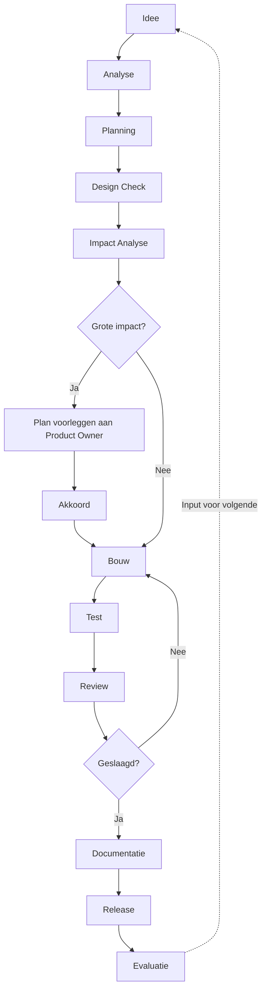

# TrainingKompas Premium Development Handbook

## Hoofdstuk 13 — Sprint Execution Handbook & Claude Development Guide

**Status:** bindend document. Vanaf dit hoofdstuk wordt geen enkele ontwikkelsprint gestart zonder aan deze werkwijze te voldoen. Dit is de enige, officiële ontwikkelstandaard voor alle toekomstige Claude-sprints binnen TrainingKompas.
**Voortbouwend op:** Hoofdstuk 1-12 in hun geheel, en de reeds bestaande, bewezen werkwijze zoals vastgelegd in `CLAUDE_SOFTWARE_ENGINEER_START.md` en Blueprint.md. Dit hoofdstuk **vervangt die documenten niet** — het formaliseert en verbindt ze aan de volledige Handbook-structuur (Hoofdstuk 1-12).
**Karakter:** productspecificatie van de ontwikkelmethodiek zelf — geen code, geen implementatie, geen architectuurwijzigingen.

---

### Leeswijzer

Dit hoofdstuk is nadrukkelijk geen nieuwe uitvinding. De kern van Deel 5 (Claude Working Method) is de reeds bestaande, in de praktijk bewezen werkwijze uit `CLAUDE_SOFTWARE_ENGINEER_START.md` — hier voor het eerst expliciet gekoppeld aan elk relevant hoofdstuk van dit Handbook, zodat "eerst analyseren, dan bouwen" concreet betekent: eerst Hoofdstuk 6 (schermen), Hoofdstuk 7 (componenten), Hoofdstuk 8-9 (AI) en Hoofdstuk 10 (navigatie) raadplegen, niet enkel de codebase. Waar dit hoofdstuk cijfers, checklists of processen introduceert die niet eerder vastlagen, is dat expliciet als nieuw gemarkeerd.

**Statusaanduiding:** 🟢 bestaande, bindende werkwijze · 🟡 gedeeltelijk bestaand, hier geformaliseerd · 🔴 nieuw in dit hoofdstuk.

---

## Deel 1 — Development Philosophy

### Waarom sprintmatig werken

TrainingKompas wordt ontwikkeld door één Product Owner en een AI Software Engineer binnen afzonderlijke, afgebakende sessies — er is geen team dat continu context deelt. Sprintmatig werken is hier geen Scrum-ceremonie voor de vorm; het is de enige manier waarop een project van deze omvang (12 hoofdstukken aan specificaties, 37 schermen, 459+ functies) behapbaar blijft binnen sessies die elk opnieuw beginnen zonder gedeeld kortetermijngeheugen. Elke sprint is daarom een zelfstandige, volledig gedocumenteerde eenheid die een volgende sessie — met een andere instantie van Claude — zonder verlies van context kan oppakken.

### Kleine iteraties

Rechtstreeks uit de bestaande werkwijze: kleine, ondubbelzinnige wijzigingen worden direct uitgevoerd; wijzigingen met grote impact krijgen eerst een kort plan. Dit is geen bureaucratische vertraging maar risicobeheersing — een kleine iteratie is makkelijk te reviewen, te testen en, indien nodig, terug te draaien; een grote, ongecontroleerde wijziging is dat niet.

### Veilig ontwikkelen

"Veilig" betekent in dit hoofdstuk letterlijk wat Deel 7 uitwerkt: nooit een breaking change zonder pad terug, altijd een rollback-mogelijkheid, data-migraties die nooit bestaande data in gevaar brengen (idempotente SQL, nullable nieuwe kolommen — bestaande, bindende praktijk). Veiligheid is de voorwaarde voor snelheid op langere termijn, niet de tegenstander ervan.

### Premium boven snelheid

Directe voortzetting van Hoofdstuk 12, Deel 1 (Quality Philosophy) en Golden Rule 1 uit de Quality Constitution: kwaliteit gaat altijd boven snelheid. Dit hoofdstuk past dat toe op het niveau van de dagelijkse ontwikkelpraktijk — een sprint die sneller "klaar" is door een van de elf Constitutions (Hoofdstuk 3-12) te schenden, is geen geslaagde sprint.

### Risicobeheersing

Elke sprint doorloopt een Impact Analyse (Deel 6) vóór bouw — niet als extra stap bovenop het werk, maar als het mechanisme waardoor risico's zichtbaar worden vóórdat ze een probleem worden, consistent met de risicoanalyse-praktijk uit Hoofdstuk 9 (AI Governance) en Hoofdstuk 12 (Quality Assurance).

### Continue verbetering

Elke sprint eindigt met een korte evaluatie (Deel 14) die niet alleen "wat is er gebouwd" vastlegt, maar ook wat de volgende sprint kan verbeteren — dezelfde discipline die de Product Audit (2 augustus 2026) zelf toepaste op het product als geheel, hier toegepast op het ontwikkelproces zelf.

### Golden Rules (Deel 1, samenvattend)

1. Eerst analyseren, dan ontwerpen, dan bouwen — nooit direct coderen (volledig uitgewerkt: Deel 5).
2. Elke wijziging is klein genoeg om volledig te kunnen overzien, of wordt eerst opgesplitst.
3. Niets wordt gebouwd zonder een pad terug (Deel 7: Rollback).
4. Documentatie is geen nazorg maar onderdeel van "Done" (Deel 8, Deel 10).
5. Premium kwaliteit is altijd belangrijker dan snelle oplevering (Hoofdstuk 12, Quality Constitution wet 1, hier herbevestigd).

---

## Deel 2 — Sprint Lifecycle



| Fase | Doel | Verantwoordelijke | Output |
|---|---|---|---|
| **Idee** | Een productbehoefte, bug, of verbetering wordt geïdentificeerd | Product Owner, of Claude signaleert proactief (bijv. architecturale overlap) | Een ruwe, nog niet uitgewerkte behoefte |
| **Analyse** | Lokaliseren van relevante bestaande code/documentatie vóór enige aanname | AI Software Engineer | Begrip van de huidige staat (Deel 5, stap 1-2) |
| **Planning** | Vertalen van de behoefte naar een Story met acceptatiecriteria | Product Owner + AI Software Engineer | Story Ready (Hoofdstuk 12, Deel 3) |
| **Design Check** | Toetsing aan Hoofdstuk 5-7 (Design System, Screens, Components) | AI Software Engineer | Design Ready (Hoofdstuk 12, Deel 3) |
| **Impact Analyse** | Volledige doorloop van Deel 6 — welke schermen/componenten/AI/navigatie/database/tests/documentatie/risico's | AI Software Engineer | Impact Analyse-document (sjabloon: Deel 15) |
| **Bouw** | Feitelijke implementatie, volgens Deel 5 (Claude Working Method) | AI Software Engineer | Werkende, lokaal gevalideerde code |
| **Test** | Doorloop van Deel 9 (Testing During Development) | AI Software Engineer | Testresultaten, inclusief volledige `logic_tests.js`-run |
| **Review** | Zelfcontrole via Deel 11 (Code Review Method) | AI Software Engineer | Geverifieerde, consistente wijziging |
| **Documentatie** | CURRENT_STATE.md/Decision Log bijgewerkt (Deel 10) | AI Software Engineer | Actuele projectdocumentatie |
| **Release** | Versiebump, SQL-migraties eerst, doorloop van de relevante Release Gate (Hoofdstuk 12, Deel 16) | AI Software Engineer + Product Owner-goedkeuring | Live, geverifieerde build |
| **Evaluatie** | Korte retrospectieve (Deel 14) | Product Owner + AI Software Engineer | Input voor de volgende sprint |

**Bindende regel:** geen enkele fase wordt overgeslagen, ook niet bij een schijnbaar triviale wijziging — de *diepte* van elke fase schaalt met de impact (Deel 6), maar elke fase wordt altijd op zijn minst kort doorlopen.


---

## Deel 3 — Sprint Planning

| Aspect | Specificatie |
|---|---|
| **Sprintdoelen** | Elke sprint heeft één primair doel, in één zin te formuleren (Product Principle P7 toegepast op sprintniveau) — een sprint met drie ongerelateerde hoofddoelen wordt gesplitst |
| **Sprintgrootte** | Realistisch voor de daadwerkelijke werkwijze: een sprint is één samenhangende sessie of een klein aantal opeenvolgende sessies, geen vaste twee-weken-cyclus (die past niet bij de solo, sessie-gedreven werkelijkheid van dit project) |
| **Prioriteiten** | Volgt de bestaande P0-P3-classificatie (Project Kickoff): P0 kritiek/eerstvolgend, P1 belangrijk, P2 waardevol later, P3 nice-to-have — consistent met de prioritering in Hoofdstuk 2, Deel 6 |
| **Story selectie** | Elke geselecteerde Story is Story Ready (Hoofdstuk 12, Deel 3); Stories met een open architecturale vraag worden niet geselecteerd vóór die vraag is beantwoord |
| **Afhankelijkheden** | Expliciet in kaart gebracht vóór sprintstart — bijv. een SQL-migratie die vóór een UI-wijziging moet draaien (bestaande, bindende volgorde) |
| **Risicoanalyse** | Elke Story met een AI-component doorloopt de risicoanalyse uit Hoofdstuk 9, Deel 1.6 (veiligheid/vertrouwen/consistentie) vóór sprintstart |

### Sprint Planning Checklist 🔴

1. Is het sprintdoel in één zin geformuleerd?
2. Is elke geselecteerde Story Story Ready?
3. Zijn alle afhankelijkheden tussen Stories geïdentificeerd?
4. Is er geen bekende architecturale overlap met bestaande functionaliteit?
5. Is voor elke AI-gerelateerde Story de risicoanalyse (Hoofdstuk 9, Deel 1.6) doorlopen?
6. Is de sprint getoetst aan de Roadmap-prioritering (P0-P3)?
7. Is er geen Story die een reeds afgewezen/uitgestelde keuze (Blueprint.md, Decision Log) zou herintroduceren zonder expliciete heroverweging?
8. Is de sprintomvang realistisch gezien de beschikbare sessietijd?

---

## Deel 4 — Story Management

### 4.1 Hiërarchie

| Niveau | Definitie | Voorbeeld |
|---|---|---|
| **Epic** | Een grote, meerdere sprints omvattende productrichting, doorgaans gekoppeld aan een Roadmap-Fase | "Fase 3 — Coach dashboard" |
| **Feature** | Een op zichzelf staand, gebruikersgericht geheel binnen een Epic | "Doelen-scherm" (Hoofdstuk 6, Scherm 7.1) |
| **Story** | Een concrete, testbare eenheid werk binnen een Feature, met acceptatiecriteria | "Als sporter wil ik een weekdoel kunnen instellen, zodat…" (Hoofdstuk 2, user story-formaat) |
| **Task** | Een technische deeltaak binnen een Story, niet zelfstandig gebruikersgericht | "SQL-migratie voor de `goals`-tabel" |
| **Bug** | Een afwijking van gespecificeerd gedrag (dit Handbook of eerdere Stories) | Zie Deel 12, Bug Management |
| **Hotfix** | Een spoedeisende, buiten de reguliere sprintplanning om uitgevoerde correctie van een Kritieke bug | Zie Deel 12 |
| **Spike** | Een tijdgebonden onderzoeksactiviteit zonder direct gebruikersgerichte output, bedoeld om een onzekerheid weg te nemen vóór Story-planning | Bijv. onderzoek naar Apple HealthKit-integratiemogelijkheden vóór een Story wordt geschreven |
| **Technische schuld** | Bewust uitgestelde, gedocumenteerde architecturale beperking (bijv. de single-file-architectuur tot na Fase 2) | Blueprint.md, "Bewust afgewezen/uitgesteld"-sectie |

### 4.2 Acceptatiecriteria

Elke Story bevat verplicht acceptatiecriteria die voldoen aan dezelfde eisen als elders in dit Handbook (Hoofdstuk 4/6/8: concreet, testbaar, herleidbaar tot een specifieke sectie). Een Story zonder toetsbare acceptatiecriteria is niet Story Ready (Hoofdstuk 12, Deel 3).

**Bindende regel:** Technische schuld wordt nooit stilzwijgend gecreëerd — elke bewuste beperking wordt expliciet gedocumenteerd (Blueprint.md-patroon) op het moment dat de beslissing wordt genomen, niet achteraf ontdekt.


---

## Deel 5 — Claude Working Method

De bestaande, bewezen werkwijze uit `CLAUDE_SOFTWARE_ENGINEER_START.md` — hier voor het eerst expliciet gekoppeld aan elk relevant Handbook-hoofdstuk. Dit is de **bindende, stapsgewijze volgorde** voor elke sprint, ongeacht omvang.

| # | Stap | Status | Handbook-koppeling |
|---|---|---|---|
| 1 | **Lokaliseer eerst** met `view`/`grep -n` — nooit blind wijzigen | 🟢 | — |
| 2 | **Onderzoek bestaande code** vóór enige aanname over hoe iets werkt | 🟢 | — |
| 3 | **Zoek eerst, dan pas uitbreiden** — nooit dupliceren wat al bestaat | 🟢 | Product Principle P9 (Hoofdstuk 3); Hoofdstuk 7 Component Library Constitution wet 2 |
| 4 | **Raadpleeg relevante context**: Blueprint.md, CURRENT_STATE.md, de betreffende Story | 🟢 | Aangevuld: raadpleeg ook het relevante Handbook-hoofdstuk (Screen/Component/AI/Navigation/Motion) vóórdat gebouwd wordt |
| 5 | **Toets aan de architectuur** — respecteer bewust uitgestelde/afgewezen keuzes (Blueprint.md, Decision Log) | 🟢 | Aangevuld: toets ook aan de elf Constitutions (Hoofdstuk 3-12) |
| 6 | **Raadpleeg de Decision Log** vóór elke wijziging die eerder een expliciete koersbeslissing raakte | 🟢 | Hoofdstuk 9, Deel 1.4 (Besluitvorming) |
| 7 | **Eerst ontwerpen, dan bouwen** — bij grote impact eerst een kort plan voorleggen en op akkoord wachten | 🟢 | Hoofdstuk 12, Deel 3 (Definition of Ready: Design Ready) |
| 8 | **Nooit direct coderen** zonder de voorgaande stappen — ook niet bij een schijnbaar eenvoudige wijziging | 🟢 | — |
| 9 | **Wijzig via `str_replace`** met exacte omliggende regels | 🟢 | — |
| 10 | **Valideer met `node --check`** | 🟢 | Hoofdstuk 12, Gate 1 (Development) |
| 11 | **Draai de volledige `logic_tests.js`-testrun** (127+ tests) | 🟢 | Hoofdstuk 12, Deel 5 (Test Strategy); Gate 2 (Sprint Complete) |
| 12 | **Playwright e2e lokaal** na oplevering | 🟢 | Hoofdstuk 12, Deel 5 |
| 13 | **Versiebump**: HTML-bestandsnaam + sw.js-cachenaam | 🟢 | Hoofdstuk 12, Quality Constitution wet 84 |
| 14 | **SQL-migraties altijd eerst**, idempotent, nieuwe kolommen nullable | 🟢 | Deel 7 van dit hoofdstuk (Safe Development Rules) |
| 15 | **Feature pas "klaar" na volledige CRUD-check en contentcheck** | 🟢 | Product Principle P10 (Hoofdstuk 3); Hoofdstuk 12, Deel 4 (Definition of Done) |
| 16 | **Signaleer architecturale overlap proactief**, vóór bouw | 🟢 | Product Principle P9; Hoofdstuk 6, Screen Design Law 18 |
| 17 | **Rapporteer altijd** wijzigingen, tests en risico's na iedere opdracht | 🟢 | Deel 10 van dit hoofdstuk (Documentation Rules) |

### Aanvullende, Handbook-specifieke stappen 🔴

Deze stappen zijn nieuw ten opzichte van de bestaande werkwijze — een directe consequentie van het feit dat er nu een volledig Handbook bestaat dat destijds nog niet geschreven was:

18. **Bij een schermwijziging:** raadpleeg eerst de exacte specificatie in Hoofdstuk 6 (Screen Specifications) — geen enkel veld (Doel, States, Accessibility, etc.) wordt genegeerd.
19. **Bij een componentwijziging:** raadpleeg eerst Hoofdstuk 7 (Component Library) — controleer of het beoogde gedrag al gespecificeerd is vóórdat iets nieuws wordt bedacht.
20. **Bij een AI-gedragswijziging:** raadpleeg Hoofdstuk 8 (AI Behaviour) én Hoofdstuk 9 (AI Governance) — inclusief de risicoanalyse en, waar relevant, de Decision Log-verplichting.
21. **Bij een navigatiewijziging:** raadpleeg Hoofdstuk 10 (Navigation Architecture) — werk de Navigation Map (Hoofdstuk 10, Deel 3.2) bij vóór release.
22. **Bij een animatie-/interactiewijziging:** raadpleeg Hoofdstuk 11 (Motion Design) — gebruik uitsluitend de gedefinieerde tokens.
23. **Vóór elke release:** doorloop de relevante Release Gate uit Hoofdstuk 12, Deel 16.

**Bindende regel:** deze drieëntwintig stappen zijn geen suggestie maar een verplichte volgorde. Een sprint die stap 9 (bouwen) uitvoert vóór stap 1-8 (analyseren/ontwerpen) zijn doorlopen, is per definitie niet conform dit Handbook, ongeacht of de uitkomst toevallig correct is.


---

## Deel 6 — Impact Analysis

Voor elke wijziging, ongeacht schijnbare omvang, wordt onderstaande tabel doorlopen — dit is de operationele vertaling van stap 16 uit Deel 5 (proactief signaleren vóór bouw).

| Vraag | Waar te controleren |
|---|---|
| **Welke schermen worden geraakt?** | Hoofdstuk 6 (Screen Specifications), Hoofdstuk 10 Deel 3.2 (Navigation Map) |
| **Welke componenten worden geraakt?** | Hoofdstuk 7 (Component Library), Reusable Component Matrix (Hoofdstuk 7) |
| **Welke AI-functionaliteit wordt geraakt?** | Hoofdstuk 8 (AI Behaviour), Hoofdstuk 9 (AI Governance) — inclusief risicoanalyse (Hoofdstuk 9, Deel 1.6) |
| **Welke navigatie wordt geraakt?** | Hoofdstuk 10 (Navigation Architecture) — Parent/Child-relaties, back-stack, deep links |
| **Welke database wordt geraakt?** | Bestaande schema-documentatie (Blueprint.md); vereist een migratie? Idempotent? Nullable nieuwe kolommen? |
| **Welke testen zijn nodig?** | Hoofdstuk 12, Deel 5 (Test Strategy) — welke van de dertien testtypen zijn relevant |
| **Welke documentatie moet bijgewerkt worden?** | Deel 10 van dit hoofdstuk — CURRENT_STATE.md, Decision Log, eventueel een Handbook-hoofdstuk zelf |
| **Welke risico's zijn er?** | Hoofdstuk 9, Deel 1.6 (voor AI); algemene risico-inschatting voor overige wijzigingen (kans op regressie, architecturale overlap) |

**Bindende regel:** een wijziging waarvan het antwoord op alle acht vragen "geen impact" is, is zeldzaam — bij twijfel wordt de impact als aanwezig behandeld, niet als afwezig aangenomen.

---

## Deel 7 — Safe Development Rules

| Regel | Specificatie |
|---|---|
| **Nooit breaking changes** | Elke wijziging aan een bestaande interface (component-props, data-structuur, API-contract) blijft achterwaarts compatibel, of wordt expliciet als majeure wijziging met migratiepad behandeld |
| **Feature Flags** 🔴 | Voor grote, risicovolle features (hoog op alle drie de risico-assen, Hoofdstuk 9 Deel 1.6): overweeg een simpele aan/uit-schakeling zodat een probleem in productie zonder volledige rollback opgelost kan worden — nieuw geïntroduceerd mechanisme, nog niet eerder gebruikt in het project, toe te passen waar de risicoanalyse dat rechtvaardigt |
| **Backward Compatibility** | Elke SQL-migratie is idempotent (`ON CONFLICT DO UPDATE`, `IF NOT EXISTS`); nieuwe kolommen zijn altijd nullable (bestaande, bindende praktijk) |
| **Rollback** | Elke wijziging is herleidbaar naar een specifieke, eerdere versie (bestaande versiebump-praktijk); een AI-gedragswijziging volgt de Rollback-procedure uit Hoofdstuk 9, Deel 10.4 |
| **Migraties** | SQL-migraties draaien altijd vóór de bijbehorende app-bestanden geüpload worden (bestaande, bindende volgorde) |
| **Data Safety** | Geen enkele migratie of wijziging brengt bestaande gebruikersdata in gevaar — dit heeft voorrang boven elke andere overweging (Product Constitution VIII: nooit een stille fout) |
| **Offline veiligheid** | Elke wijziging aan de trainingsflow wordt getest onder vliegtuigmodus vóór release (Hoofdstuk 12, Deel 5: Offline Tests) |

**Bindende regel:** deze zeven regels zijn nooit onderhandelbaar onder tijdsdruk — een "snelle" wijziging die Data Safety of Backward Compatibility zou schenden, wordt niet uitgevoerd, ongeacht de urgentie van de onderliggende behoefte (die urgentie wordt in plaats daarvan geadresseerd via een zorgvuldig, wel-compatibel migratiepad).


---

## Deel 8 — Definition of Sprint Done

Directe toepassing van Hoofdstuk 12, Deel 4 (Definition of Done) op sprintniveau — een sprint is pas Done wanneer elke geraakte Story voldoet aan alle acht categorieën, samengevat hier:

| Categorie | Sprint-niveau eis |
|---|---|
| **Code** | Geen syntaxfout (`node --check`), geen bekende regressie |
| **UI** | Elk element herleidbaar tot een Design Token (Hoofdstuk 5); Premium Design Checklist doorlopen voor geraakte componenten |
| **UX** | Premium UX Checklist (Hoofdstuk 4, Deel 11) doorlopen voor geraakte flows |
| **AI** | Alle vijf AI-testtypen (Hoofdstuk 9, Deel 4.2) geslaagd voor geraakte AI-functionaliteit |
| **Motion** | Motion QA Checklist (Hoofdstuk 11, Deel 16) doorlopen voor nieuwe animaties |
| **Performance** | Relevante Performance Standards (Hoofdstuk 12, Deel 7) gemeten en gehaald |
| **Accessibility** | Relevante Accessibility-checklists (Hoofdstuk 3/4/5/10/11) doorlopen |
| **Documentatie** | CURRENT_STATE.md/Decision Log bijgewerkt (Deel 10 van dit hoofdstuk) |
| **Tests** | Volledige `logic_tests.js`-run zonder regressie; relevante aanvullende testtypen (Deel 9) uitgevoerd |
| **Play Store Readiness** | Uitsluitend relevant bij een sprint die richting een Store-release gaat — dan volledige doorloop van Hoofdstuk 12, Deel 11 |

**Bindende regel:** een sprint met één onvolledige categorie is niet Done — de sprint wordt verlengd of de betreffende Story wordt teruggezet naar de volgende sprint, nooit stilzwijgend als "goed genoeg" opgeleverd.

---

## Deel 9 — Testing During Development

| Vraag | Antwoord |
|---|---|
| **Wanneer testen?** | Continu tijdens de bouwfase (na elke betekenisvolle wijziging), niet uitsluitend aan het einde |
| **Hoe vaak testen?** | De volledige `logic_tests.js`-suite draait bij elke wijziging (bestaand, bindend); aanvullende testtypen (Hoofdstuk 12, Deel 5) naar relevantie |
| **Smoke Tests** | Direct na elke lokale wijziging — de kernflow (inloggen, trainen loggen, AI-advies) blijft functioneel |
| **Regression** | Elke wijziging draait de volledige bestaande testsuite, niet enkel tests voor het gewijzigde onderdeel |
| **Manual Testing** | Voor elke UI-/UX-wijziging: visuele en interactieve verificatie op minimaal één representatief toestel |
| **Edge Cases** | Voor elke AI-wijziging: de vaste edge-casetestset (Hoofdstuk 9, Deel 5.11); voor overige wijzigingen: de grenswaarden die de Story expliciet benoemt |
| **Exploratory Testing** | Door de Product Owner, aan het einde van de sprint, op de volledige, geïntegreerde build (Hoofdstuk 12, Deel 5) |
| **AI Testing** | Volledige doorloop van Hoofdstuk 9, Deel 4.2 (functioneel, explainability, safety, persoonlijkheid, sportspecifiek) bij elke AI-wijziging, ongeacht schijnbare omvang |

**Bindende regel:** testen is geen fase die ná bouwen komt binnen een sprint — het is doorlopend geïntegreerd, consistent met de bestaande praktijk (`node --check` en `logic_tests.js` bij elke wijziging, niet enkel aan het einde van een sprint).


---

## Deel 10 — Documentation Rules

| Document | Wanneer bijgewerkt | Door wie |
|---|---|---|
| **CURRENT_STATE.md** | Na elke afgeronde Story en elke release (bestaande, bindende praktijk) | AI Software Engineer |
| **Decision Log** | Bij elke wijziging die een grote koersbeslissing raakt, of een Constitution-afwijking (Hoofdstuk 3-12) | AI Software Engineer, met Product Owner-akkoord |
| **Blueprint-updates** | Bij elke architecturale wijziging (nieuwe tabel, nieuwe technische keuze) | AI Software Engineer |
| **Versiebeheer** | Bij elke release: HTML-bestandsnaam + sw.js-cachenaam + `versionCode`/`versionName` (Hoofdstuk 12, Deel 11) | AI Software Engineer |
| **Architectuurdocumentatie** | Bij elke wijziging die een nieuw patroon introduceert (bijv. een nieuwe componentcategorie, Hoofdstuk 7) | AI Software Engineer, met verwijzing naar het relevante Handbook-hoofdstuk |
| **Sprintverslagen** 🔴 | Aan het einde van elke sprint — nieuw geformaliseerd, sjabloon in Deel 15 | AI Software Engineer |

**Documentatie-principe:** consistent met Hoofdstuk 9, Deel 10.5 (Documentatieplicht) — geen enkele wijziging wordt stilzwijgend doorgevoerd zonder op zijn minst de eerste, lichtste vorm van documentatie (een CURRENT_STATE.md-vermelding).

---

## Deel 11 — Code Review Method

Hoe Claude zichzelf controleert vóór een wijziging als afgerond geldt — tien controlegebieden, elk gekoppeld aan het relevante Handbook-hoofdstuk.

| Controlegebied | Vraag | Bron |
|---|---|---|
| **Duplicatie** | Bestaat deze functionaliteit al ergens anders in de codebase? | Product Principle P9 |
| **Complexiteit** | Is dit de eenvoudigste oplossing die de Story-eisen vervult? | Product Principle P6 |
| **Architectuur** | Respecteert dit de bestaande, bewust gekozen architectuur (single-file, geen premature migratie)? | Blueprint.md |
| **Performance** | Voldoet dit aan de relevante Performance Standards (Hoofdstuk 12, Deel 7)? | Hoofdstuk 12 |
| **Security** | Is RLS correct toegepast bij een nieuwe tabel? Is er geen client-side sleutelblootstelling? | Hoofdstuk 12, Deel 10 |
| **Accessibility** | Voldoet dit aan de relevante accessibility-eisen (Hoofdstuk 3/4/5/10/11)? | — |
| **Motion** | Gebruikt elke animatie een gedefinieerd token (Hoofdstuk 11, Deel 3)? | Hoofdstuk 11 |
| **UX** | Voldoet dit aan de relevante UX Golden Rules (Hoofdstuk 3/4)? | — |
| **Naming** | Is naamgeving consistent met bestaande conventies in de codebase? | — |
| **Consistency** | Gedraagt dit component/scherm zich consistent met vergelijkbare, bestaande elementen? | Hoofdstuk 3, UI42/UI43 |

**Bindende regel:** deze zelfcontrole gebeurt vóór het rapporteren van een wijziging als afgerond (stap 17, Deel 5) — nooit als losse, optionele nazorg.


---

## Deel 12 — Bug Management

Volledig consistent met de classificatie uit Hoofdstuk 9, Deel 13.2 en Hoofdstuk 12, Deel 12 — hier toegepast op reguliere (niet enkel AI-) bugs binnen de sprintwerkwijze.

| Aspect | Specificatie |
|---|---|
| **Bugclassificatie** | Kritiek (blokkeert kernflow of schendt een veiligheids-/Constitution-regel) / Hoog (functioneel defect zonder kernflow-blokkade) / Middel (UX/UI-afwijking) / Laag (cosmetisch) |
| **Prioriteit** | Kritiek: onmiddellijk, onderbreekt de huidige sprint · Hoog: binnen de huidige sprint · Middel: ingepland voor een volgende sprint · Laag: verzameld, periodiek beoordeeld |
| **Hotfix** | Een Kritieke bug in productie triggert een Hotfix — een sprint buiten de reguliere planning om, die dezelfde volledige Claude Working Method (Deel 5) doorloopt, uitsluitend versneld in doorlooptijd, nooit versneld in zorgvuldigheid |
| **Root Cause Analyse** | Voor elke Kritieke/Hoge bug: niet enkel het symptoom oplossen, maar de onderliggende oorzaak vaststellen (vergelijkbaar met de DEC-006/DEC-009-precedenten: een bug leidde tot een bredere audit van vergelijkbare patronen) |
| **Preventie** | Elke opgeloste bug krijgt een permanente regressietest (`logic_tests.js`) die herhaling voorkomt |
| **Regressiepreventie** | De volledige testsuite draait bij elke wijziging, specifiek om te voorkomen dat een eerder opgeloste bug terugkeert |

---

## Deel 13 — Sprint Metrics

| Metric | Wat het meet | Gebruik |
|---|---|---|
| **Velocity** | Hoeveelheid afgeronde Stories per sprint | Diagnostisch — helpt toekomstige sprintplanning realistisch inschatten, nooit een doel op zich (consistent met Hoofdstuk 12, Deel 17: metrics zijn diagnostisch) |
| **Stories** | Aantal gestart/afgerond/teruggezet | Trend over meerdere sprints |
| **Bugs** | Aantal per classificatie (Deel 12) | Kwaliteitsindicator — een stijgend aantal Kritieke bugs signaleert een structureel probleem |
| **Regressies** | Aantal eerder opgeloste bugs die zijn teruggekeerd | Zou structureel 0 moeten zijn — elke regressie is een signaal dat de regressietestset (Deel 12) onvolledig was |
| **Coverage** | Mate waarin `logic_tests.js` de daadwerkelijke functionaliteit dekt | Gevolgd als trend, geen absolute norm gezien de zelfstandige-scenario-aanpak (geen traditionele coverage-tooling) |
| **Performance** | Zie Hoofdstuk 12, Deel 7/17 | — |
| **UX-score** | UX Scorecard-resultaten (Hoofdstuk 4, Deel 12) op gewijzigde schermen | Per sprint gevolgd voor schermen die worden aangepast |
| **AI-score** | Elf Evaluation-criteria (Hoofdstuk 9, Deel 5) op gewijzigde AI-functionaliteit | Per sprint gevolgd |
| **Kwaliteit** | Samengestelde indicator: Definition of Sprint Done (Deel 8) volledig gehaald ja/nee | Binaire, harde norm — geen "grotendeels Done" |
| **Technische schuld** | Aantal openstaande, gedocumenteerde technische-schuld-items (Deel 4.1) | Gevolgd om te voorkomen dat schuld zich onopgemerkt opstapelt |

**Bindende regel:** geen enkele metric in dit Deel wordt ooit gebruikt om een Constitution-wet (Hoofdstuk 3-12) te rechtvaardigen te schenden — een hoge velocity die ten koste gaat van Definition of Sprint Done is geen succes, maar een signaal om de sprintplanning te herzien.


---

## Deel 14 — Continuous Improvement

Na elke sprint, een korte, altijd uitgevoerde reflectie — geen zware ceremonie (governance-niveau B), wel een vast, herhaalbaar patroon.

| Vraag | Doel |
|---|---|
| **Wat ging goed?** | Patronen herkennen die herhaald moeten worden |
| **Wat kan beter?** | Concrete, actiegerichte verbeterpunten voor de volgende sprint — nooit vage constateringen zonder vervolg |
| **Nieuwe inzichten** | Alles wat de sprint heeft opgeleverd dat niet vooraf voorzien was (vergelijkbaar met hoe DEC-006/DEC-009 voortkwamen uit tijdens-het-werk-ontdekte inzichten) |
| **Architectuur** | Is er een architecturale beperking zichtbaar geworden die om een Blueprint-update vraagt? |
| **UX** | Is er een UX-patroon ontdekt dat een Handbook-herziening rechtvaardigt (Hoofdstuk 3/4)? |
| **AI** | Is er AI-gedrag geconstateerd dat een Hoofdstuk 8/9-herziening rechtvaardigt? |
| **Performance** | Is er een performance-inzicht dat de normen uit Hoofdstuk 12, Deel 7 zou moeten bijstellen? |
| **Roadmap** | Verandert dit de prioritering van toekomstige Stories (Roadmap.md)? |

**Bindende regel:** elke sprint eindigt met deze reflectie, ook een sprint die volledig volgens plan verliep — "niets te verbeteren" is een zeldzame, expliciet te beargumenteren uitkomst, geen standaard-antwoord.

---

## Deel 15 — Sprint Templates

Acht kant-en-klare sjablonen, direct bruikbaar bij elke sprint.

### 15.1 Sprintplanning-sjabloon

```
SPRINT: [naam/datum]
DOEL (één zin): 
GESELECTEERDE STORIES:
  - [Story 1] — Prioriteit: [P0-P3] — Story Ready: [ja/nee]
  - [Story 2] — ...
AFHANKELIJKHEDEN: 
RISICOANALYSE (indien AI-gerelateerd):
  - Veiligheidsrisico: [laag/middel/hoog]
  - Vertrouwensrisico: [laag/middel/hoog]
  - Consistentierisico: [laag/middel/hoog]
PLANNING CHECKLIST DOORLOPEN: [ja/nee]
```

### 15.2 Sprint Review-sjabloon

```
SPRINT: [naam/datum]
AFGERONDE STORIES: 
NIET AFGERONDE STORIES (en waarom):
DEFINITION OF SPRINT DONE:
  - Code: [ja/nee]  UI: [ja/nee]  UX: [ja/nee]  AI: [ja/nee]
  - Motion: [ja/nee]  Performance: [ja/nee]  Accessibility: [ja/nee]
  - Documentatie: [ja/nee]  Tests: [ja/nee]
DEMO/VOORBEELDEN: 
```

### 15.3 Sprint Retrospective-sjabloon

```
SPRINT: [naam/datum]
WAT GING GOED: 
WAT KAN BETER: 
NIEUWE INZICHTEN: 
ACTIEPUNTEN VOOR VOLGENDE SPRINT: 
```

### 15.4 Impact Analyse-sjabloon

```
WIJZIGING: [korte omschrijving]
GERAAKTE SCHERMEN (Hoofdstuk 6): 
GERAAKTE COMPONENTEN (Hoofdstuk 7): 
GERAAKTE AI-FUNCTIONALITEIT (Hoofdstuk 8-9): 
GERAAKTE NAVIGATIE (Hoofdstuk 10): 
GERAAKTE DATABASE: 
BENODIGDE TESTEN (Hoofdstuk 12, Deel 5): 
BENODIGDE DOCUMENTATIE-UPDATES: 
RISICO'S: 
```

### 15.5 Bug Report-sjabloon

```
BUG: [korte titel]
CLASSIFICATIE: [Kritiek/Hoog/Middel/Laag]
GECONSTATEERD OP: [scherm/component/AI-functie]
STAPPEN OM TE REPRODUCEREN: 
VERWACHT GEDRAG (verwijzing naar Handbook-sectie): 
DAADWERKELIJK GEDRAG: 
ROOT CAUSE (indien vastgesteld): 
OPLOSSING: 
REGRESSIETEST TOEGEVOEGD: [ja/nee]
```

### 15.6 Feature Proposal-sjabloon

```
FEATURE: [naam]
PERSONA-BEHOEFTE (Hoofdstuk 2): 
ROADMAP-KOPPELING: 
GETOETST AAN PRODUCT CONSTITUTION (Hoofdstuk 3): [ja/nee, met toelichting]
VOORGESTELDE SCHERMEN (indien nieuw): 
VOORGESTELDE COMPONENTEN (indien nieuw, na controle op hergebruik): 
AI-COMPONENT (indien van toepassing) — RISICOANALYSE: 
GESCHATTE IMPACT (Deel 6): 
```

### 15.7 Architectuur Review-sjabloon

```
VOORSTEL: [korte omschrijving]
HUIDIGE ARCHITECTUUR (Blueprint.md): 
VOORGESTELDE WIJZIGING: 
WAAROM UITBREIDING NIET VOLSTAAT (Product Principle P9): 
IMPACT OP BESTAANDE FUNCTIONALITEIT: 
MIGRATIEPAD: 
DECISION LOG-VERMELDING VEREIST: [ja/nee]
```

### 15.8 Release Notes-sjabloon

```
VERSIE: [versienummer]
DATUM: 
WAT IS ER NIEUW (gebruikersgericht, geen technisch jargon):
  - [Punt 1]
  - [Punt 2]
OPGELOSTE PROBLEMEN: 
BEKENDE BEPERKINGEN: 
```


---

## Deel 16 — Claude Checklist

Driehonderd controlepunten, doorlopend genummerd. Claude doorloopt deze checklist vóór iedere sprint — de diepte van doorloop schaalt met de impact (Deel 6), maar geen enkele sectie wordt overgeslagen.

### Analyse (1-25)
1. Is de Story/het idee gelokaliseerd in de bestaande codebase met `view`/`grep -n` vóór enige aanname?
2. Is bestaande, vergelijkbare functionaliteit onderzocht vóór het plannen van iets nieuws?
3. Is Blueprint.md geraadpleegd voor relevante architecturale context?
4. Is CURRENT_STATE.md geraadpleegd voor de actuele projectstatus?
5. Is de Decision Log geraadpleegd voor eerdere, relevante koersbeslissingen?
6. Is de Roadmap geraadpleegd voor de prioriteringscontext?
7. Is de Product Audit geraadpleegd indien de wijziging een eerder gesignaleerde bevinding raakt?
8. Is vastgesteld of dit een kleine, ondubbelzinnige wijziging is of een wijziging met grote impact?
9. Is bij grote impact een kort plan opgesteld vóór verder te gaan?
10. Is gecontroleerd of deze wijziging een eerder bewust uitgestelde/afgewezen keuze zou herintroduceren?
11. Is het relevante Handbook-hoofdstuk (6/7/8-9/10/11) geïdentificeerd en geraadpleegd?
12. Is gecontroleerd of de Story Story Ready is (Hoofdstuk 12, Deel 3)?
13. Zijn alle open vragen aan de Product Owner geïdentificeerd vóór bouw?
14. Is de persona-behoefte (Hoofdstuk 2) achter deze wijziging expliciet benoemd?
15. Is gecontroleerd of dit een Epic/Feature/Story/Task/Bug/Hotfix/Spike is (Deel 4.1) en behandeld conform dat type?
16. Is bij een Bug de classificatie (Kritiek/Hoog/Middel/Laag) vastgesteld?
17. Is bij een Hotfix bevestigd dat dit daadwerkelijk een Kritieke bug betreft?
18. Is bij een Spike een tijdgebonden onderzoeksvraag expliciet geformuleerd?
19. Is bevestigd dat deze wijziging geen ongedocumenteerde technische schuld zou creëren?
20. Is de sportcontext (indien relevant) correct begrepen vóór AI-gerelateerde analyse?
21. Is de doelgroep (primair/secundair/tertiair, Hoofdstuk 2) van deze wijziging duidelijk?
22. Is bevestigd welke van de elf Constitutions (Hoofdstuk 3-12) mogelijk geraakt worden?
23. Is er een vergelijkbare, eerder opgeloste situatie in de projectgeschiedenis (Decision Log) die relevant is?
24. Is de analysefase afgerond vóór enige ontwerp- of bouwactiviteit gestart is?
25. Is deze analyse, indien substantieel, kort samengevat voor toekomstige referentie?

### Design Check (26-50)
26. Is de wijziging getoetst aan de Product Constitution (Hoofdstuk 3)?
27. Is de wijziging getoetst aan de UX Constitution (Hoofdstuk 4)?
28. Is de wijziging getoetst aan de Design Constitution (Hoofdstuk 5)?
29. Bij een schermwijziging: is de volledige Hoofdstuk 6-specificatie (24 velden) geraadpleegd?
30. Bij een componentwijziging: is de volledige Hoofdstuk 7-specificatie geraadpleegd?
31. Is gecontroleerd of een bestaand component/scherm hergebruikt kan worden in plaats van iets nieuws te bouwen?
32. Is elke kleur herleidbaar tot een Design Token (Hoofdstuk 5, Deel 15)?
33. Is elke spacing-waarde herleidbaar tot een Design Token?
34. Is elke typografiestijl herleidbaar tot een Design Token?
35. Is de informatiehiërarchie van het scherm getoetst aan Hoofdstuk 3?
36. Is er precies één primaire actie per scherm/dialog?
37. Is elke destructieve actie voorzien van een Confirmation Dialog-ontwerp?
38. Is Empty/Loading/Error/Success-state voor elk nieuw element ontworpen?
39. Is dark mode als volwaardig ontwerp meegenomen, niet als latere toevoeging?
40. Is de merknaam "Trainingskompas" correct en onverkort aanwezig waar relevant?
41. Is toegankelijkheid (contrast, touch-targets, screenreader-volgorde) vanaf het ontwerp meegenomen?
42. Is het ontwerp getoetst aan de kwetsbaarste relevante persona?
43. Is Design Ready (Hoofdstuk 12, Deel 3) bevestigd vóór bouw?
44. Is er geen architecturale overlap met een bestaand scherm/component geconstateerd zonder documentatie?
45. Is de Reusable Component Matrix (Hoofdstuk 7) geraadpleegd voor hergebruik-mogelijkheden?
46. Is de Navigation Map (Hoofdstuk 10, Deel 3.2) geraadpleegd bij een schermtoevoeging?
47. Is de Information Architecture (Hoofdstuk 10, Deel 1) geraadpleegd voor domein-toewijzing?
48. Is bij twijfel over een ontwerpkeuze de toetsvragenlijst (Hoofdstuk 1, sectie 1.13) toegepast?
49. Is het ontwerp visueel consistent met vergelijkbare, bestaande schermen?
50. Is Design Check afgerond en gedocumenteerd vóór Impact Analyse start?


### Impact Analyse (51-75)
51. Zijn alle geraakte schermen geïdentificeerd (Hoofdstuk 6)?
52. Zijn alle geraakte componenten geïdentificeerd (Hoofdstuk 7)?
53. Is geraakte AI-functionaliteit geïdentificeerd (Hoofdstuk 8-9)?
54. Is geraakte navigatie geïdentificeerd (Hoofdstuk 10)?
55. Is geraakte database-structuur geïdentificeerd?
56. Zijn benodigde tests geïdentificeerd (Hoofdstuk 12, Deel 5)?
57. Zijn benodigde documentatie-updates geïdentificeerd?
58. Zijn risico's expliciet benoemd, niet enkel impliciet aangenomen?
59. Is bij een AI-wijziging de risicoanalyse (Hoofdstuk 9, Deel 1.6) volledig doorlopen?
60. Is het Impact Analyse-sjabloon (Deel 15.4) ingevuld?
61. Is bevestigd dat geen enkele wijziging een breaking change introduceert zonder migratiepad?
62. Is de impact op offline-gedrag (Hoofdstuk 4/10) beoordeeld?
63. Is de impact op bestaande gebruikersdata beoordeeld (Data Safety, Deel 7)?
64. Is de impact op performance-normen (Hoofdstuk 12, Deel 7) ingeschat?
65. Is de impact op toegankelijkheid ingeschat?
66. Is de impact op de coach-persoonlijkheid (Hoofdstuk 8, Deel 15) beoordeeld, indien AI-gerelateerd?
67. Is de impact op bestaande Play Store-metadata beoordeeld, indien relevant?
68. Is bevestigd dat geen enkele wijziging een van de elf Constitutions doorbreekt zonder Decision Log-plan?
69. Is de omvang van de wijziging (klein/groot) definitief vastgesteld op basis van deze analyse?
70. Is bij een grote wijziging het plan voorgelegd aan de Product Owner?
71. Is akkoord van de Product Owner verkregen vóór bouw bij grote impact?
72. Is de Impact Analyse zelf bewaard voor toekomstige referentie?
73. Is gecontroleerd of deze wijziging afhankelijk is van een andere, nog niet afgeronde wijziging?
74. Is de volgorde van uitvoering (bijv. SQL-migratie vóór UI) expliciet vastgesteld?
75. Is Impact Analyse volledig afgerond vóór Bouw start?

### Bouw (76-100)
76. Wordt gewijzigd via `str_replace` met exacte omliggende regels?
77. Is vóór elke `str_replace` het bestand opnieuw bekeken (niet vertrouwd op verouderde context)?
78. Wordt geen enkele bestaande, werkende functionaliteit verwijderd zonder voorafgaande analyse?
79. Is de wijziging zo klein mogelijk gehouden, gegeven het doel?
80. Is bevestigd dat geen code gedupliceerd wordt die al elders bestaat?
81. Volgt de wijziging de bestaande architectuur (single-file, geen premature migratie)?
82. Is naamgeving consistent met bestaande conventies?
83. Is elke nieuwe SQL-migratie idempotent (`ON CONFLICT DO UPDATE`, `IF NOT EXISTS`)?
84. Zijn nieuwe kolommen nullable?
85. Draait de SQL-migratie vóór de app-bestanden geüpload worden?
86. Is elke nieuwe component gebouwd conform zijn Hoofdstuk 7-specificatie?
87. Is elk nieuw scherm gebouwd conform zijn Hoofdstuk 6-specificatie?
88. Is elke nieuwe animatie gebouwd met een gedefinieerd token (Hoofdstuk 11, Deel 3)?
89. Is elke nieuwe AI-output voorzien van de verplichte tweelagen-uitleg (Hoofdstuk 8, Deel 3)?
90. Is RLS toegepast op elke nieuwe tabel vóór productiedata?
91. Is elke nieuwe permissie-aanvraag getoetst aan Hoofdstuk 10, Deel 5 (wanneer wel/niet vragen)?
92. Is bevestigd dat geen API-sleutel of gevoelig geheim client-side is blootgesteld?
93. Is elke nieuwe destructieve actie voorzien van een Confirmation Dialog?
94. Is elke nieuwe lege staat voorzien van uitleg, motivatie en een concrete volgende stap?
95. Is elke nieuwe loading-staat voorzien van skeleton-loading of een passend token?
96. Is dubbel-klik-bescherming toegepast op elke nieuwe opslaan-actie?
97. Is offline-gedrag correct geïmplementeerd voor elke nieuwe trainingsgerelateerde functie?
98. Is de content-check (Product Principle P10) toegepast op elke nieuwe gegenereerde structuur?
99. Is elke nieuwe CRUD-entiteit volledig (Create/Read/Update/Delete)?
100. Is de Bouw-fase afgerond met een werkende, lokaal gevalideerde wijziging?


### Test (101-130)
101. Is `node --check` uitgevoerd en geslaagd?
102. Is de volledige `logic_tests.js`-suite (127+ tests) uitgevoerd zonder regressie?
103. Is Playwright e2e lokaal uitgevoerd na oplevering?
104. Is een Smoke Test uitgevoerd direct na de wijziging?
105. Is de kernflow (inloggen, trainen, AI-advies) bevestigd functioneel?
106. Is bij een AI-wijziging de vaste edge-casetestset (Hoofdstuk 9, Deel 5.11) doorlopen?
107. Is bij een AI-wijziging elk van de vijf testtypen (Hoofdstuk 9, Deel 4.2) uitgevoerd?
108. Is bij een UI-wijziging een handmatige, visuele controle uitgevoerd?
109. Is getest op zowel light als dark mode?
110. Is getest op zowel een klein als een groot schermformaat?
111. Is getest met een schermlezer actief, indien de wijziging navigatie/content raakt?
112. Is getest met `prefers-reduced-motion` actief, indien de wijziging animatie raakt?
113. Is getest onder vliegtuigmodus, indien de wijziging de trainingsflow raakt?
114. Is getest met een gesimuleerd trage/instabiele verbinding, indien relevant?
115. Is elke nieuwe grenswaarde (edge case) die de Story benoemt, expliciet getest?
116. Is regressie op eerder opgeloste, vergelijkbare bugs uitgesloten?
117. Is de wijziging getest vanuit het perspectief van de kwetsbaarste relevante persona?
118. Is bij een nieuwe component een geïsoleerd testscenario tegen de Hoofdstuk 7-specificatie uitgevoerd?
119. Is bij een nieuw scherm de Screen Review Checklist (Hoofdstuk 6) doorlopen?
120. Is bij een nieuwe animatie de relevante sectie van de Motion QA Checklist (Hoofdstuk 11, Deel 16) doorlopen?
121. Is bij een navigatiewijziging de relevante sectie van de Navigation Review Checklist (Hoofdstuk 10, Deel 13) doorlopen?
122. Is performance gemeten (niet aangenomen) voor elke wijziging die de trainingsflow of laadtijd raakt?
123. Is er 0 nieuwe console-fout of waarschuwing geconstateerd?
124. Is exploratory testing door de Product Owner uitgevoerd bij een substantiële wijziging?
125. Is User Acceptance Testing gepland/uitgevoerd voor een feature gericht op de doelgroep?
126. Is er een testresultaat gedocumenteerd, niet enkel "getest" zonder specificatie?
127. Is bij een mislukte test de wijziging teruggedraaid of gecorrigeerd vóór verder te gaan?
128. Is bevestigd dat alle testtypen die de Impact Analyse als relevant identificeerde, daadwerkelijk zijn uitgevoerd?
129. Is de teststrategie (Hoofdstuk 12, Deel 5) volledig gevolgd voor deze wijziging?
130. Is Test-fase afgerond met een aantoonbaar geslaagd resultaat vóór Review start?

### Review (131-155)
131. Is gecontroleerd op duplicatie van bestaande functionaliteit?
132. Is gecontroleerd of dit de eenvoudigste oplossing is die de eisen vervult?
133. Is gecontroleerd of de architectuur gerespecteerd is?
134. Is performance opnieuw beoordeeld na de daadwerkelijke implementatie?
135. Is security opnieuw beoordeeld (RLS, geen sleutelblootstelling)?
136. Is accessibility opnieuw beoordeeld op de daadwerkelijke implementatie?
137. Is motion opnieuw beoordeeld op tokengebruik?
138. Is UX opnieuw beoordeeld tegen de relevante Golden Rules?
139. Is naamgeving consistent gecontroleerd?
140. Is consistentie met vergelijkbare, bestaande elementen gecontroleerd?
141. Is de wijziging getoetst aan alle relevante Constitutions (Hoofdstuk 3-12) als laatste stap?
142. Is er 0 onopgeloste schending van een Golden Rule of Constitution-wet?
143. Is, indien een schending onvermijdelijk was, deze vastgelegd in de Decision Log?
144. Is de wijziging leesbaar en onderhoudbaar voor een toekomstige sessie zonder huidige context?
145. Is elke aanname die tijdens de bouw is gemaakt, expliciet gedocumenteerd?
146. Is de wijziging gecontroleerd op ongewenste neveneffecten op niet-direct-geraakte functionaliteit?
147. Is bevestigd dat de wijziging daadwerkelijk het oorspronkelijke Story-doel vervult?
148. Is de wijziging vanuit het perspectief van Hoofdstuk 1 (Productvisie) getoetst — past dit bij wie TrainingKompas is?
149. Is de wijziging vanuit het perspectief van Hoofdstuk 2 (Persona's) getoetst?
150. Is er een laatste, volledige doorloop van de Definition of Sprint Done (Deel 8) uitgevoerd?
151. Is bevestigd dat geen technische schuld ongedocumenteerd is achtergebleven?
152. Is de Code Review Method (Deel 11) volledig doorlopen, niet gedeeltelijk?
153. Is de wijziging, waar mogelijk, door een tweede blik gereviewd (ook al is dat de Product Owner zelf)?
154. Is Review afgerond met een expliciet "akkoord" vóór Documentatie start?
155. Is elke bevinding uit Review verwerkt vóórdat de wijziging als afgerond geldt?


### Documentatie (156-175)
156. Is CURRENT_STATE.md bijgewerkt?
157. Is de Decision Log bijgewerkt, indien een grote koersbeslissing of Constitution-afwijking van toepassing is?
158. Is Blueprint.md bijgewerkt, indien een architecturale wijziging is doorgevoerd?
159. Is de versiebump uitgevoerd (HTML-bestandsnaam + sw.js-cachenaam)?
160. Is, indien relevant, een Handbook-hoofdstuk zelf bijgewerkt (bijv. Navigation Map, Reusable Component Matrix)?
161. Is een sprintverslag opgesteld (Deel 15.2-sjabloon)?
162. Is elke aanname die tijdens de sprint is gemaakt, vastgelegd?
163. Is elke technische-schuld-beslissing expliciet gedocumenteerd?
164. Zijn release notes opgesteld, indien de wijziging naar een Store-release gaat (Deel 15.8-sjabloon)?
165. Is de documentatie geschreven zodat een toekomstige sessie zonder huidige context deze kan volgen?
166. Is bevestigd dat de documentatie feitelijk overeenkomt met de daadwerkelijke implementatie (geen "aspirational" documentatie)?
167. Is documentatie bijgewerkt vóórdat de wijziging als Done geldt, niet als losse nazorg erna?
168. Is er geen tegenstrijdigheid tussen deze documentatie-update en een bestaand Handbook-hoofdstuk?
169. Is de AI-gedragsdocumentatie (Hoofdstuk 9, Deel 1.5) bijgewerkt bij een AI-contextwijziging?
170. Is het audit-trail-principe (Hoofdstuk 9, Deel 11.7) gevolgd voor AI-gedragswijzigingen?
171. Is de documentatie beknopt maar volledig — geen overbodige uitweiding, geen weggelaten kernfeit?
172. Is bevestigd dat de Product Owner de belangrijkste documentatiewijzigingen heeft gezien?
173. Is er een archief/geschiedenis van eerdere versies behouden voor toekomstige referentie?
174. Is Documentatie afgerond vóór Release start?
175. Is elke Documentation Done-eis (Hoofdstuk 12, Deel 4) vervuld?

### Release (176-200)
176. Is de relevante Release Gate (Hoofdstuk 12, Deel 16) geïdentificeerd voor deze wijziging?
177. Is Gate 1 (Development) doorlopen — `node --check` slaagt?
178. Is Gate 2 (Sprint Complete) doorlopen — volledige testsuite slaagt?
179. Is Gate 3 (Feature Complete) doorlopen — Definition of Done volledig?
180. Is, indien van toepassing, Gate 4 (Alpha) doorlopen — Smoke Tests geslaagd op een echt toestel?
181. Is, indien van toepassing, Gate 5 (Internal Testing) doorlopen?
182. Is, indien van toepassing, Gate 6 (Closed Testing) doorlopen?
183. Is, indien van toepassing, Gate 7 (Open Testing) doorlopen?
184. Is, indien een Store-release, Gate 8 (Production) — de volledige 412-punts Production Readiness Review — doorlopen?
185. Draait de SQL-migratie vóór de app-bestanden geüpload worden?
186. Is de push naar GitHub geverifieerd via de Contents API (niet via de raw-CDN, vanwege cache-vertraging)?
187. Is de versiebump zichtbaar in zowel het bestand als de daadwerkelijke live-omgeving?
188. Is bevestigd dat de release geen bekende Kritieke of Hoge bug bevat?
189. Is, bij een AI-wijziging, bevestigd dat geen Constitution-wet (Hoofdstuk 8-9) geschonden is zonder Decision Log-vermelding?
190. Is de release compatibel met bestaande gebruikersdata (geen breaking change)?
191. Is een rollback-pad beschikbaar en bevestigd functioneel?
192. Is, indien relevant, een Feature Flag ingesteld voor een risicovolle nieuwe functie?
193. Is de Play Store Readiness (Hoofdstuk 12, Deel 11) doorlopen, indien dit een Store-release betreft?
194. Zijn release notes gepubliceerd/beschikbaar?
195. Is de release aan de Product Owner gerapporteerd met een samenvatting van wijzigingen, tests en risico's?
196. Is bevestigd dat de release geen eerder afgewezen/uitgestelde architecturale keuze stilzwijgend herintroduceert?
197. Is er een moment van bewuste bevestiging (niet automatisch) vóór een Store-release wordt ingediend?
198. Is de release gekoppeld aan de juiste Sprint/Story-documentatie voor toekomstige traceerbaarheid?
199. Is, na release, een korte post-release-controle uitgevoerd (functioneert de live-omgeving zoals verwacht)?
200. Is Release Done (Hoofdstuk 12, Deel 4) volledig bevestigd?


### AI-specifiek (201-230)
201. Is elke AI-wijziging getoetst aan de volledige AI Behaviour Constitution (Hoofdstuk 8)?
202. Is elke AI-wijziging getoetst aan de volledige AI Governance Constitution (Hoofdstuk 9)?
203. Is de risicoanalyse (veiligheid/vertrouwen/consistentie, Hoofdstuk 9 Deel 1.6) uitgevoerd?
204. Is bevestigd dat elke AI-output een navolgbare data-referentie en redenering bevat?
205. Is bevestigd dat de AI nooit zelfstandig beslist — elk advies heeft een gelijkwaardig alternatief?
206. Is Confidence correct getoond bij elke inschatting?
207. Zijn alle tien AI Safety-regels (Hoofdstuk 8, Deel 14.5) gecontroleerd?
208. Stelt de wijziging nergens een medische diagnose of behandeladvies?
209. Blijft elke kwantitatieve aanbeveling binnen de sportwetenschappelijke veiligheidsgrenzen?
210. Heeft blessurerisico-signalering de hoogste informatieprioriteit gehouden?
211. Gaat herstel vóór prestatie in de gewijzigde logica?
212. Is de vaste edge-casetestset (Hoofdstuk 9, Deel 5.11) uitgevoerd?
213. Zijn er 0 gedetecteerde hallucinations?
214. Klopt de sportcontext voor elke geraakte `SPORT_BLOCKS`-sport?
215. Functioneert het generieke fallback-raamwerk correct, indien geraakt?
216. Is de coach-persoonlijkheid (zeven kerneigenschappen) consistent gebleven?
217. Past de toon zich correct aan het ervaringsniveau aan zonder de persoonlijkheid te veranderen?
218. Is elke notificatie functioneel, nooit activatiegedreven?
219. Is de Contextprioriteit correct gerespecteerd in de wijziging?
220. Is elke deterministisch berekenbare waarde aangeleverd, nooit door het model geschat?
221. Is de coach-proxy-beveiliging (JWT) ongewijzigd intact of, indien geraakt, opnieuw geverifieerd?
222. Is de wijziging getoetst aan de acht bias-/fairnessgebieden (Hoofdstuk 9, Deel 8)?
223. Beïnvloedt quotabeheer de kwaliteit van een individueel advies niet?
224. Is, bij een modelwijziging, de volledige testprocedure opnieuw uitgevoerd?
225. Blijft menselijke controle (Product Owner kan herzien/terugdraaien) intact?
226. Is de wijziging getoetst aan de zeven ethische principes (Hoofdstuk 9, Deel 12)?
227. Is, bij een Kritiek AI-incident-risico, de Incident Management-procedure (Hoofdstuk 9, Deel 13) paraat?
228. Is de AI-geheugenlaag (Hoofdstuk 9, Deel 2) correct behandeld, inclusief vergeet-/reset-regels?
229. Is elke AI-wijziging die een Constitution-wet raakt, vastgelegd in de Decision Log?
230. Is AI Validation (Hoofdstuk 12, Deel 9) volledig doorlopen voor deze wijziging?

### Safe Development & Bug Management (231-270)
231. Introduceert de wijziging geen breaking change zonder migratiepad?
232. Is een Feature Flag overwogen voor een hoog-risico feature?
233. Is elke SQL-migratie idempotent?
234. Zijn nieuwe kolommen nullable?
235. Is een rollback-pad bevestigd functioneel?
236. Brengt de migratie geen bestaande gebruikersdata in gevaar?
237. Is offline-veiligheid getest voor elke trainingsflow-wijziging?
238. Is, bij een gevonden bug, de classificatie (Kritiek/Hoog/Middel/Laag) correct vastgesteld?
239. Is een Kritieke bug direct geëscaleerd naar een Hotfix-traject?
240. Is Root Cause Analyse uitgevoerd voor elke Kritieke/Hoge bug?
241. Is een permanente regressietest toegevoegd voor elke opgeloste bug?
242. Is bevestigd dat de bugoplossing geen nieuwe regressie introduceert?
243. Is het Bug Report-sjabloon (Deel 15.5) ingevuld?
244. Is, bij een Hotfix, dezelfde volledige Claude Working Method gevolgd, ondanks tijdsdruk?
245. Is bevestigd dat geen enkele Safe Development Rule onder tijdsdruk is versoepeld?
246. Is de wijziging getoetst aan Product Constitution VIII (nooit een stille fout)?
247. Is bevestigd dat een dubbele actie (bijv. dubbele tik) niet tot dubbele registratie leidt?
248. Is de wijziging getoetst op correcte state-afhandeling (loading/empty/error/success)?
249. Is bevestigd dat de wijziging de bestaande CRUD-completeness-regel volgt?
250. Is de wijziging getest tegen minimaal één representatief grensgeval?
251. Is bevestigd dat er geen ongedocumenteerde afwijking van de bestaande architectuur is?
252. Is, bij twijfel over veiligheid van een migratie, een extra controle uitgevoerd vóór uitvoering?
253. Is bevestigd dat de wijziging reproduceerbaar is (een andere sessie zou tot hetzelfde resultaat komen met dezelfde input)?
254. Is de wijziging controleerbaar — is elke stap herleidbaar en uitlegbaar?
255. Is de wijziging documenteerbaar — is de documentatie daadwerkelijk geschreven, niet enkel gepland?
256. Is de wijziging testbaar — bestaat er een concreet testscenario?
257. Is de wijziging rollbackbaar — is het pad terug expliciet bekend?
258. Levert de wijziging aantoonbaar premium kwaliteit op (Hoofdstuk 12, Deel 2)?
259. Is bevestigd dat geen enkele van de zeven Safe Development Rules (Deel 7) is genegeerd?
260. Is er, bij een architecturale twijfel, een Architectuur Review-sjabloon (Deel 15.7) ingevuld?
261. Is bevestigd dat de wijziging geen eerder afgewezen Blueprint v6-achtige zware structuur herintroduceert?
262. Is de wijziging getoetst aan governance-niveau B — niet te licht, niet te zwaar voor de projectomvang?
263. Is bevestigd dat de wijziging past bij de bestaande, bewezen werkwijze in plaats van een nieuwe, ongeteste methode te introduceren?
264. Is, bij een spike/onderzoek, het resultaat vastgelegd, ook als de conclusie "geen actie nodig" is?
265. Is bevestigd dat technische schuld, indien gecreëerd, expliciet en bewust is, niet toevallig?
266. Is de kans op regressie voor deze specifieke wijziging expliciet ingeschat?
267. Is de wijziging getoetst tegen de laatst bekende, vergelijkbare incidenten (Decision Log-precedenten)?
268. Is bevestigd dat geen enkele wijziging de Fitbit-Testing-mode-beperking of vergelijkbare bekende technische schuld verergert?
269. Is de wijziging getoetst op consistentie met de meest recente CURRENT_STATE.md?
270. Is Safe Development volledig gewaarborgd vóór deze wijziging als afgerond geldt?


### Sprint-proces algemeen (271-300)
271. Is het sprintdoel in één zin geformuleerd?
272. Zijn alle geselecteerde Stories Story Ready?
273. Is de Sprint Planning Checklist (Deel 3) volledig doorlopen?
274. Is de sprintomvang realistisch gegeven de beschikbare sessietijd?
275. Zijn alle afhankelijkheden tussen Stories vooraf geïdentificeerd?
276. Is elke Story voorzien van toetsbare acceptatiecriteria?
277. Is de Definition of Sprint Done (Deel 8) aan het begin van de sprint bekend, niet pas achteraf bedacht?
278. Zijn Sprint Metrics (Deel 13) bijgehouden gedurende de sprint?
279. Is bevestigd dat geen enkele metric-optimalisatie ten koste ging van een Constitution-wet?
280. Is aan het einde van de sprint de Continuous Improvement-reflectie (Deel 14) uitgevoerd?
281. Is het Sprint Review-sjabloon (Deel 15.2) ingevuld?
282. Is het Sprint Retrospective-sjabloon (Deel 15.3) ingevuld?
283. Zijn actiepunten uit de vorige retrospectieve daadwerkelijk meegenomen in deze sprint?
284. Is bevestigd dat "niets te verbeteren" (indien geconstateerd) een uitzonderlijke, beargumenteerde conclusie is?
285. Is de volledige Sprint Lifecycle (Deel 2) doorlopen, geen fase overgeslagen?
286. Is elke fase, ook bij een kleine wijziging, op zijn minst kort doorlopen?
287. Is bevestigd dat de diepte van elke fase schaalde met de daadwerkelijke impact?
288. Is de Claude Working Method (Deel 5, 23 stappen) in de juiste volgorde gevolgd?
289. Is stap 1-8 (analyse/ontwerp) volledig afgerond vóór stap 9 (bouwen) begon?
290. Is elk relevant Handbook-hoofdstuk (6/7/8-9/10/11/12) daadwerkelijk geraadpleegd, niet enkel aangenomen bekend te zijn?
291. Is bevestigd dat deze sprint geen enkele van de elf Constitutions (Hoofdstuk 3-12) heeft geschonden zonder Decision Log-vermelding?
292. Is de sprint, als geheel, herleidbaar en reproduceerbaar voor een toekomstige sessie?
293. Is de sprint veilig verlopen (geen onomkeerbare actie zonder bevestiging)?
294. Is de sprint gecontroleerd verlopen (elke stap bewust, geen impulsieve beslissingen)?
295. Is de sprint documenteerbaar gebleken (alle benodigde documentatie kon daadwerkelijk geschreven worden)?
296. Is de sprint testbaar gebleken (elke wijziging had een concreet testpad)?
297. Is de sprint rollbackbaar gebleken (elke wijziging had een pad terug)?
298. Heeft de sprint aantoonbaar premium kwaliteit opgeleverd, conform Hoofdstuk 12?
299. Is deze volledige driehonderd-punts checklist daadwerkelijk doorlopen, niet enkel als format aanwezig?
300. Is deze checklist zelf, als geheel, goedgekeurd door de Product Owner als de leidende werkwijze voor de volgende sprint?


---

## Deel 17 — Sprint Constitution

Honderd bindende Sprint Laws — de samenvatting van dit gehele hoofdstuk en de enige officiële ontwikkelstandaard voor alle toekomstige Claude-sprints binnen TrainingKompas. Aanvullend op alle voorgaande Constitutions (Hoofdstuk 3-12). Elke afwijking wordt vastgelegd in de Decision Log, met motivatie en impactanalyse.

**Volgorde en discipline**

**1.** Eerst analyseren, dan ontwerpen, dan bouwen — nooit direct coderen.

**2.** Nooit code dupliceren — eerst bestaande functionaliteit zoeken, dan pas uitbreiden.

**3.** Eerst bestaande componenten en schermen zoeken vóór iets nieuws wordt ontworpen.

**4.** Nooit een Constitution schenden zonder Decision Log-vermelding.

**5.** Architectuur gaat vóór snelheid.

**6.** Premium kwaliteit is altijd belangrijker dan snelle oplevering.

**7.** Elke stap in de Claude Working Method (Deel 5) wordt in volgorde doorlopen, geen stap wordt overgeslagen.

**8.** Bij grote impact wordt eerst een plan voorgelegd en op akkoord gewacht, vóór bouw begint.

**9.** Bij kleine, ondubbelzinnige wijzigingen wordt direct uitgevoerd, zonder onnodige vertraging.

**10.** Geen enkele wijziging wordt groter gemaakt dan nodig voor het gestelde doel.

**Testen en regressie**

**11.** Iedere wijziging krijgt regressietesten — de volledige `logic_tests.js`-suite draait bij elke wijziging.

**12.** Geen enkele wijziging wordt als afgerond gerapporteerd zonder geslaagde tests.

**13.** Elke AI-wijziging doorloopt de vaste edge-casetestset.

**14.** Elke opgeloste bug krijgt een permanente regressietest.

**15.** Testen gebeurt doorlopend tijdens bouw, niet uitsluitend aan het einde.

**16.** Een mislukte test wordt opgelost vóór verder gegaan wordt, nooit genegeerd.

**17.** Playwright e2e draait lokaal na elke oplevering.

**18.** Offline-gedrag wordt getest onder daadwerkelijke vliegtuigmodus, niet aangenomen.

**19.** Elke nieuwe component krijgt een geïsoleerd testscenario tegen zijn specificatie.

**20.** Geen enkele release verlaat een Gate zonder de bijbehorende tests geslaagd te hebben.

**Documentatie**

**21.** Iedere sprint eindigt met documentatie.

**22.** CURRENT_STATE.md wordt bijgewerkt na elke afgeronde Story.

**23.** De Decision Log wordt bijgewerkt bij elke grote koersbeslissing of Constitution-afwijking.

**24.** Documentatie wordt geschreven zodat een toekomstige sessie zonder gedeeld geheugen kan volgen.

**25.** Geen enkele wijziging wordt stilzwijgend doorgevoerd zonder minimale documentatie.

**26.** Technische schuld wordt altijd expliciet en bewust gedocumenteerd, nooit toevallig gecreëerd.

**27.** Versiebeheer (bestandsnaam, cachenaam, versionCode) wordt bij elke release uitgevoerd.

**28.** Documentatie komt feitelijk overeen met de daadwerkelijke implementatie, nooit aspirationeel.

**29.** Elk sprintverslag wordt opgesteld, ook bij een kleine sprint.

**30.** Architectuurdocumentatie wordt bijgewerkt bij elke architecturale wijziging.

**Acceptatiecriteria en Done**

**31.** Iedere feature heeft acceptatiecriteria vóór bouw begint.

**32.** Iedere Story is Story Ready vóór opname in een sprint.

**33.** Een feature is pas Done wanneer alle acht Definition of Done-categorieën Done zijn.

**34.** Een sprint is pas Done wanneer elke geraakte Story voldoet aan de Definition of Sprint Done.

**35.** Geen enkele feature wordt als "compleet" gemeld met een bekend, onopgelost CRUD-gat.

**36.** Elke gegenereerde structuur wordt gecontroleerd op daadwerkelijk gevulde inhoud, nooit als lege huls opgeleverd.

**37.** Acceptatiecriteria zijn altijd concreet en testbaar, nooit vaag.

**38.** Geen enkele Story wordt als afgerond gemeld zonder dat alle acceptatiecriteria aantoonbaar gehaald zijn.

**39.** Bij twijfel over Done-status geldt de striktste interpretatie, nooit de soepelste.

**40.** Done is binair — een feature is Done of niet, nooit "grotendeels Done".

**Veiligheid en rollback**

**41.** Iedere wijziging is rollbackbaar.

**42.** Nooit een breaking change zonder migratiepad.

**43.** Elke SQL-migratie is idempotent en gebruikt nullable nieuwe kolommen.

**44.** SQL-migraties draaien altijd vóór de bijbehorende app-bestanden.

**45.** Data Safety heeft voorrang boven elke andere overweging, inclusief tijdsdruk.

**46.** Een risicovolle nieuwe feature overweegt een Feature Flag.

**47.** Geen enkele wijziging brengt bestaande gebruikersdata in gevaar.

**48.** Elke Hotfix volgt dezelfde volledige werkwijze als een reguliere sprint, uitsluitend versneld in doorlooptijd.

**49.** Een kritieke security-bevinding blokkeert onvoorwaardelijk elke release.

**50.** Rollback blijft mogelijk, ook na een Production-release.

**Impact en analyse**

**51.** Voor iedere wijziging wordt de volledige Impact Analyse (Deel 6) doorlopen.

**52.** Geraakte schermen, componenten, AI, navigatie, database, tests, documentatie en risico's worden altijd expliciet benoemd.

**53.** Architecturale overlap wordt proactief gesignaleerd vóór bouw, nooit pas na constatering van een bug.

**54.** Bij twijfel over impact wordt impact als aanwezig behandeld, nooit als afwezig aangenomen.

**55.** Elke AI-wijziging doorloopt de risicoanalyse op veiligheid, vertrouwen en consistentie.

**56.** Geen enkele wijziging wordt uitgevoerd zonder te begrijpen welke bestaande functionaliteit ermee samenhangt.

**57.** De Decision Log wordt geraadpleegd vóór elke wijziging die een eerdere koersbeslissing zou kunnen raken.

**58.** Bewust uitgestelde of afgewezen architecturale keuzes worden gerespecteerd, tenzij expliciet heroverwogen.

**59.** Elke wijziging wordt getoetst aan minimaal één relevant Handbook-hoofdstuk (6 t/m 12).

**60.** Impact Analyse is nooit een formaliteit — het is het mechanisme dat risico's zichtbaar maakt vóór ze een probleem worden.

**AI-specifiek**

**61.** Iedere AI-functie is explainable, zonder uitzondering.

**62.** De AI-coach beslist nooit — elk advies heeft een gelijkwaardig alternatief.

**63.** Elke AI-wijziging doorloopt de volledige testprocedure vóór release.

**64.** Confidence wordt altijd getoond bij een inschatting.

**65.** Geen enkele AI-output overschrijdt een van de tien veiligheidsregels.

**66.** Blessurerisico-signalering heeft de hoogste informatieprioriteit.

**67.** Elke sportcontext blijft volledig eigen, nooit generiek verdund.

**68.** Deterministisch berekenbare waarden worden altijd aangeleverd, nooit door het model geschat.

**69.** Menselijke controle over AI-gedrag blijft te allen tijde intact.

**70.** Elke AI-wijziging die een Constitution raakt, wordt vastgelegd in de Decision Log.

**Kwaliteit en consistentie**

**71.** Iedere schermwijziging voldoet aan Hoofdstuk 6.

**72.** Iedere component voldoet aan Hoofdstuk 7.

**73.** Iedere AI-functie voldoet aan Hoofdstuk 8 en 9.

**74.** Iedere navigatiewijziging voldoet aan Hoofdstuk 10.

**75.** Iedere animatie voldoet aan Hoofdstuk 11.

**76.** Iedere release voldoet aan Hoofdstuk 12 (Quality Assurance).

**77.** Iedere release voldoet aan Play Store-richtlijnen vóór indiening.

**78.** Consistentie tussen vergelijkbare elementen weegt zwaarder dan een lokale, eenmalige "verbetering".

**79.** Naamgeving en stijl zijn consistent met de bestaande codebase.

**80.** Elke wijziging wordt zelfgereviewd (Deel 11) vóór deze als afgerond geldt.

**Metrics en verbetering**

**81.** Metrics zijn diagnostisch — geen enkele metric-optimalisatie schendt ooit een Golden Rule.

**82.** Velocity is nooit een doel op zich.

**83.** Elke sprint eindigt met een reflectie: wat ging goed, wat kan beter.

**84.** Actiepunten uit een retrospectieve worden daadwerkelijk meegenomen in de volgende sprint.

**85.** Een stijgend aantal Kritieke bugs wordt actief onderzocht als structureel signaal.

**86.** Regressies zouden structureel nul moeten zijn — elke regressie signaleert een onvolledige testset.

**87.** Technische schuld wordt gevolgd en periodiek beoordeeld, nooit onopgemerkt opgestapeld.

**88.** Elke sprint draagt bij aan de lange-termijnvisie (Hoofdstuk 1), niet enkel aan de kortetermijn-Story.

**89.** Nieuwe inzichten tijdens een sprint worden vastgelegd, ook als ze niet vooraf voorzien waren.

**90.** Continue verbetering is een vast, herhaald patroon, geen incidentele activiteit.

**Governance en eigenaarschap**

**91.** De Product Owner is eindverantwoordelijk voor elke sprint- en releasebeslissing.

**92.** Geen enkele kwaliteitsnorm wordt versoepeld onder tijdsdruk zonder expliciete, gedocumenteerde beslissing.

**93.** Governance schaalt met de daadwerkelijke projectomvang — geen overbodige ceremonie, geen tekortschietende discipline.

**94.** Dit hoofdstuk is de enige officiële ontwikkelstandaard — geen tegenstrijdige, informele praktijk blijft ernaast bestaan.

**95.** Elke sjabloon in dit hoofdstuk (Deel 15) wordt daadwerkelijk gebruikt, niet enkel als referentie bewaard.

**96.** De driehonderd-punts Claude Checklist (Deel 16) wordt vóór iedere sprint doorlopen, met een diepte die schaalt met de impact.

**97.** Elke grote productuitbreiding (nieuwe Fase) triggert een herziening van dit hoofdstuk.

**98.** Dit hoofdstuk wordt zelf onderworpen aan dezelfde discipline die het oplegt — wijzigingen eraan volgen de Decision Log-werkwijze.

**99.** Geen enkele sprint wordt gestart zonder dat deze werkwijze bekend en toegankelijk is voor wie de sprint uitvoert.

**100.** Elke afwijking van deze honderd wetten wordt expliciet vastgelegd in de Decision Log, met motivatie en impactanalyse — dezelfde bindende werkwijze als alle voorgaande Constitutions in dit Handbook voorschrijven.

---

*Einde Hoofdstuk 13. Dit hoofdstuk vormt samen met Hoofdstuk 1 t/m 12 het volledige, operationele fundament van het TrainingKompas Premium Development Handbook. Waar de voorgaande hoofdstukken vastlegden wát TrainingKompas is, hoe het zich gedraagt, en hoe bewezen wordt dat het goed genoeg is, legt dit hoofdstuk vast hoe er, sprint voor sprint, sessie voor sessie, daadwerkelijk aan gebouwd wordt. Dit is de enige, officiële ontwikkelstandaard voor alle toekomstige Claude-sprints binnen TrainingKompas — elke sprint vanaf dit moment wordt getoetst aan de Sprint Constitution hierboven, vóór deze als gestart, laat staan afgerond, geldt.*

