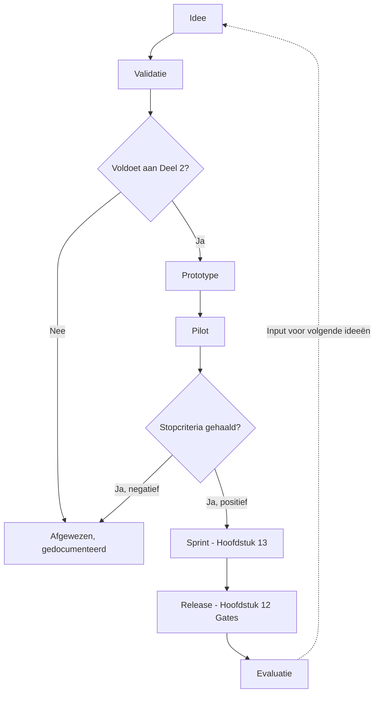

# TrainingKompas Premium Development Handbook

## Hoofdstuk 14 — Product Strategy, Innovation Roadmap & Future Vision

**Status:** bindend document — de strategische afsluiting van het TrainingKompas Premium Development Handbook. Vanaf dit hoofdstuk wordt iedere nieuwe feature, sprint en roadmapbeslissing getoetst aan de strategische visie hieronder.
**Voortbouwend op:** Hoofdstuk 1-13 in hun geheel. In het bijzonder Hoofdstuk 1 (sectie 1.16, de driejaren-visie die hier wordt uitgebreid naar 2030), Hoofdstuk 8 (Deel 11, Sport Intelligence, hier uitgebreid tot een expansiestrategie) en Hoofdstuk 13 (de sprintwerkwijze waarin elke innovatie uiteindelijk landt).
**Karakter:** productspecificatie van strategie en toekomstvisie — geen code, geen implementatie, geen architectuurwijzigingen.

---

### Leeswijzer

Dit hoofdstuk beschrijft geen enkele functie die al elders in dit Handbook volledig is gespecificeerd (AI-gedrag: Hoofdstuk 8-9; schermen: Hoofdstuk 6; kwaliteit: Hoofdstuk 12) — het beschrijft de **richting en de rechtvaardiging**: waarom bepaalde uitbreidingen wel passen bij TrainingKompas en andere bewust niet, in welke volgorde, en binnen welke onveranderlijke grenzen. Waar dit hoofdstuk een toekomstige functie noemt die verder gaat dan wat eerder is gespecificeerd (Computer Vision, Voice Coach), is dat expliciet een **richting**, geen toezegging — elke daadwerkelijke bouw doorloopt eerst de volledige Innovation Governance uit Deel 11 en, uiteindelijk, elk voorgaand hoofdstuk van dit Handbook.

**Statusaanduiding:** 🟢 bestaand/reeds op de Roadmap · 🟡 gedeeltelijk bestaand · 🔴 nieuwe strategische richting, dit hoofdstuk.

---

## Deel 1 — Product Vision 2030

### Missie

Ongewijzigd ten opzichte van Hoofdstuk 1, sectie 1.1 — en dat is zelf een strategische uitspraak: TrainingKompas' missie verandert niet met schaal. *De discipline van nauwkeurige trainingslogging combineren met de intelligentie van een coach die richting geeft — uitlegbaar, dagelijks, zonder de kosten van een personal trainer.* Elke strategische keuze in dit hoofdstuk dient deze missie, of wordt niet gemaakt.

### Visie 2030

Over vijf jaar is TrainingKompas het platform waar functionele/CrossFit-sportscholen in Nederland (en vervolgens breder) op vertrouwen voor AI-gestuurde coaching — niet omdat het de meeste features heeft, maar omdat het de enige app is die uitlegbaarheid, herstel-eerst-denken en leeftijdsbewustzijn nooit heeft losgelaten bij het opschalen. Dit is een directe voortzetting van Hoofdstuk 1, sectie 1.16, hier geconcretiseerd naar een tijdshorizon.

### Positionering

TrainingKompas positioneert zich niet als "nog een trainingsapp" maar als de enige app die HRV-gedreven dagfactor, uitlegbare AI, Masters-leeftijdsbewustzijn, sportspecifieke context en visuele spierherstel-tracking in één samenhangend geheel combineert (Hoofdstuk 1, sectie 1.11) — een positionering die met elke uitbreiding in dit hoofdstuk versterkt wordt, nooit verwaterd.

### Markt

| Marktlaag | Omvang-inschatting | Status |
|---|---|---|
| Individuele functionele/CrossFit-sporters (Nederland) | Middelgroot, groeiend | 🟢 huidige focus |
| Functionele/CrossFit-boxen (white-label, Nederland) | Klein aantal, hoge waarde per klant | 🟡 Fase 4, ART CrossFit als eerste |
| Bredere fitness-/krachtsportmarkt (uitbreiding via Sport Expansion, Deel 6) | Groot | 🔴 toekomstige uitbreiding, na validatie |
| Internationale markt (Deel 9) | Groot, vereist lokalisatie | 🔴 lange termijn, geen huidige prioriteit |

### Concurrentiepositie

Volledig uitgewerkt in Hoofdstuk 1 (sectie 1.11) en de Product Audit (sectie 7) — hier strategisch samengevat: TrainingKompas concurreert niet op elke as tegelijk (snelheid zoals Hevy, eenvoud zoals Strong, sensordata zoals Garmin) maar wint op de combinatie die geen concurrent biedt. Deze combinatie is de enige verdedigbare marktpositie en wordt in elke strategische keuze in dit hoofdstuk bewaakt.

### Waardepropositie

*"Een coach die je nooit vergeet en nooit oordeelt"* (Hoofdstuk 1, sectie 1.16) — de emotionele kern die elke functionele uitbreiding moet versterken. Een innovatie die deze waardepropositie niet versterkt, wordt getoetst aan Deel 2 vóórdat deze verder wordt overwogen.

### Langetermijndoelen (tot 2030)

1. TrainingKompas is het aantoonbaar meest uitlegbare AI-coachingplatform in zijn categorie, ongeacht schaal.
2. Elke nieuwe gym-klant krijgt dezelfde kwaliteit coaching als de eerste (ART CrossFit) — geen "afgeslankte" versie bij groei (Hoofdstuk 1, sectie 1.16).
3. Het platform ondersteunt een breed scala aan sporten met volwaardige, niet-generieke AI-context (Deel 6).
4. Commerciële duurzaamheid wordt bereikt zonder de kernwaarden (uitlegbaarheid, herstel-eerst, geen manipulatie) ooit te verkopen (Hoofdstuk 1, sectie 1.16; Deel 8 van dit hoofdstuk).

---

## Deel 2 — Product Principles

Vertaling van de Product Constitution (Hoofdstuk 3) naar strategische investeringsuitgangspunten.

### Waar investeren we in?

| Investeringsrichting | Rechtvaardiging |
|---|---|
| Diepgang in uitlegbare AI (Hoofdstuk 8-9) | Kernonderscheid, Product Constitution III |
| Herstel- en dagfactor-intelligentie (Hoofdstuk 8, Deel 4) | Kernonderscheid, Product Constitution II |
| Sportspecifieke context-uitbreiding (Deel 6) | Verbreedt de markt zonder de kernwaarde te verdunnen |
| Toegankelijkheid en premium afwerking (Hoofdstuk 5, 11) | Dicht de kloof tussen functionele sterkte en presentatie (Product Audit) |
| Gym-/coach-functionaliteit (Fase 3-4, bestaande Roadmap) | Bevestigde marktvraag (DEC-008) |

### Waar investeren we bewust niet in?

| Wat we bewust vermijden | Rechtvaardiging |
|---|---|
| Functies die uitsluitend concurrenten nabootsen zonder eigen waarde | Product Principle P5 (Hoofdstuk 3) |
| Sociale features die de kernervaring zouden overschaduwen | Hoofdstuk 1, sectie 1.4 (wie TrainingKompas niet bedient) |
| Elke vorm van advertenties | Deel 8, expliciet en onvoorwaardelijk |
| Elke vorm van manipulatieve gamification | Product Constitution XX |
| Een volledige herbouw naar een ander technisch platform vóór Fase 2 is afgerond | Blueprint.md, bestaand besluit |
| Enterprise-governance-zwaarte die niet bij de projectomvang past | DEC-003, DEC-005 |

### Welke functies passen niet bij TrainingKompas?

- Een functie die AI-advies presenteert als vaststaand in plaats van uitlegbaar (schendt Product Constitution III, ongeacht hoe waardevol de functie verder zou zijn).
- Een functie die primair bestaat om schermtijd te maximaliseren los van trainingswaarde (Hoofdstuk 4, Deel 1, verboden UX-patronen).
- Een functie die vereist dat de gebruiker constant online is, zonder een offline-alternatief (schendt Hoofdstuk 4, Golden Rule UX41).
- Een functie die financieel gedreven is (bijv. advertentie-inkomsten) ten koste van gebruikerservaring (Deel 8: geen advertenties, onvoorwaardelijk).
- Een functie die het merk Trainingskompas zou laten verdwijnen achter een partner- of white-label-merk (Product Constitution XI).

**Bindende regel:** elke nieuwe featurevoorstel doorloopt deze drie tabellen vóór het als idee de Innovation Governance (Deel 11) ingaat.

---

## Deel 3 — Product Maturity Model

Vijf volwassenheidsfasen — een **capability-model**, te onderscheiden van de chronologische Roadmap-Fasen 1-5 (Roadmap.md). Beide bestaan naast elkaar: de Roadmap-Fasen beschrijven *wanneer* iets gebouwd wordt, dit maturity-model beschrijft *welk niveau van productvolwassenheid* daarbij hoort. Een product kan bijvoorbeeld al in Roadmap-Fase 2 zitten terwijl het qua maturity nog dicht bij "Premium" staat.

| Fase | Naam | Doelen | Functionaliteit | Kwaliteit | Doelgroep | Succescriteria |
|---|---|---|---|---|---|---|
| **1** | **MVP** | Bewijzen dat de kerncombinatie (AI-coach + herstel-eerst) werkt voor één atleet | Trainingslogging, dagfactor, basis-AI-advies | Functioneel, niet per se premium | Eén primaire gebruiker (Maurice) | Dagelijks bruikbaar zonder externe hulp |
| **2** | **Premium** | De kloof tussen functionaliteit en presentatie dichten (huidige fase, Product Audit) | Volledige feature-set uit Hoofdstuk 1-13, premium UI/UX/motion | Voldoet aan Hoofdstuk 3-12 volledig | Individuele atleten, eerste gym (ART CrossFit) | Product Audit-scores "Premium" op alle UX Scorecard-dimensies (Hoofdstuk 4) |
| **3** | **Professional** | Coaches en serieuze meerdere-atleten-begeleiders volwaardig bedienen | Coach-dashboard, multi-atleet-overzicht, programma-toewijzing (Hoofdstuk 8, Deel 6.1-uitbreiding) | Zelfde standaard als Fase 2, uitgebreid met rolgebonden schermen (Hoofdstuk 7, Deel 4.7 Drawer) | Coaches, personal trainers (Persona Iris, Bram) | Een coach kan tien-plus atleten efficiënt begeleiden zonder kwaliteitsverlies per atleet |
| **4** | **Enterprise** | Meerdere gyms, white-label, schaalbaar beheer | Gym-brede branding, meerdere vestigingen, owner-dashboard | Zelfde standaard, getest op meerdere gelijktijdige gym-klanten | Gym-eigenaren (Persona Tom) | Een nieuwe gym-klant is operationeel binnen een korte, gedocumenteerde onboardingsperiode zonder kwaliteitsverlies |
| **5** | **AI Performance Platform** | Het platform waar de AI-coach de meest geavanceerde, nog steeds volledig uitlegbare prestatie-intelligentie biedt in de markt | Predictive Recovery, Performance Forecasting, volledige Sport Expansion (Deel 4-6) | Onveranderd hoge standaard — schaal vergroot de reikwijdte, nooit de kwaliteitsgrens | Brede markt, meerdere sporten en landen | TrainingKompas wordt als referentie genoemd voor uitlegbare AI-coaching binnen de sportsector |

**Bindende regel:** doorstroom naar een volgende maturity-fase vereist niet alleen nieuwe functionaliteit maar **bevestigde, gemeten kwaliteit** op de voorgaande fase (Hoofdstuk 12) — een product schuift nooit door naar "Enterprise" met een "Premium"-fase die zelf nog onvoldoende scoort.

---

## Deel 4 — Innovation Roadmap

Negen toekomstige innovatierichtingen — elk expliciet als **richting**, niet als toezegging. Elke innovatie doorloopt vóór bouw de volledige Innovation Governance (Deel 11) en wordt getoetst aan Deel 2.

| Innovatie | Status | Beschrijving | Rechtvaardiging | Grootste risico |
|---|---|---|---|---|
| **AI Coach 2.0** 🔴 | Richting | Diepere lange-termijn-patroonherkenning, expliciete verwijzing naar eerdere, vergelijkbare situaties (Hoofdstuk 1, sectie 1.14: coach-geheugen verder uitgebouwd) | Directe versterking van de kernwaardepropositie | Complexiteitsgroei van de AI-context (Hoofdstuk 9, Deel 3.3: contextlimieten) |
| **Computer Vision** 🔴 | Verkenning | Automatische techniekbeoordeling via camera (bijv. squat-diepte-detectie) | Zou Exercise Intelligence (Hoofdstuk 8, Deel 7) een objectieve, visuele laag geven | Aanzienlijke technische complexiteit; privacy-gevoeligheid van videodata (Deel 12); risico op onterecht "medisch" aanvoelend advies (Hoofdstuk 8, Deel 14.1) — vereist zeer zorgvuldige AI Safety-toetsing vóór enige bouw |
| **Video Analyse** 🔴 | Verkenning, lichter dan Computer Vision | Een gebruiker neemt een set op, de AI-coach geeft tekstuele feedback op basis van een menselijke review-achtige aanpak (niet per se geautomatiseerd) | Lager risico dan volledige Computer Vision, mogelijk eerdere haalbare stap | Nog steeds een aanzienlijke productiviteits-/privacy-afweging |
| **Voice Coach** 🔴 | Richting | Spraakinvoer tijdens training (Hoofdstuk 7, 2.1-uitbreiding), mogelijk ook gesproken AI-adviezen | Directe toepassing op de bestaande "handen vrij tijdens training"-behoefte (Hoofdstuk 6, Scherm 3.4) | Geluidskwaliteit in een luidruchtige gymomgeving; moet de ingehouden merktoon (Hoofdstuk 8, Deel 15) ook via stem waarmaken |
| **Natural Language Planning** 🔴 | Richting | Een gebruiker beschrijft een doel in vrije taal ("ik wil over 3 maanden 100kg squatten"), de AI vertaalt dit naar een concreet programma | Versterkt Goal Intelligence (Hoofdstuk 8, Deel 6) aanzienlijk | Vereist zeer zorgvuldige explainability — een vrije-taal-input mag nooit tot een minder uitlegbare output leiden (Hoofdstuk 8, Deel 3 blijft onverkort van toepassing) |
| **Predictive Recovery** 🔴 | Richting | Voorspelling van hersteltijd vóór een geplande zware sessie, gebaseerd op langetermijnpatronen | Uitbreiding van Recovery Intelligence (Hoofdstuk 8, Deel 4) | Voorspellingen moeten altijd expliciet als inschatting gelabeld blijven (Hoofdstuk 8, Deel 3.8) — nooit als zekerheid gepresenteerd |
| **Performance Forecasting** 🔴 | Richting | Uitbreiding van "Voortgang voorspellen" (Hoofdstuk 8, Deel 6.5) met een bredere data-basis | Directe uitbreiding van bestaande, reeds gespecificeerde functionaliteit | Zelfde confidence-eis als Predictive Recovery |
| **Blessurepreventie (uitgebreid)** 🔴 | Richting | Verdieping van Hoofdstuk 8, Deel 14.3 met meer databronnen (bijv. bewegingspatroonanalyse indien Computer Vision ooit gebouwd wordt) | Direct gekoppeld aan het herstel-eerst-principe | Het grootste AI Safety-risico in deze hele lijst — vereist de striktste toetsing (Hoofdstuk 8, Deel 14; Hoofdstuk 9, Deel 1.6) |
| **Slimme periodisering (verdiept)** 🔴 | Richting | Dynamische deload-timing op basis van werkelijke cumulatieve belasting in plaats van een vast schema (reeds genoemd als mogelijke uitbreiding, Hoofdstuk 8, Deel 5.2) | Directe uitbreiding van bestaande, gespecificeerde functionaliteit | Moet de structurele periodiseringsgarantie (Product Constitution, Hoofdstuk 8 Deel 5.1) behouden, niet vervangen door een minder voorspelbaar systeem |

**Bindende regel:** hoe dichter een innovatie bij het fysieke lichaam en de gezondheid van de gebruiker komt (Computer Vision, Blessurepreventie), hoe strenger de AI Safety-toetsing (Hoofdstuk 8, Deel 14) vóórdat bouw ook maar wordt overwogen — dit is geen gelijke lijst van negen even-haalbare ideeën, maar een lijst met sterk uiteenlopend risiconiveau.

---

## Deel 5 — Ecosysteem

Achttien mogelijke integraties. De bestaande Fitbit-koppeling (Hoofdstuk 6, Scherm 8.1) is het precedent en de architecturale basis (Google Health API) — elke nieuwe integratie wordt getoetst op of ze dat bestaande patroon kan hergebruiken (Product Principle P9) vóórdat een nieuw integratiepatroon wordt overwogen.

| Integratie | Status | Doel | Waarde | Prioriteit | Afhankelijkheden | Risico's |
|---|---|---|---|---|---|---|
| **Health Connect** (Google) | 🟢 Reeds op Roadmap, DEC-010 | Bredere Android-gezondheidsdata-toegang dan het huidige Fitbit-specifieke pad | Hoog — vervangt/verbreedt de huidige beperkte koppeling | P0 | Google Play Services | Laag — platformstandaard |
| **Apple HealthKit** | 🟢 Reeds op Roadmap, DEC-010 | iOS-equivalent van Health Connect | Hoog, vereist voor iOS-uitbreiding (Capacitor) | P1 (na Health Connect) | Capacitor-wrapping (Blueprint.md, al voorzien) | Middel — vereist iOS-specifieke ontwikkeling |
| **Garmin** | 🟢 Reeds op Roadmap, DEC-010 | Directe koppeling voor Garmin-gebruikers (grote wearable-marktspeler in de sportwereld) | Hoog — grote overlap met de doelgroep (Persona Ruud, Sanne) | P1 | Garmin Connect API-toegang | Middel — externe API-afhankelijkheid, vergelijkbare Testing-mode-risico's als Fitbit |
| **Whoop** | 🟢 Reeds op Roadmap, DEC-010 | Herstel-/HRV-gerichte wearable, sterke overlap met TrainingKompas' eigen focus | Hoog — inhoudelijk zeer complementair aan de dagfactor-motor | P1 | Whoop API | Middel |
| **Oura** | 🟢 Reeds op Roadmap, DEC-010 | Slaap-/hersteltracking | Hoog — directe aanvulling op de slaapcomponent van de dagfactor | P1 | Oura API | Middel |
| **Polar** | 🔴 Nieuw in dit hoofdstuk | Hartslag-/cardiotracking, vergelijkbare doelgroep als Garmin | Middel | P2 | Polar API | Middel |
| **Suunto** | 🔴 Nieuw | Outdoor-/duursport-gerichte wearable | Middel, relevant voor Persona Sanne (HYROX/triathlon) | P2 | Suunto API | Middel |
| **Coros** | 🔴 Nieuw | Opkomende duursport-wearable | Laag-middel | P3 | Coros API | Middel |
| **Samsung Health** | 🔴 Nieuw | Grote Android-gebruikersgroep buiten Google Fit/Health Connect om | Middel | P2 | Samsung Health SDK | Middel — mogelijk overlap met Health Connect, vereist duidelijke afbakening |
| **Zwift** | 🔴 Nieuw | Indoor-wielren-/hardloop-trainingsdata | Middel, relevant voor Wielrennen/Mountainbike-context (Hoofdstuk 8, Deel 11.8-11.10) | P2 | Zwift API (indien beschikbaar) | Middel |
| **Strava** | 🔴 Nieuw | Zeer breed gebruikte activiteiten-tracker, met name hardlopen/wielrennen | Hoog — grote potentiële gebruikersoverlap | P1 | Strava API | Middel — Strava's eigen sociale laag kan overlappen met TrainingKompas' toekomstige social-traject (DEC-008), vereist zorgvuldige afbakening |
| **TrainingPeaks** | 🔴 Nieuw | Gevestigd platform voor duursport-periodisering | Middel — mogelijk eerder een concurrent dan een integratiepartner op termijn | P3 | TrainingPeaks API | Middel-hoog — strategische overweging nodig of dit concurreert met TrainingKompas' eigen programmagenerator |
| **Concept2** | 🔴 Nieuw | Roeimachine-data (split-tijden, Hoofdstuk 8 Deel 11.11) | Middel, nichegebruik | P3 | Concept2 Logbook API | Laag |
| **Wahoo** | 🔴 Nieuw | Fietstrainer-/sensordata | Middel | P2 | Wahoo API | Middel |
| **Tacx** | 🔴 Nieuw | Fietstrainer, vergelijkbaar met Wahoo | Laag-middel | P3 | Tacx API | Middel |
| **Fitbit** | 🟢 Bestaand | Zie Hoofdstuk 6, Scherm 8.1 | Bewezen | P0, reeds actief | Google Health API | Bekend, gedocumenteerd risico (Testing-mode-tokenverval, Product Audit sectie 4.8) |
| **Google Fit** | 🟡 Grotendeels vervangen door Health Connect als opvolger | Legacy-relevantie, afnemend | P3 | — | Laag — aflopend platform |

**Bindende regel:** elke nieuwe integratie wordt eerst getoetst op hergebruik van de bestaande OAuth-/Google Health API-architectuur (Product Principle P9) — een volledig nieuw integratiepatroon per wearable-merk zou de onderhoudslast onbeheersbaar maken voor een solo-ontwikkelaar. Prioritering (P0-P3) volgt de mate van overlap met de bevestigde doelgroep (Hoofdstuk 2) en het bestaande Roadmap-commitment (DEC-010), niet enkel merkbekendheid.

---

## Deel 6 — Sport Expansion Strategy

Directe uitbreiding van Hoofdstuk 8, Deel 11 (Sport Intelligence) — dit Deel beschrijft het **proces** waarmee een sport van het generieke fallback-raamwerk (Hoofdstuk 8, Deel 11.25) doorgroeit naar een volwaardig `SPORT_BLOCKS`-blok.

| Stap | Criterium |
|---|---|
| **1. Signaal** | Een sport wordt herhaald gekozen in de onboarding-sportkeuze (Hoofdstuk 6, Scherm 1.2) zonder eigen `SPORT_BLOCKS`-uitwerking, of wordt expliciet gevraagd door een gym-klant (DEC-008-precedent) |
| **2. Criteria voor opname** | Voldoende gebruikersvolume om de investering te rechtvaardigen (geen harde drempel vastgesteld — een productbeslissing per geval, Deel 11 Innovation Governance); een duidelijk te onderscheiden trainingslogica t.o.v. bestaande sporten |
| **3. Benodigde data** | Welke kernmetrics zijn specifiek voor deze sport (vergelijkbaar met de kolom "Kernmetrics" in Hoofdstuk 8, Deel 11.2-11.24) |
| **4. AI-ondersteuning** | Een nieuw `SPORT_BLOCKS`-blok volgens exact hetzelfde format als de zeven bestaande blokken — geen afwijkende structuur |
| **5. UX-aanpassingen** | Nieuwe logica vereist mogelijk nieuwe metrics-invoervelden (Hoofdstuk 7, Deel 2) — altijd eerst toetsen of bestaande componenten (Stepper, Text Field-varianten) volstaan |
| **6. Teststrategie** | Volledige doorloop van Hoofdstuk 12, Deel 9 (AI Validation) specifiek voor de nieuwe sportcontext, inclusief de edge-casetestset (Hoofdstuk 9, Deel 5.11) uitgebreid met sport-specifieke grensgevallen |
| **7. Acceptatiecriteria** | Geen kruisbesmetting met bestaande sportcontexten (Hoofdstuk 12, Deel 9); AI-adviezen voor de nieuwe sport zijn even uitlegbaar als voor de bestaande zeven |

**Bindende regel:** een sport verlaat het generieke fallback-raamwerk nooit "gedeeltelijk" — de overgang naar een volwaardig `SPORT_BLOCKS`-blok is een complete stap die de volledige zeven-stappen-procedure hierboven doorloopt, nooit een halve, ongeteste uitbreiding.

---

## Deel 7 — AI Evolution

Vijf fasen — een ontwikkelingslijn voor de AI-coach zelf, te onderscheiden van het Product Maturity Model (Deel 3, dat het hele product beschrijft).

| Fase | Naam | Beschrijving | Status |
|---|---|---|---|
| **1** | **Coach** | Geeft trainingsadvies op basis van dagfactor en herstel (huidige staat) | 🟢 |
| **2** | **Persoonlijke assistent** | Herinnert, plant, beantwoordt vragen buiten het directe trainingsmoment (uitbreiding van Coach Chat, Hoofdstuk 6 Scherm 4.3) | 🟡 |
| **3** | **Prestatie-analist** | Diepere trendanalyse, Predictive Recovery/Performance Forecasting (Deel 4) | 🔴 |
| **4** | **Digitale trainingspartner** | Voice Coach, mogelijk Video Analyse (Deel 4) — een AI die tijdens de training zelf actief meebeweegt met de gebruiker | 🔴 |
| **5** | **Autonome planning (altijd onder menselijke controle)** | Volledige, doorlopende programma-aanpassing op basis van patronen, zonder dat de gebruiker elke aanpassing handmatig hoeft te initiëren — expliciet **nooit autonoom in de zin van Product Constitution I overtreden**: de gebruiker keurt elke structurele wijziging nog steeds goed, "autonoom" betekent hier "proactief voorstellend", niet "beslissend zonder toestemming" | 🔴 |

### Grenzen die de AI nooit overschrijdt, in elke fase

Deze grenzen zijn **identiek** in Fase 1 en Fase 5 — AI Evolution betekent meer capaciteit, nooit meer autonomie voorbij wat Hoofdstuk 8-9 al vastlegt:

1. De AI beslist nooit — elk advies, in elke fase, heeft een gelijkwaardig alternatief (Product Constitution I, onveranderd van toepassing in Fase 5).
2. De AI stelt nooit een medische diagnose (Hoofdstuk 8, Deel 14.1) — ook niet met Computer Vision-achtige toekomstige input.
3. Elke AI-output blijft, ongeacht fase, volledig uitlegbaar (Hoofdstuk 8, Deel 3) — grotere AI-capaciteit verlaagt nooit de uitlegbaarheidseis.
4. Menselijke controle (Hoofdstuk 9, Deel 12.7) blijft in elke fase intact — de Product Owner kan elk AI-gedrag herzien of terugdraaien, ook in een "autonome" Fase 5.
5. Elke fase-overgang doorloopt de volledige AI Governance-risicoanalyse (Hoofdstuk 9, Deel 1.6) opnieuw — een hogere AI-capaciteit is per definitie een hoger risiconiveau, nooit automatisch "vertrouwd" omdat een eerdere fase goed functioneerde.

**Bindende regel:** "Autonome planning" in Fase 5 is een functionele beschrijving van proactiviteit, geen uitzondering op Product Constitution I — deze naam wordt bewust zo gekozen om de ambitie te beschrijven, maar de AI Behaviour Constitution (Hoofdstuk 8) staat boven deze naamgeving in geval van elke schijnbare tegenstrijdigheid.

---

## Deel 8 — Monetisatie

Uitbreiding van Hoofdstuk 10, Deel 7 (Premium vs Free) naar de volledige, strategische tier-structuur.

| Tier | Doelgroep | Kern | Status |
|---|---|---|---|
| **Gratis** | Alle individuele gebruikers | Volledige trainingslogging, herstel-heatmap, basisstatistieken, beperkt AI-quotum (Hoofdstuk 10, Deel 7.1) | 🟢 |
| **Premium** | Individuele atleten die meer AI-diepgang willen | Ruimer/onbeperkt AI-quotum, volledige analytics (ACWR, plateau-detectie) | 🟡 (schema bestaat, handhaving Fase 5) |
| **Professional** 🔴 | Zelfstandige personal trainers (Persona Bram) | Coach-dashboard, multi-atleet-beheer (Deel 3, Fase 3) | 🔴 |
| **Team** 🔴 | Kleine trainingsgroepen zonder volledige gym-structuur | Gedeelde doelen/challenges (Hoofdstuk 6, Scherm 7.1-7.2) op kleinere schaal dan een volledige gym | 🔴 |
| **Coach** 🔴 | Individuele coaches binnen een gym | Rolgebonden toegang tot ledendata (bestaand rollen-schema, `gym_role`) | 🟡 (rollen bestaan, tier-koppeling nieuw) |
| **Enterprise** 🔴 | Gym-eigenaren (Persona Tom) | Sportschool-tier: branding, meerdere vestigingen, owner-dashboard (Fase 4-5) | 🟡 (schema bestaat) |

### Abonnementen versus eenmalige aankopen

| Vorm | Toepassing |
|---|---|
| **Abonnementen** | Primair model — Premium/Professional/Team/Coach/Enterprise, aansluitend bij het bestaande, ontworpen `plan_features`-schema |
| **Eenmalige aankopen (creditpacks)** | Voor incidenteel extra AI-gebruik zonder volledige tier-upgrade — reeds voorbereid (`credit_packs`, Blueprint.md) |

### Niet-onderhandelbare grenzen

**Geen advertenties.** Onvoorwaardelijk, systeembreed, in elke tier — een trainingscoach-app die gezondheidsdata verwerkt, verdient het vertrouwen dat die data nooit ten dienste staat van advertentie-inkomsten (directe toepassing van Hoofdstuk 1, sectie 1.10).

**Geen dark patterns.** Elke upsell volgt Hoofdstuk 10, Deel 7 (nooit storend, nooit manipulatief) — dit geldt voor elke toekomstige tier-uitbreiding in dit Deel, zonder uitzondering.

**Bindende regel:** de kernervaring (trainen, loggen, herstel zien) blijft, ook bij volledige uitrol van alle zes tiers hierboven, onvoorwaardelijk gratis toegankelijk (herhaling van Hoofdstuk 10, Deel 7.1, hier bevestigd als permanente strategische grens).

---

## Deel 9 — Internationalisering

| Aspect | Status | Specificatie |
|---|---|---|
| **Talen** | 🟡 | Nederlands is en blijft de primaire taal; Engels reeds vereist voor Privacy/Terms (Hoofdstuk 6, Scherm 9.6); bredere meertaligheid staat op de Roadmap-backlog, geen huidige prioriteit |
| **Regio's** | 🔴 | Nederland eerst (bevestigde markt), daarna mogelijk België (Nederlandstalig, laagste lokalisatiedrempel) vóór verdere internationale uitbreiding |
| **Lokalisatie** | 🔴 | Niet enkel vertaling — de coach-persoonlijkheid (Hoofdstuk 8, Deel 15) moet in elke taal even herkenbaar "TrainingKompas" aanvoelen, getoetst via de Personality-test (Hoofdstuk 9, Deel 4.2) per taal |
| **Eenheden** | 🟡 | Metrisch (kg, km) is de huidige, enige standaard; imperiale eenheden (lb, mi) zijn een mogelijke toekomstige instelling bij internationale uitbreiding, geen huidige prioriteit |
| **Culturele verschillen** | 🔴 | Reeds gesignaleerd als open validatiepunt (Hoofdstuk 9, Deel 8: "culturele verschillen" als niet-gevalideerde aanname) — vereist expliciet onderzoek vóór een taal/regio wordt toegevoegd, niet enkel een vertaalslag |
| **Wetgeving** | 🟡 | AVG (Nederland/EU) is de huidige basis (Hoofdstuk 12, Deel 10); elke nieuwe regio vereist een aparte juridische toetsing (bijv. HIPAA-achtige regelgeving in andere jurisdicties bij gezondheidsdata) vóór lancering |

**Bindende regel:** internationalisering is nooit uitsluitend een vertaalexercitie — elke nieuwe taal/regio doorloopt dezelfde AI Evaluation-criteria (Hoofdstuk 9, Deel 5) en Quality Standards (Hoofdstuk 12, Deel 2) als een reguliere feature, met expliciete aandacht voor culturele overdracht van de coach-toon (Hoofdstuk 8, Deel 15).

---

## Deel 10 — Product Analytics

Strategische KPI's — te onderscheiden van de operationele Quality Metrics uit Hoofdstuk 12, Deel 17 (die crash-free rate/performance meten) en de Navigation Analytics uit Hoofdstuk 10, Deel 12 (die schermgedrag meten). Dit Deel meet **productsucces op businessniveau**.

| KPI | Definitie | Strategisch gebruik |
|---|---|---|
| **DAU** (Daily Active Users) | Unieke gebruikers per dag | Basismaat van dagelijkse relevantie — cruciaal gezien de dagelijkse check-in-kern van het product |
| **WAU/MAU** | Wekelijks/maandelijks actieve gebruikers | DAU/MAU-ratio als "stickiness"-indicator |
| **Retentie** | Percentage gebruikers actief na dag 1/7/30 | Belangrijkste lange-termijn-gezondheidsindicator; nooit geoptimaliseerd via manipulatieve mechanismen (Product Constitution XX, herhaald hier op strategisch niveau) |
| **Workout Completion** | Percentage gestarte trainingen dat wordt afgerond | Directe maat van de trainingsflow-kwaliteit (Hoofdstuk 4, Deel 4) |
| **AI Acceptance** | Percentage AI-adviezen dat wordt opgevolgd | Diagnostisch voor AI-kwaliteit (Hoofdstuk 9, Deel 7) — nooit een doel om de AI "overtuigender" te maken |
| **Premium Conversion** | Percentage gratis-naar-betaald | Commerciële gezondheid, getoetst tegen Deel 8 (nooit via manipulatie verhoogd) |
| **Churn** | Percentage abonnees dat opzegt | Vroege-waarschuwing voor waardepropositie-problemen |
| **Crash Free Rate** | Zie Hoofdstuk 12, Deel 17 | Hier herhaald als strategische KPI omdat stabiliteit direct aan vertrouwen (Hoofdstuk 1) gekoppeld is |
| **NPS** (Net Promoter Score) | Waarschijnlijkheid dat een gebruiker TrainingKompas aanbeveelt | Kwalitatieve aanvulling op kwantitatieve metrics — vangt merkwaarde die andere KPI's missen |
| **Gebruik van AI** | Frequentie van Coach Chat-interacties, check-in-voltooiing | Directe maat van of de kernwaardepropositie (AI-coach) daadwerkelijk gebruikt wordt, niet enkel aanwezig is |

**Bindende regel:** elke KPI in dit Deel is, net als in Hoofdstuk 10/12, diagnostisch — geen enkele metric-optimalisatie mag ooit een Golden Rule of Constitution-wet uit Hoofdstuk 3-13 schenden. Specifiek voor dit strategische niveau: Premium Conversion en Retentie worden nooit nagestreefd via technieken die Deel 8 (geen dark patterns) zouden schenden.

---

## Deel 11 — Innovation Governance

Acht stappen waarmee een nieuw idee wordt beoordeeld — de brug tussen dit strategische hoofdstuk en de operationele Sprint-werkwijze (Hoofdstuk 13).

| Stap | Doel | Verantwoordelijke | Doorstroom-eis |
|---|---|---|---|
| **Idee** | Een ruwe innovatierichting wordt geïdentificeerd (bijv. uit Deel 4, of extern) | Product Owner, of Claude signaleert proactief | Geformuleerd in één zin |
| **Validatie** | Getoetst aan Deel 2 (waar investeren we in/niet in) en de bevestigde persona-behoeften (Hoofdstuk 2) | Product Owner | Voldoet aan Deel 2; geen ongefundeerde aanname (Hoofdstuk 2, Deel 8-discipline) |
| **Prototype** | Een minimale, niet-productiewaardige uitwerking om haalbaarheid te toetsen | AI Software Engineer | Bevestigt technische haalbaarheid binnen de bestaande architectuur (Product Principle P9) |
| **Pilot** | Beperkte test met een kleine groep (vergelijkbaar met Closed Testing, Hoofdstuk 12, Deel 13) | Product Owner + kleine testgroep | Positieve, concrete signalen op de relevante Hoofdstuk 9/12-criteria |
| **Sprint** | Volledige bouw volgens de Sprint Execution-werkwijze | AI Software Engineer | Doorloopt Hoofdstuk 13 volledig |
| **Release** | Doorloop van de Release Gates | AI Software Engineer + Product Owner | Hoofdstuk 12, Deel 16 |
| **Evaluatie** | Meten tegen de KPI's uit Deel 10 en de kwaliteitsnormen uit Hoofdstuk 12 | Product Owner | Concrete, meetbare uitkomst |
| **Stopcriteria** | Op elk moment in dit proces kan een idee stoppen | Product Owner | Zie hieronder |

### Stopcriteria (op elk moment toepasbaar)

- Het idee blijkt bij Validatie niet te voldoen aan Deel 2 (waar we bewust niet in investeren).
- Het Prototype onthult een fundamenteel architecturaal conflict dat niet binnen Product Principle P9 op te lossen is.
- De Pilot toont een AI Safety-risico (Hoofdstuk 8, Deel 14) dat niet voldoende te mitigeren is.
- De Pilot toont dat de innovatie de coach-persoonlijkheid (Hoofdstuk 8, Deel 15) of een andere Constitution ondermijnt.
- Evaluatie toont dat de KPI-impact (Deel 10) de investering niet rechtvaardigt.

**Bindende regel:** een gestopt idee wordt niet stilzwijgend vergeten — het stopmoment en de reden worden vastgelegd (vergelijkbaar met een Decision Log-vermelding), zodat een toekomstige heroverweging niet blind dezelfde weg opnieuw hoeft te bewandelen.

---

## Deel 12 — Product Risks

| Risicocategorie | Concreet risico | Mitigatie |
|---|---|---|
| **Technologie** | Single-file-architectuur wordt op termijn onhoudbaar bij verdere groei (8.640+ regels en groeiend) | Bewust bewaakt, gedocumenteerde technische schuld (Blueprint.md); file-split blijft een agendapunt voor na Fase 2 |
| **AI** | Een AI-model-upgrade verandert gedrag op een manier die de Constitution schendt | Volledige hertoetsing bij elke modelwijziging (Hoofdstuk 9, Deel 9-10) |
| **Privacy** | Uitbreiding naar nieuwe databronnen (wearables, Computer Vision) vergroot de privacy-attack-surface | Elke nieuwe databron doorloopt Hoofdstuk 12, Deel 10 (Security & Privacy Validation) vóór bouw |
| **Markt** | De functionele/CrossFit-niche blijft kleiner dan gehoopt voor commerciële duurzaamheid | Sport Expansion Strategy (Deel 6) als beheerste, gevalideerde verbredingsroute |
| **Concurrentie** | Een grote speler (Garmin, Whoop) voegt vergelijkbare uitlegbare AI-coaching toe | De combinatie van herstel-eerst + Masters-bewustzijn + sportspecifieke context (Hoofdstuk 1, sectie 1.11) blijft het verdedigbare onderscheid, niet een enkele feature die kopieerbaar is |
| **Vendor Lock-in** | Afhankelijkheid van Supabase, Netlify, Anthropic als kernleveranciers | Bewust geaccepteerd risico gezien de solo-projectomvang; een migratiepad wordt pas overwogen bij een concrete, aantoonbare leveranciersstoring, niet preventief |
| **Afhankelijkheden** | Wearable-partners (Fitbit Testing-mode-beperking) kunnen de gebruikerservaring beperken | Actief gemonitord (Hoofdstuk 12, Deel 15, Wearables-sectie), met een concreet plan richting Production-verificatie |
| **Wetgeving** | AVG-wijzigingen of nieuwe regelgeving rond gezondheidsdata/AI (bijv. EU AI Act-classificatie van coaching-AI) | Periodieke juridische toetsing, met name bij internationale uitbreiding (Deel 9) |

**Bindende regel:** elk risico in deze tabel wordt periodiek herbeoordeeld (aansluitend bij het kwartaalritme uit Hoofdstuk 9, Deel 10.1) — een risico dat "geaccepteerd" is, blijft zichtbaar bewaakt, nooit stilzwijgend vergeten.

---

## Deel 13 — Roadmap Governance

| Aspect | Specificatie |
|---|---|
| **Backlogbeheer** | De bestaande Roadmap.md blijft de centrale bron; dit hoofdstuk voegt de strategische toetsing (Deel 2, Deel 11) toe vóórdat een backlog-item een Epic/Feature wordt (Hoofdstuk 13, Deel 4.1) |
| **Epicbeheer** | Elke Epic is gekoppeld aan een Roadmap-Fase én, waar relevant, een Product Maturity-fase (Deel 3) |
| **Versiebeheer** | Ongewijzigd de bestaande, bindende praktijk (Hoofdstuk 12/13) |
| **Releaseplanning** | Volgt de Release Gates (Hoofdstuk 12, Deel 16); grote strategische releases (bijv. een nieuwe Maturity-fase) krijgen een expliciete Product Owner-review vóór planning |
| **Prioritering** | P0-P3 (bestaand), aangevuld met de strategische toetsing uit Deel 2 — een P0-item dat niet aan Deel 2 voldoet, wordt heroverwogen vóór uitvoering |
| **Technische schuld** | Gevolgd als Sprint Metric (Hoofdstuk 13, Deel 13); grote, strategische technische schuld (zoals de single-file-architectuur) wordt in dit hoofdstuk als Product Risk (Deel 12) bewaakt |
| **Innovatiebudget** 🔴 | Nieuw concept: een impliciete, nooit vast percentage-vastgelegde ruimte binnen elke sprintcyclus voor Innovation Governance-activiteiten (Deel 11, met name Prototype/Pilot-stappen) naast reguliere Story-uitvoering — bewust flexibel gehouden gezien de solo-projectrealiteit, geen rigide 20%-regel |

**Bindende regel:** Roadmap Governance vervangt nooit de bestaande, lichte governance-niveau-B-praktijk (DEC-005) door een zwaardere structuur — elk element in dit Deel is een toevoeging aan, geen vervanging van, de bestaande Roadmap.md/Decision Log-werkwijze.

---

## Deel 14 — Future Quality Standards

Een korte, maar fundamentele sectie: elke toekomstige uitbreiding — elke innovatie uit Deel 4, elke integratie uit Deel 5, elke nieuwe sport uit Deel 6, elke AI Evolution-fase uit Deel 7, elke nieuwe markt uit Deel 9 — **blijft zonder uitzondering voldoen aan elk van de volgende hoofdstukken**:

| Hoofdstuk | Wat nooit verlaagd wordt |
|---|---|
| **Hoofdstuk 3** | De Product Design Principles en Golden Rules — elke nieuwe feature wordt getoetst aan de Product Constitution |
| **Hoofdstuk 4** | De Premium UX-standaard — geen enkele innovatie verlaagt de UX Checklist-eisen |
| **Hoofdstuk 5** | Het Design System — elke nieuwe visuele toevoeging blijft binnen de vastgestelde merkidentiteit |
| **Hoofdstuk 6** | De Screen Specification-standaard — elk nieuw scherm volgt het volledige 24-veld-format |
| **Hoofdstuk 7** | De Component Library — hergebruik vóór nieuwbouw blijft absoluut |
| **Hoofdstuk 8** | De AI Behaviour Constitution — uitlegbaarheid, geen diagnose, geen manipulatie blijven onaantastbaar, ook in AI Evolution Fase 5 |
| **Hoofdstuk 9** | De AI Governance — elke AI-uitbreiding doorloopt dezelfde risicoanalyse en testprocedure |
| **Hoofdstuk 10** | De Navigation Architecture — nieuwe schermen passen binnen de bestaande Information Architecture, geen ad-hoc navigatie |
| **Hoofdstuk 11** | De Motion Constitution — nieuwe animaties gebruiken uitsluitend de gedefinieerde tokens |
| **Hoofdstuk 12** | De Quality Assurance-standaard — elke release, ongeacht hoe innovatief, doorloopt dezelfde Release Gates |
| **Hoofdstuk 13** | De Sprint Execution-werkwijze — elke innovatie wordt via dezelfde, volledige Claude Working Method gebouwd |

**Bindende regel, zonder uitzondering:** geen enkele innovatie — ongeacht commercieel potentieel, technische elegantie, of gebruikersvraag — mag een van deze elf standaarden verlagen. Waar een innovatie een spanning blijkt op te leveren met een bestaande standaard, wordt de innovatie aangepast om binnen de standaard te passen, nooit andersom. Dit is de belangrijkste enkele regel in dit hoofdstuk: **groei dient de standaard, de standaard buigt nooit voor groei.**

---

## Deel 15 — Product Constitution 2030

Honderd bindende Product Strategy Laws — de strategische samenvatting van dit hoofdstuk, en daarmee de **laatste, overkoepelende Constitution van het volledige TrainingKompas Premium Development Handbook**. Deze wetten staan niet los naast de Constitutions van Hoofdstuk 3-13 — ze zijn de strategische laag daarboven, die vastlegt dat groei nooit een reden mag zijn om aan een van de voorgaande elf Constitutions te tornen.

**Missie en richting**

**1.** Innovatie dient altijd de gebruiker — nooit uitsluitend de groeicijfers.

**2.** De missie van TrainingKompas (Hoofdstuk 1) verandert niet met schaal.

**3.** Elke roadmapbeslissing is herleidbaar naar de productvisie (Hoofdstuk 1).

**4.** TrainingKompas concurreert op de combinatie van uitlegbaarheid, herstel-eerst en leeftijdsbewustzijn — nooit op een enkele, geïsoleerde feature.

**5.** Groei naar meerdere gyms, sporten of landen verwatert nooit de persoonlijke, uitlegbare aandacht die de eerste gebruiker kreeg.

**AI**

**6.** AI ondersteunt de sporter maar vervangt hem nooit.

**7.** De AI beslist nooit, in geen enkele evolutiefase — elk advies heeft een gelijkwaardig alternatief.

**8.** "Autonome planning" (AI Evolution Fase 5) betekent proactief voorstellen, nooit beslissen zonder menselijke goedkeuring.

**9.** De AI stelt nooit een medische diagnose, ongeacht welke nieuwe databron (Computer Vision, wearables) ooit wordt toegevoegd.

**10.** Elke AI-uitbreiding blijft volledig uitlegbaar — grotere capaciteit verlaagt nooit de uitlegbaarheidseis.

**11.** Menselijke controle over AI-gedrag blijft in elke toekomstige fase intact.

**12.** Elke AI-model-upgrade doorloopt de volledige testprocedure opnieuw, ongeacht bewezen prestaties in het verleden.

**13.** Elke sport krijgt een volledig eigen AI-context — het generieke fallback-raamwerk is zelf al eerlijk, nooit een tijdelijke verontschuldiging voor een verdunde ervaring.

**Eenvoud en waarde**

**14.** Nieuwe functies zijn alleen toegestaan als ze de app eenvoudiger of waardevoller maken — nooit allebei opofferen voor een derde doel (bijv. groeicijfers).

**15.** Een functie die uitsluitend concurrenten nabootst zonder eigen waarde, wordt niet gebouwd.

**16.** Complexiteit wordt altijd getoetst aan de kwetsbaarste relevante persona, ook bij een uitbreiding naar nieuwe markten.

**17.** Elke nieuwe integratie (Deel 5) hergebruikt bestaande architectuur vóór een nieuw patroon wordt overwogen.

**18.** Elke nieuwe sport (Deel 6) doorloopt de volledige zeven-stappen-procedure, nooit een verkorte versie.

**19.** Een functie die het merk Trainingskompas zou laten verdwijnen achter een partner- of white-label-merk, wordt niet gebouwd.

**20.** Eenvoud voor de nieuwe gebruiker en diepgang voor de ervaren gebruiker worden altijd binnen dezelfde architectuur bediend, nooit via een afgeslankte "lite"-versie.

**Kwaliteit**

**21.** Kwaliteit gaat boven snelheid, op elk niveau — sprint, release, en strategie.

**22.** Geen enkele innovatie verlaagt de standaarden uit Hoofdstuk 3 t/m 13.

**23.** Groei dient de standaard; de standaard buigt nooit voor groei.

**24.** Doorstroom naar een nieuwe Product Maturity-fase vereist bevestigde, gemeten kwaliteit op de voorgaande fase.

**25.** Elke innovatie doorloopt dezelfde Release Gates als een reguliere feature.

**26.** Elke internationale uitbreiding doorloopt dezelfde AI Evaluation- en Quality Standards als een reguliere feature.

**27.** Elke nieuwe wearable-integratie doorloopt Security & Privacy Validation vóór bouw.

**28.** Stabiliteit (crash-free rate) blijft een strategische KPI, niet enkel een operationele metric.

**29.** Geen enkele metric-optimalisatie (Deel 10) schendt ooit een Golden Rule of Constitution-wet.

**30.** Premium Conversion en Retentie worden nooit nagestreefd via manipulatieve technieken.

**Commercie**

**31.** Geen advertenties — onvoorwaardelijk, in elke tier, op elk moment.

**32.** Geen dark patterns — in geen enkele upsell, ooit.

**33.** De kernervaring blijft, ongeacht hoeveel tiers TrainingKompas ooit kent, onvoorwaardelijk gratis toegankelijk.

**34.** Een abonnementsannulering is altijd even makkelijk vindbaar als een upgrade.

**35.** Quota-beperkingen beïnvloeden nooit de kwaliteit van een individueel AI-advies.

**36.** Elke nieuwe tier wordt getoetst aan dezelfde niet-manipulatie-eisen als de bestaande.

**37.** Commerciële duurzaamheid is een middel om de missie vol te houden, nooit een reden om ervan af te wijken.

**38.** Een betaalfout leidt nooit tot abrupt functieverlies van een reeds actief abonnement.

**39.** Eenmalige aankopen (creditpacks) blijven transparant geprijsd, zonder verborgen kosten.

**40.** Elke commerciële beslissing wordt getoetst aan Deel 2 (waar investeren we bewust niet in) vóór uitvoering.

**Privacy en veiligheid**

**41.** Privacy is een kernwaarde, geen compliance-checkbox.

**42.** Elke nieuwe databron (wearable, Computer Vision, spraakinvoer) doorloopt volledige privacy-toetsing vóór bouw.

**43.** Dataminimalisatie geldt bij elke uitbreiding — niets wordt verzameld zonder functioneel doel.

**44.** Een kritieke security-bevinding blokkeert onvoorwaardelijk elke release, op elk schaalniveau.

**45.** Internationale uitbreiding vereist expliciete juridische toetsing per regio, nooit een aanname van AVG-gelijkwaardigheid.

**46.** Blessurerisico-gerelateerde innovaties (Computer Vision, uitgebreide Blessurepreventie) doorlopen de strengste AI Safety-toetsing van alle innovatiecategorieën.

**47.** Voorspellende functies (Predictive Recovery, Performance Forecasting) tonen altijd expliciete onzekerheid, nooit schijnzekerheid.

**48.** Elke integratie met een externe partij (Deel 5) wordt getoetst op dataminimalisatie vóór de OAuth-scope wordt vastgesteld.

**49.** Wearable-data wordt nooit ongevraagd gedeeld met een gym of coach zonder expliciete toestemming.

**50.** Video- of beelddata (indien Computer Vision ooit gebouwd wordt) krijgt een striktere privacy-standaard dan tekstuele trainingsdata.

**Sport en doelgroep**

**51.** Nieuwe sporten volgen altijd dezelfde kwaliteitsstandaard als de bestaande zeven `SPORT_BLOCKS`.

**52.** Geen sport wordt toegevoegd zonder de volledige AI Validation-toetsing.

**53.** Sport Expansion dient het verbreden van de markt, nooit het verdunnen van de kernwaarde.

**54.** Elke nieuwe doelgroep (coaches, gym owners, internationale gebruikers) krijgt dezelfde uitlegbaarheids- en herstel-eerst-ervaring als de eerste gebruiker.

**55.** Persona-aannames voor een nieuwe markt worden behandeld als aannames, niet als vaststaande feiten, tot gevalideerd.

**Integraties en ecosysteem**

**56.** Integraties mogen de gebruikerservaring nooit verslechteren.

**57.** Elke integratie behoudt handmatige invoer als volwaardig alternatief.

**58.** Vendor lock-in wordt bewust geaccepteerd waar het de projectomvang past, nooit naïef genegeerd.

**59.** Een integratiepartner overneemt nooit een functie die het merk Trainingskompas zou verdringen (bijv. een sociale laag die concurreert met het eigen social-traject).

**60.** Elke integratie-prioritering volgt bevestigde doelgroep-overlap, niet enkel merkbekendheid van de partner.

**Governance en proces**

**61.** Elk nieuw idee doorloopt de volledige Innovation Governance (Deel 11) vóór bouw.

**62.** Een idee dat niet aan Deel 2 voldoet, wordt niet verder ontwikkeld, ongeacht enthousiasme.

**63.** Elk gestopt idee wordt gedocumenteerd met reden, nooit stilzwijgend vergeten.

**64.** Roadmap-prioritering combineert altijd P0-P3-classificatie met strategische toetsing.

**65.** Technische schuld wordt altijd bewust en gedocumenteerd gecreëerd, nooit toevallig.

**66.** Governance schaalt met de daadwerkelijke projectomvang — geen overbodige zwaarte, geen tekortschietende discipline.

**67.** De Product Owner blijft eindverantwoordelijk voor elke strategische beslissing, ongeacht toekomstige teamgroei.

**68.** Elke afwijking van dit hoofdstuk wordt vastgelegd in de Decision Log.

**69.** Dit hoofdstuk wordt herzien bij elke overgang naar een nieuwe Product Maturity-fase.

**70.** De bestaande, lichte governance-praktijk (niveau B) wordt nooit vervangen door een zwaardere structuur zonder expliciete rechtvaardiging.

**Risico en weerbaarheid**

**71.** Elk geïdentificeerd Product Risk wordt periodiek herbeoordeeld, nooit als "opgelost" afgesloten zonder monitoring.

**72.** Een bekende technische beperking (bijv. wearable-tokenverval) wordt actief gecommuniceerd, niet verborgen.

**73.** De single-file-architectuur blijft een bewust bewaakt risico, met een expliciet toekomstig heroverwegingsmoment.

**74.** Concurrentiedruk wordt beantwoord door de kernwaardepropositie te verdiepen, nooit door kernwaarden te verdunnen om sneller te kunnen concurreren.

**75.** Elke marktuitbreiding wordt eerst gevalideerd met een kleine, beheerste pilot vóór volledige uitrol.

**Toegankelijkheid en inclusie op schaal**

**76.** Toegankelijkheidsnormen (Hoofdstuk 3/4/5/10/11) gelden onverkort bij elke internationale of sportuitbreiding.

**77.** Een nieuwe taal wordt nooit toegevoegd als kale vertaling zonder culturele toon-toetsing.

**78.** Elke nieuwe doelgroep wordt getoetst op dezelfde inclusiviteitseisen als de bestaande Persona's (Hoofdstuk 2).

**79.** Bias- en fairness-toetsing (Hoofdstuk 9, Deel 8) wordt uitgebreid, niet vervangen, bij elke nieuwe markt.

**80.** Culturele verschillen worden als open onderzoeksvraag behandeld, nooit als opgeloste zekerheid verondersteld.

**Lange termijn**

**81.** TrainingKompas blijft over vijf jaar herkenbaar als hetzelfde merk met dezelfde kernwaarden, ongeacht hoeveel functionaliteit is toegevoegd.

**82.** Elke Product Maturity-fase behoudt de volledige Design/UX/AI-standaard van de voorgaande fase.

**83.** "AI Performance Platform" (Fase 5) is een uitbreiding van reikwijdte, nooit een verlaging van zorgvuldigheid.

**84.** De coach-persoonlijkheid (Hoofdstuk 8, Deel 15) blijft consistent herkenbaar in elke toekomstige taal, sport, en AI-evolutiefase.

**85.** Elke toekomstige generatie van dit Handbook zelf (een eventueel Hoofdstuk 15+) bouwt voort op, en respecteert, alle voorgaande veertien hoofdstukken.

**Slotwetten**

**86.** Premium kwaliteit is altijd belangrijker dan snelle oplevering — op sprintniveau (Hoofdstuk 13), op productniveau (Hoofdstuk 12), en op strategisch niveau (dit hoofdstuk).

**87.** Elke innovatie wordt getoetst op of ze de waardepropositie "een coach die je nooit vergeet en nooit oordeelt" versterkt.

**88.** Geen enkele strategische beslissing wordt genomen zonder herleidbaarheid naar Hoofdstuk 1 (Productvisie).

**89.** De grens tussen wat TrainingKompas wel en niet is (Hoofdstuk 1, sectie 1.3-1.4) blijft onveranderd relevant bij elke toekomstige uitbreiding.

**90.** Elke toekomstige Product Owner-beslissing wordt genomen met dezelfde zorgvuldigheid die dit Handbook als geheel demonstreert.

**91.** Snelheid van groei is nooit een excuus om een checklist, Constitution, of Gate over te slaan.

**92.** Elk Handbook-hoofdstuk (1-14) blijft geldig totdat het expliciet en beargumenteerd wordt herzien — nooit stilzwijgend verouderd.

**93.** Een toekomstige herziening van dit Handbook volgt dezelfde zorgvuldigheid als de oorspronkelijke totstandkoming.

**94.** Dit Handbook is nooit "af" in de zin van onveranderlijk — het is af in de zin van compleet genoeg om op te bouwen.

**95.** Elke sessie die aan TrainingKompas werkt, ongeacht wie of wanneer, is gebonden aan dit volledige Handbook.

**96.** Bij twijfel tussen twee opties kiest TrainingKompas altijd de optie die het meeste vertrouwen van de gebruiker verdient, niet de optie die het snelst groeit.

**97.** De waarde van TrainingKompas wordt uiteindelijk gemeten aan of gebruikers het advies vertrouwen, niet aan hoeveel functies het heeft.

**98.** Elke toekomstige generatie AI-modellen die TrainingKompas aandrijft, wordt getoetst aan dezelfde Constitution als de huidige — vooruitgang in AI-capaciteit is nooit een vrijbrief om normen te verlagen.

**99.** Dit Handbook beschermt niet alleen de gebruiker van vandaag, maar ook de gebruiker van 2030 die nog geen account heeft — elke beslissing wordt met beide in gedachten genomen.

**100.** Elke afwijking van deze honderd wetten — en van elke wet in Hoofdstuk 3 t/m 13 — wordt expliciet vastgelegd in de Decision Log, met motivatie en impactanalyse. Dit is, en blijft, de enige manier waarop TrainingKompas verandert: bewust, gedocumenteerd, en nooit stilzwijgend.

---

## Slotwoord — Einde van het TrainingKompas Premium Development Handbook

Veertien hoofdstukken, van de eerste vraag — *waarom bestaat TrainingKompas?* (Hoofdstuk 1) — tot de laatste — *hoe blijft TrainingKompas zichzelf, ook over jaren van groei?* (dit hoofdstuk). Elk hoofdstuk bouwde aantoonbaar voort op het vorige: de visie (1) definieerde de doelgroep (2), de doelgroep definieerde de principes (3), de principes definieerden UX (4), UI (5), schermen (6), componenten (7), AI-gedrag (8) en de bewaking daarvan (9), navigatie (10) en beweging (11), de kwaliteitsstandaard die dit alles verifieert (12), de sprintwerkwijze die het bouwt (13), en tot slot de strategie die bepaalt waar dit alles naartoe groeit zonder zichzelf te verliezen (14).

Geen van deze veertien hoofdstukken staat los. Samen vormen ze één document: het enige dat nodig is om TrainingKompas te ontwerpen, te bouwen, te bewaken, en te laten groeien — vandaag, en tot 2030.

*Dit Handbook is leidend voor alle toekomstige productontwikkeling van TrainingKompas.*

